# 第一节 开始使用 Jetpack Compose

Android UI工具包现在**已经有10多年的历史了**!多年来，它在功能、提供的UI元素类型和优化方面都得到了大量的更新。但由于UI团队最初开发工具包的方式，它的**复杂性也在增加，**即使是最简单的组件的**代码量也在增加**。


最后，在2020年，一个奇迹发生了。**Jetpack Compose**。这个新的UI工具包被宣布，并开始由谷歌认真开发。Jetpack Compose是一个全新的工具包，**完全由Kotlin构建**，为开发自定义组件和漂亮的界面提供了一个简单和**声明式的**方法。


在本节中，你将了解到所有关于。

• Jetpack Compose提供的基本组件。

• 如何构建常见的用户界面组件，如容器、导航控件和列表。

在这四章中，你将深入了解API，并学习到关于这个奇妙的新UI工具包的许多知识。


# 第一章：开发用户界面

**用户界面（UI）**是你的移动应用的体现。你可以说，它是用户和他们所交互的系统之间不断发展的关系。当你从大的方面来看，很容易理解为什么用户界面设计如此重要：它是产品失败或成功的原因。

在本章中，你将了解现有的**Android UI工具包**的**设计概念**。你将回顾基本构件、如何制作**自定义视图**、在屏幕上显示布局的过程以及当前工具包所依据的**原则**。你将了解到这些概念背后的原因，它们的缺点，它们是如何演变的，以及它们是如何影响到**Jetpack Compose**--或简称Compose--的想法的。

之后，你会了解到Compose--用于Android的超棒的新UI工具包，它让所有的Android孩子都超级兴奋！ :]

你将看到Compose如何处理当前Android UI工具包的每个概念，以及为什么它是Android开发的下一个进化步骤。

## 解开Android UI工具包的包装

在Android中，你将你的用户界面构建为一个**布局**和**部件**的层次结构。在代码中，布局是由ViewGroup对象表示的。它们是控制**其子对象**在屏幕上的**位置和行为的容器**。

另一方面，widget是由View对象表示的。它们显示单独的UI组件，如按钮和文本框。

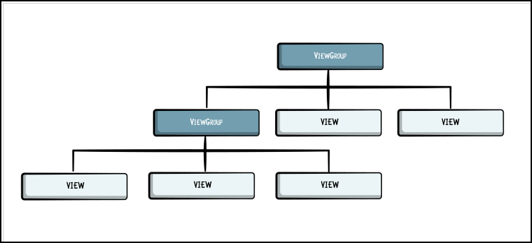

正如你在图片中看到的，你在安卓系统中把每个屏幕定义为一棵树的

ViewGroup和View对象。ViewGroups可以包含其他的ViewGroups和View。如果你熟悉计算机科学结构，你会认识到ViewGroups就像**树状结构**的**节点**，每个View是一个**叶子**。

这里要注意的最重要的事情是，你的视图对象负责你的用户界面的外观。因此，通过考察你如何实现和使用视图类来开始这个旅程是有意义的。

### View

如前所述，一个视图代表了UI组件的基本构件。它在屏幕上占据一个矩形区域，在那里**绘制**特定的UI组件，如一个按钮或一个文本字段。


但用户界面并不是被设计成静态的--至少，大多数的用户界面都不是。你的用户希望通过点击、拖动或输入来与用户界面互动。

幸运的是，视图也支持这种类型的互动和事件。专门的视图通常暴露了一组特定的**监听器**，你可以用它来管理互动事件。

正如你所知，**巨大的权力带来巨大的责任**，而Android的View组件无疑是强大的。你曾经使用过的每一个UI组件都是View的直接或间接子类。

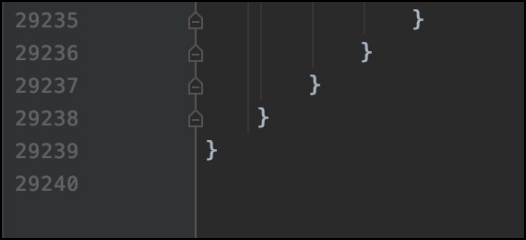

随着Android作为一个平台的成长，View变得越来越大。在当前的API中，**View.java**文件有**超过29000行代码**。不相信吗？打开它，自己检查一下吧!:]

这意味着目前的Android UI工具包的扩展性很差，而且越来越难以维护。

想象一下，你试图修复View类文件中的一个特定错误。你在基础视图中所做的每一个小改动都会以不知道多少种方式反映在整个Android UI工具包上！你可能在修复一个小错误的同时，又产生了几十个或几百个其他的错误。你可能在修复一个小错误的同时，又产生了几十个或几百个其他的错误

视图已经*超出了重构的范围*，然而目前Android UI工具包发展的唯一途径就是让这个类变得更大。而当你试图构建**自定义**视图时，这个问题就会被放大。

### 实现自定义视图

尽管View和当前API提供的其他自定义部件的功能，但在有些情况下，你需要创建自定义视图来解决具体问题。

考虑到整个UI工具包是建立在视图之上的，你会认为建立一些自定义的东西是非常容易的，它可以将视图扩展为它的父对象？

好吧，再想想吧!如果你想建立哪怕是最简单的自定义视图，你就必须经历所有这些步骤。

```kotlin
class MyWidget : View {

// 1 - Overriding constructors ...

// 2 - Inflating layout ...

// 3 - Parsing attributes ...

// 4 - Getters ...

// 5 - Setters ...

// 6 - Measuring and Layout ...
  
// 7 - Handling touch events ...

}
```


你要做的第一件事是创建一个从View延伸出来的类。编写自定义视图来解决一个特定的问题是很难的。有很多事情你需要做的很好。

1. 你必须重写视图构造函数。是的，有多个，每个都有自己的用例

2. 为了膨胀特定的布局，你必须把它定义为一个**XML资源**。

3. 为了从XML中定制你的视图，你必须创建特殊的XML属性并将它们添加到**attrs.xml**文件中。

4. 要修改你的自定义小组件，你必须把所有必要的**属性**和它们各自的 **getters 和setters** 添加到类中。

5. 你必须考虑**样式**和你的视图在不同显示模式下的表现，如**浅色和深色**主题。

6. 如果你需要**自定义测量**或布局，你必须覆盖特定的回调。

7. 你需要处理触摸事件吗？那么你需要**额外的代码来增加对触摸和手势的支持**!

正如你所看到的，在编写自定义视图时，你需要考虑很多事情。而作为一个开发者，你可能希望有一个干净而简单的API，你可以很容易地用你的自定义实现来扩展。不幸的是，目前的Android UI工具包并不容易。

### ViewGroup

在你为实现你的自定义视图所做的所有工作之后，是时候把它添加到你的用户界面了。但在这之前，你必须为你的容器选择正确的ViewGroup。而这可能不是一个简单的决定。你可能最终会有不止一个。当为你的屏幕创建一个布局时，你总是要选择哪个ViewGroup作为你的根视图。

在Android中，有许多不同类型的ViewGroups。一些常见的实现是LinearLayout、RelativeLayout和FrameLayout。每一个都暴露了一组不同的参数，你可以用来安排他们的子View：

- **LinearLayout**。当你想在一行或一列中组织子群时，可以使用它。

- **RelativeLayout**。使你能够指定子对象相对于彼此或父对象的位置。

- **FrameLayout**。最简单的容器之一，通常用于存储一个小部件或片段。

 


然而，UI并不总是那么简单，你可以在你的布局中只使用一个ViewGroup。当构建更复杂的UI时，你通常会定义屏幕的不同区域，并使用最符合你使用情况的特定ViewGroup。

通常情况下，这将导致大量**嵌套的**ViewGroups，使你的代码难以阅读和维护。最重要的是，它降低了你的应用程序的性能。

最近，Android UI工具包收到了一个新的ViewGroup，以解决这个问题 -- 

ConstraintLayout。它允许你用一个扁平的视图层次结构来创建大型复杂的布局。简而言之，你用它来创建视图之间的复杂**约束**，这样你就不必嵌套那么多布局。每个约束描述了一个视图是否被约束到另一个视图的开始、结束、顶部或底部。

然而这并不能完全解决嵌套布局的问题。有些时候，你仍然可以通过组合更简单的ViewGroups而不是使用ConstraintLayout获得更好的性能。

另外，你可以说，有时在复杂的UI中，当你有某种程度的嵌套时，更容易理解布局是如何组织的。很讽刺，对吧？]

正如你所看到的，在构建你的用户界面时，挑选一个ViewGroup并不容易。通常情况下，随着你经验的增加，它变得更容易，但新的开发者在开始玩Android时仍然会有困难。

### **显示视图**

现在，想象一下你已经成功地创建了你的布局。你选择了正确的视图。你创建了一个自定义视图来解决一个特定的问题。你使用了正确的ViewGroups来组织你的视图。现在，你想显示你美丽的布局。

但是，要实现这种行为，你还需要采取**许多步骤**!

由于你可能有使用Android UI工具包的经验，你知道大部分的UI是在XML文件中定义的。Android提供了一个XML模式，用于包括ViewGroup和View类。因此，你的布局可能看起来像这样。

```xml
<?xml version="1.0" encoding="utf-8"?>
<FrameLayout xmlns:android="http://schemas.android.com/apk/res/android"
    android:layout_width="match_parent"
    android:layout_height="match_parent">

    <TextView
        android:layout_width="wrap_content"
        android:layout_height="wrap_content"
        android:layout_gravity="center"
        android:text="Hello World" />

</FrameLayout>
```


这个**简单的**布局显示了一个 "Hello World" 文本。

很好!但所有这些工作**仍然不足以**显示你的用户界面。为了在屏幕上呈现该布局，你需要将它与你的活动或片段连接起来。如果你正在使用一个活动，你会做这样的事情。

```kotlin
class MyActivity : AppCompatActivity() {

    override fun onCreate(savedInstanceState: Bundle?) {
        super.onCreate(savedInstanceState) 
        setContentView (R.layout.activity_layout)
    }

}
```

使用setContentView(ViewResource)，Activity负责创建一个你放置UI的窗口。这是你在Android中显示UI元素的最简单方式。

另一方面，Fragments代表了一个活动中的一段行为或一部分UI。你可以在一个活动中结合多个片段来构建一个多窗格的用户界面，你也可以在多个活动中重复使用一个片段。把Fragment看成是一个活动的模块化部分。

```kotlin
class MyFragment : Fragment() {

    override fun onCreateView(inflater: LayoutInflater, container: ViewGroup?, savedInstanceState: Bundle?): View { 
        return inflater.inflate(R.layout.layout, container, false) 
    }

}
```


为了给一个片段提供布局，你必须实现onCreateView()。当片段要绘制它的用户界面时，Android系统就会调用它。

你对这个方法的实现必须返回一个视图，这个视图是你的 

片段的布局。为了从onCreateView()返回一个布局，你要从你在XML中定义的布局资源中**膨胀**它。为了帮助你这样做，onCreateView()提供了一个LayoutInflater--一个特殊的组件，它读取XML定义，并使用你定义的属性和特性来构建Kotlin和Java对象，如视图的**宽度**、**高度**、**颜色**、**约束**和自定义属性。

这个过程也被称为**布局充气**，因为布局类似于气球--你需要给它们充气，使其成形，并做一些工作!:]

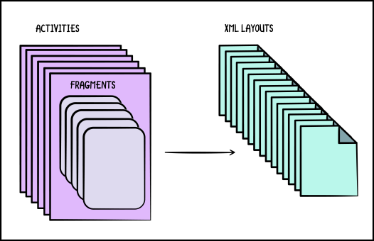

非尺度化的布局系统

想象一下，你现在需要一个带有活动和片段的屏幕。为了创建这个屏幕，你需要以下文件。**MyActivity.kt**, **my_activity.xml**, **MyFragment.kt**, **my_fragment.xml**, **attrs.xml**中定义的额外属性和**style.xml**中定义的特殊样式。对于这样一个**简单的屏幕**，你必须**写太多的代码**。

正如你所看到的，目前的Android UI工具包的扩展性**很差**。现代应用程序通常有几十个，甚至几百个功能，每个都有自己的XML布局、属性、样式、Kotlin或Java代码等等。

除此之外，还不可能在资源文件夹中组织这些文件。如果你决定为**动态UI组件**定义列表或页面项目，事情就变得**更加复杂**。

### 分开关注

从一个简单的布局定义到在屏幕上显示你的用户界面已经很困难了，但是如果你真的想看到你的用户界面在运行，你必须把它和你的业务逻辑联系起来。

你总是听说你应该把你的业务逻辑和你的用户界面逻辑分开。这个概念被称为**关注点的分离（SoC）**。这是计算机科学中的一个设计原则，它说你应该把一个程序分成不同的部分，每个部分解决一个不同的**问题**。

关注点是一组影响计算机程序代码的信息。它可以像运行应用程序的硬件的细节那样笼统，也可以像要实例化的类的名称那样具体。

SoC包括两个主要概念：**耦合**和**内聚**。你可以把你的应用程序看成是一组模块。**每个模块都包含许多单元**。一般来说，你想尽可能地减少耦合，增加内聚力。但这些术语是什么意思？

#### 耦合和凝聚力

不同模块之间的依赖关系代表了**耦合性**。一个模块的部分内容可以影响另一个模块。如果你对一个模块的代码做了改变，根据耦合性，你也必须改变其他模块。

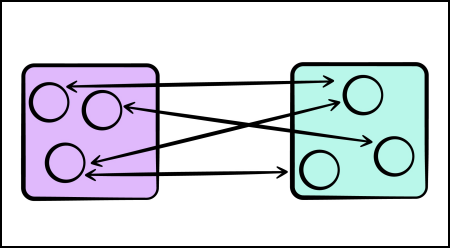

联轴器

另一方面，内聚力描述了一个给定模块内部的单元是如何相互归属的。

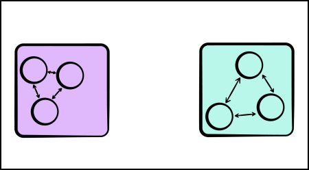

凝聚力

因此，目标是将尽可能多的相关代码分组。这样一来，你的代码就可以随着时间的推移而得到维护，并随着你的应用程序的增长而扩展。

考虑到这一点，想想你在实现Android UI时如何组织代码。请注意，你有两个模块是相互依赖的。

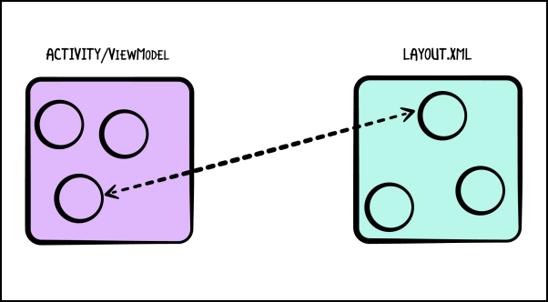

**实现Android UI时的模块**

你为什么要这样定义这些模块？嗯，每个模块都是用另一种语言编写的，它们之间的差异导致框架需要这样的设计。

你的ViewModel和布局可以是密切相关的，因此是耦合的，但你没有选择画出分离的界限，因为你用不同的语言写它们，有不同的语义属性。

换句话说，这些单元**应该是有凝聚力的，但由于语言的差异，它们不可能有凝聚力**。然而，它们为了工作而相互依赖，但这种**依赖是隐性的**。

同样，这是因为语言的不同，以及你不能直接与XML文件通信的事实。你必须把它膨胀成一个Kotlin或Java对象，然后再与之通信。

由于这个原因，随着你的ViewModel和布局的增长，它们变得非常难以维护。

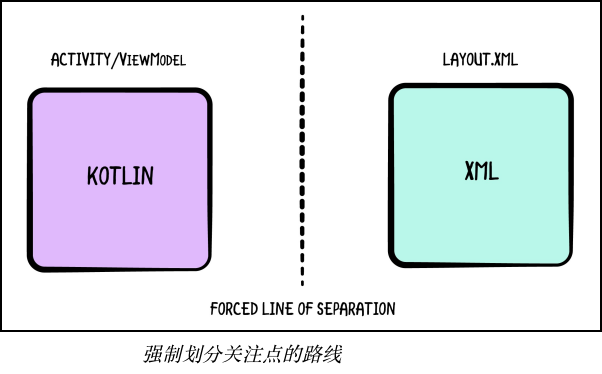

### 强制性思维

每当用户在你的用户界面上执行一个特定的动作时，你必须捕获该事件，更新**视图状态**和用户界面以表示新给出的状态。在你的应用程序的整个生命周期中，你都在反复地做这个工作。

如果你希望当你的状态发生变化时能有动画效果，你需要定义你的视图在不同的状态之间如何变化。这种编程风格被称为**命令式编程**。

势在必行意味着你在命令或告诉程序做你想做的事或显示你需要的意见。它使用函数形式的语句来改变程序的状态。命令式编程的重点是描述程序应该**如何**运行。

传统上，在Android中，你使用命令式风格来构建和管理你的UI。你经常创建一个全功能的用户界面，然后在状态发生变化时使用函数对其进行突变。

想象一下一个日历事件的用户界面。所需的属性是一个标题、一个事件所有者和一个在线会议的链接。其他可选的属性是一个客人名单和一个房间名称。如果有五个以上的客人，应用程序应该折叠客人名单。

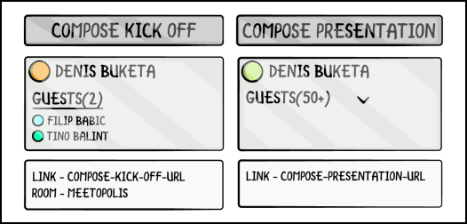

**日历活动**

用命令式的思维，你可以用下面的代码来渲染事件卡。

```kotlin
fun renderEventCard(event: Event) {
    // Handle event title
    setTitle(event.title)

    // Handle event owner
    setOwner(event.owner)

    // Handle event call link
    setCallLink(event.callLink)

    // Handle guest list visibility
    if (event.guests.size > 0 && !hasGuestList()) {

        addGuestList()
    } else if (event.guests.size == 0 && hasGuestList()) {

        removeGuestList()
    }

    // Handle case with more than 5 guests
    if (event.guests.size > 5 && !isGuestListCollapsed()) {

        collapseGuestList()
    } else if (event.guests.size > 0 && isGuestListCollapsed()) {

        expandGuestList()
    }

    // Handle guest count badge
    if (event.guests.size <= 50) {

        setGuestCountText("$count")
    } else {

        setGuestCountText("50+")
    }
}
```


该函数只是展示了对于一个日历事件的给定情况，你需要处理多少种不同的状态。

在设置了标题、所有者和呼叫链接等基本属性后，你必须为卡片可能具有的各种状态处理四个不同的if语句--如显示可折叠的客人名单、客人人数或会议室。

在为这个用例建立用户界面时，你需要考虑以下问题。

• 对于任何给定的数据，你想显示哪个用户界面。

• 如何对事件作出反应。

• 你的用户界面如何随时间变化。

仅仅通过如果检查的数量，你的日历卡就有十六个不同的状态。

这似乎是一个简单的用例，但实际上**非常复杂**，在你开发的过程中会有很多bug悄悄出现。想象一个更复杂的例子，你还需要处理状态间的动画。

处理用户界面如何随时间变化是构建一个用户界面最难的部分。但是，如果你能将行为概括化，你就可以试着简化它:]

### 继承性

在更新你的用户界面时，使你的生活更容易的一个方法是将你的用户界面的某些部分提取到自定义视图类。

如果你有经常在整个应用程序中重复使用的组件，只需创建一个自定义视图并将所有的代码放在一个地方。

你已经看到，制作一个自定义视图是很难的，但在这样的情况下，它是很有用的。有一个众所周知的原则，描述了如何以这种方式组织你的代码--**组合大于继承**。

这是面向对象编程（OOP）中的一个原则，即类应该通过它们的组合来实现多态行为和代码重用--也就是说，通过包含实现所需功能的其他类的实例，而不是继承自基类或父类。

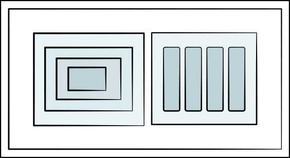

**继承与构成**

在当前的Android UI API中，继承起了很大的作用--这就造成了问题。例如，Button是每个Android应用程序中最常用的小工具之一。当你看Button的类层次结构时，你会看到这样的东西。

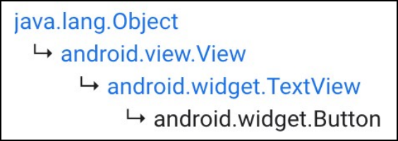

**按钮的类层次结构**

这似乎是有道理的，因为按钮显示文本。但问题是，TextViews可以做很多事情。例如，如果你想的话，你可以让一个按钮可选择。

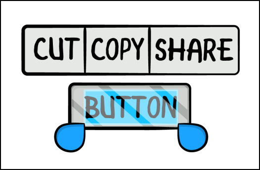

**可选择的按钮**

现在，ImageButton怎么样了？你能猜到ImageButton扩展了什么类吗？好吧，看看它的类的层次结构。

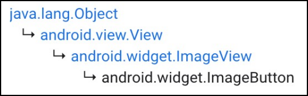

**ImageButton的类层次结构**

正如你所看到的，你现在有两个共享相同逻辑的按钮，除了一个使用图片，而另一个使用文本作为其内容。然而，它们扩展了不同的类。

现在，想象一下，在某个**疯狂的世界里**，你需要一个带有图片**和**文字的按钮。你应该扩展哪个类？这就造成了一个问题。

继承不仅引入了很多不必要的逻辑，而且还限制了你可以继承的类，如在Kotlin和Java中，**你只能继承一个父类**，没有多重继承。

### 数据流

在目前的Android UI中还有一件重要的事情要看，这与状态和UI与业务逻辑之间的数据流有关。在谈论状态时，必须考虑三个主要问题。

• 真理的来源是什么？

• 谁拥有这个国家？

• 谁来更新状态？

在Android开发中，要回答这些问题并不简单，这就是为什么你有这么多不同的架构模式。

你有模型-视图-控制器（MVC）、模型-视图-视图模型（MVVM）、模型-视图-展示者（MVP）、模型-视图-内容（MVI），可能还有更多的模型-视图-某种东西。这些模式的存在是为了帮助定义和推理你的应用程序的数据流和状态管理。以Spinner组件为例。

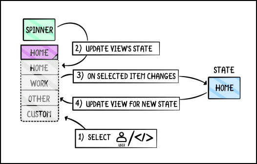

**旋转器和状态管理**

Spinner提供了一个名为onSelectedItemChanged的监听器，它可以告诉你用户何时改变了值--但它是在值改变之后发生的。如果你的用户界面也拥有和管理状态，那么就很难将你的用户界面构建成你的模型的代表。

在这个例子中，Spinner将更新它的状态并通知你状态的变化。你的模型将更新状态，如果你有逻辑在状态变化时更新Spinner，你将为该变化再更新一次Spinner。

但你无法知道是你在改变Spinner的状态，还是事件来自于用户。

看来你已经读到了目前的UI工具包所提供的很多复杂性和问题，所以如果其中有些问题对你打击很大的话，你会很高兴听到**有**希望的消息--而且它就在拐角处等着你呢!:]

## Jetpack Compose简介

在前面的章节中，你经历了关于原始Android UI工具包的一些重要概念和问题。现在，是时候向**Jetpack问好了** 

**创作**!

Jetpack Compose是Android的现代工具包，用于构建本地UI。当你了解到用原始的Android UI工具包在Android中构建一个UI是多么困难时，你从基本的、熟悉的构建模块--View和ViewGroup开始。因此，用Jetpack Compose的基本构件--**可组合函数来**开始这个介绍是有意义的。

### Composables

像所有伟大的教程一样，这个教程将从 "Hello World!"的例子开始!:]

```kotlin
@Composable 
fun GreetingWorld(){
}
```

你可以把这段代码分成两部分。首先，它是一个函数，其次，这个函数有一个名为@Composable的注解。

这几乎是你创建一个新的小部件所需要的全部内容。准备好迎接大惊喜了吗？在 Compose 的世界里，你把这些 widget 称为 **composables**。

你会注意到，你不需要扩展任何类（看着你，View）或覆盖构造函数或其他函数。你需要关心的是，你写了一个函数并使用了这个新的花哨的注解。

准备好了，因为你会**经常**看到这句话的。

在这个例子中，你想向用户显示一条 "Hello World！"的信息。要做到这一点，你可以做以下工作。

```kotlin
@Composable 
fun GreetingWorld(){ 
  Text(text = "Hello world!") 
}
```

在 Compose 中，调用一个能在屏幕上显示东西的函数被称为**发射用户界面**。因此，为了发出你的信息，你需要调用一个Text函数。

Text也是一个可组合函数，它是组成Jetpack Compose的默认可组合函数之一。有一点需要注意的是，可组合函数只能从其他可组合函数中调用--如果你试图删除@Composable，你会得到一个错误，阻止你使用Text()。

但是，如果你想把一个特定的信息或名称，或任何类型的参数传递给可组合的人呢？那么，你可以这样做。

```kotlin
@Composable 
fun Greeting(name: String) {
  Text(text = "Hello $name!") 
}
```


由于可组合函数，你可以将数据作为函数参数传递给它们。在你的例子中，你给Greeting()添加了一个属性名，并在调用Text()时使用该数据。

思考可合成物的最简单方式是理解它们是将你的数据转化为你的用户界面的函数。另一种说法是--在Compose中，**用户界面是数据（状态）的一个函数**。

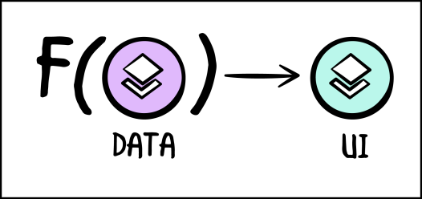

**作为数据函数的用户界面**

在过去的几年里，你可能听说过函数式编程，以及拥有纯函数是多么的风靡。通过使用 Compose，你可以成为这群很酷的孩子中的一员！ :] 。

撇开所有的玩笑不谈，这种函数式范式使代码的编写和重构更加简单。它也使它更容易被可视化。

### 显示composables

当涉及到显示你的可合成物时，你仍然使用活动或片段作为起点。要显示你刚才看到的 "问候 "这个可合成的东西，你要做以下工作。

```kotlin
class MainActivity : AppCompatActivity() {

    override fun onCreate(savedInstanceState: Bundle?) { 
        super.onCreate(savedInstanceState) 
        setContent { Greeting("World") } 
    }

}

@Composable 
fun Greeting(name: String) {
    Text (text = "Hello $name!") 
}
```


你用一个**内容块**将可合成物与你的活动连接起来。 setContent()定义了活动的布局。你不需要用XML文件来定义布局内容，而只需要调用可组合的函数。

Jetpack Compose背后的魔力是将这些可组合的函数转化为应用程序的用户界面元素。第2章，"学习Jetpack Compose基础"，将更详细地探讨这个问题!

### 使用Kotlin

如果你到目前为止还没有注意到，Jetpack Compose允许你使用Kotlin编写你的用户界面，这种神奇的语言比生锈的老XML好得多。不仅如此--Jetpack Compose完全是用Kotlin构建的!

让我们看看如何使用Kotlin的功能和遵循OOP的编程实践来解决你前面读到的困难。

#### 分开关注

你已经看到了用不同的语言来构建你的业务逻辑和你的用户界面是如何导致关注点被迫分离的。有了Jetpack Compose，这条界限就消失了。

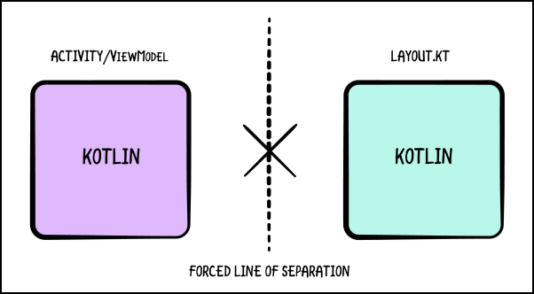

**控制关注点的分界线**

通过使用Kotlin来编写你的用户界面，你承担了划定分离线的责任。你可以做任何在你的情况下最有意义的事情。你不必遵从操作系统的限制。

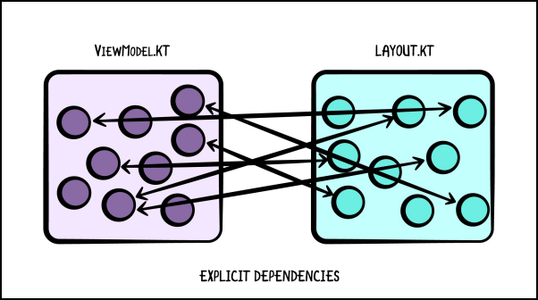

**明确的依赖关系**

这意味着你在布局和业务逻辑之间的许多隐含的依赖关系现在变得明确。

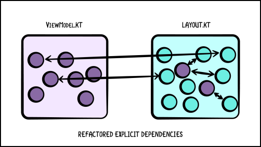

**重构显式依赖关系**

让你的用户界面和业务逻辑用相同的语言编写，可以让你重构这些依赖关系，以减少耦合，提高代码的内聚力。

一个框架不应该为你分离你的关注点。这并不意味着你应该混合你的逻辑和UI。但是通过用Kotlin编写所有的东西，你可以应用所有的好的做法来定义你想在两者之间划清界限。

#### 陈述性思维

你已经读过关于原始Android UI工具包的设计是如何要求你写命令式代码的。无论你使用什么架构，你都会发现自己在写描述你的用户界面**如何**随时间变化的代码。

在Jetpack Compose中，你必须转变你在**声明式编程**方面对用户界面的思考方式。

**声明式编程**是一种编程范式，你不注重描述程序应该**如何**操作，而是描述程序应该完成**什么**--例如，**它应该显示一个隐藏的**按钮，而不是**应该隐藏**一个按钮。

还记得那个事件卡的例子吗？你可以用Jetpack Compose声明性地写出同样的逻辑。

```kotlin
@Composable 
fun EventCard(event: Event) {

    CaseMap.Title(event.title)

    Owner(event.owner)

    Call(event.callLink)

    if (event.guests.size > 0) { 
        Guests(collapsed = event.guests.size > 5) {
            if (event.guests.size > 50) {
                Badge(text="50+") 
            } else { 
                Badge(text="$count") 
            } 
        } 
    }

    if (event.isRoomSelected) {
        Room(event.room) 
    }
}
```


注意你是如何描述应该发生的事情而没有说应该如何发生。只有当客人名单和房间名称存在时，应用程序才会添加它们。当客人超过五人时，名单会崩溃。

你还记得那些关于UI状态的担忧吗？你不再需要担心你的用户界面如何随时间变化。通过使用这种声明式的方法，你描述了UI应该是什么样子，而框架则控制你如何从一个状态到另一个状态。

此外，可组合函数是一个函数定义，但它在一个地方描述了你的用户界面的所有可能状态。

#### 构成

在Buttons和ImageButtons的例子中，你看到了继承如何导致特定的问题。Jetpack Compose允许你通过倾向于**组合而不是继承来**解决这些问题。通过研究同一个例子，你会看到如何处理这个问题。

要制作一个按钮小部件，你要做的事情是这样的。

```kotlin
@Composable 
fun TextButton(text: String) {
    Box(modifier = Modifier.clickable(onClick = { ... })) {
        Text(text = text)
    }
}
```


请注意，在这个例子中，你有一个盒子，它是一个可组合的，可以让你**堆叠多个可组合的**。它还使用了Modifier.clickable()，以使可组合的东西可以被点击。现在，你不需要了解修改器。

你将在后面的章节中了解到盒子组件。在第6章 "使用组合修改器 "中，你会更详细地了解修改器。现在，你只需知道Box()允许你包裹你的Text()，你使用修改器来使它可被点击。

现在，如果你需要一个带有图像的按钮，就像前面的例子一样，该怎么办？你可以这样做。

```kotlin
@Composable 
fun ImageButton() {
    Box(modifier = Modifier.clickable(onClick = { ... })) {
        Icon(painterResource(id = R.drawable.vector), contentDescription = "")
    } 
}
```


这里，你使用Icon()而不是Text()。下一章将更详细地介绍这个问题。现在，我们只需说，这种可组合性允许你显示矢量或静态图像。

总结一下这个例子，如果你需要一个带有文字和图片的按钮，你现在可以这样做。

```kotlin
@Composable
fun TextImageButton(text: String) {
    Box(modifier = Modifier.clickable(onClick = { ... })) {
        Keyboard.Row(
            verticalAlignment = Alignment.CenterVertically
        ) {
            Icon(painterResource(id = R.drawable.vector), contentDescription = "") Text (text =
                text)
        }
    }
}
```


在这里，你把图标和文本组合在一个行中。一个行类似于一个水平的LinearLayout，项目将在水平方向上一个接一个地被放置。通过这样做，你成功地创建了一个带有图像和文本的按钮。 

如此简单!:]

而这就是了。使用Compose，不需要添加任何东西，你只需添加你需要的组件。你从你已经创建的或Jetpack Compose为你提供的其他小部件中建立你的小部件。

#### 封装

在**数据流**部分，你看到了数据如何在用户界面和业务逻辑之间流动。你看到在旧的Android UI工具包中，视图也管理状态，并且它们暴露了回调，你用它来捕获该状态的变化。

Compose的设计方式是，你的用户界面是你的数据的一个代表。这意味着你的用户界面组件--在这种情况下，是可组合的--并不**负责管理**状态。它们**代表**你的状态。

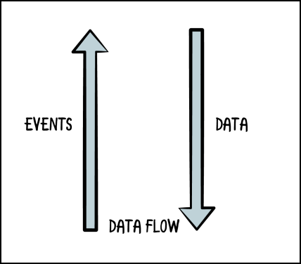

**数据流**

Kotlin允许你以函数参数的形式向下传递数据，但你也可以通过回调来将事件向上传播。这就是你实现可组合函数的公共API的方式。

想象一下，你想要一个用户可以点击的帖子列表。你可以创建一个像这样的可组合的帖子。

```kotlin
@Composable
fun Post(post: PostData, onClickAction: () -> Unit) {
    Box(modifier = Modifier.clickable(onClick = onClickAction)) {
        Keyboard.Row {
            Icon(
                bitmap = post.image,
                contentDescription = ""
            ) Text (text = post.title)
        }
    }
}
```


你把PostData传递给函数，以渲染一个特定的帖子，你还传递了一个回调，以接收用户点击帖子时的点击事件。

你应该努力拥有**自上而下的数据流**，这意味着数据应该向下流向你的用户界面（你的可合成物），而事件应该从你的用户界面流向你的ViewModels。

### 重新组合

**重组**是Jetpack Compose中最重要的概念之一。简单地说，重新组合允许任何可组合的函数在任何时候被**重新调用**。

这在用新状态更新你的用户界面时非常有用。每当状态发生变化时，Compose 会**重新唤起**所有依赖于该状态的可合成物，并更新你的用户界面。

第二章，"学习Jetpack Compose基础 "将更详细地介绍重新组合的步骤。现在，你只需要知道这个概念意味着当状态发生变化时，你不必像在旧的Android UI工具包中那样，手动更新你的UI。

现在，想象一下你有一个这样的帖子列表。

```kotlin
@Composable
fun Posts(livePosts: LiveData<List<Post>>) {
    val posts by livePosts.observeAsState(initial = emptyList())
    if (posts.isNotEmpty()) {
        PostList(posts)
    } else {
        MessageForEmptyPosts()
    }
}
```


如果帖子的数量不是零，你会显示一个帖子的列表。如果帖子的数量为零，你就显示一条信息。

在这里，你可以看到你如何使用LiveData并将其作为一种状态来观察。你将在第7章 "在Compose中管理状态 "中了解更多这方面的信息。

这背后的想法是，你观察 Posts 的状态。每当livePosts的数据发生变化时，Compose会重新调用Posts()，并**重新评估**里面的逻辑。

如果没有帖子，则 Compose 调用 MessageForEmptyPosts() ，你的应用程序将为用户显示一条信息。如果有帖子，Compose调用PostList(post)，你的应用程序就会显示帖子的列表。

## Jetpack Compose的技术栈

现在，你应该对Compose如何试图解决旧的Android UI工具包的问题有了更好的了解。你已经看到了Jetpack Compose可以实现的一些例子，但它在引擎盖下是如何运作的？

两个部分对组成Jetpack Compose的不同组件进行了分类：**开发主机**和**设备主机**。

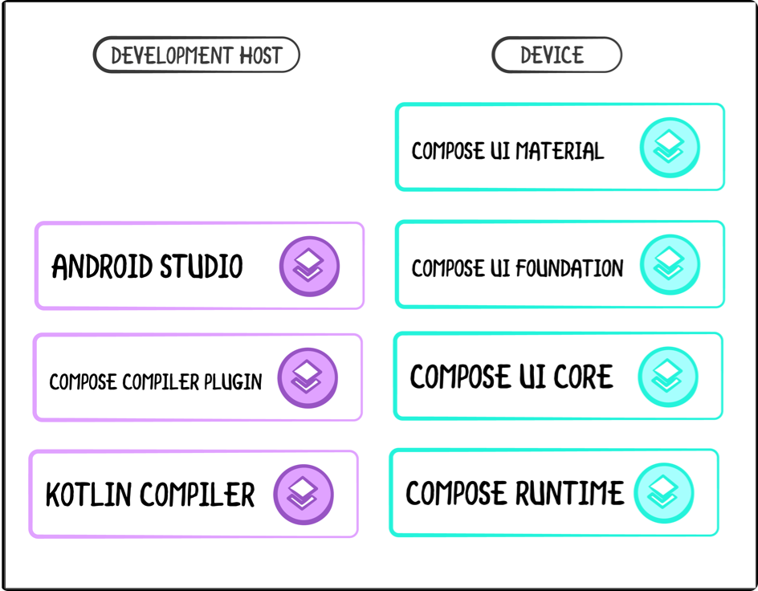

### 发展的主人

开发主机包含所有帮助你编写代码的工具。

在底部，你有一个**Kotlin编译器**。Jetpack Compose是用Kotlin编写的，并使用了大量的Kotlin特性，这就是它的灵活性和易用性。你已经看到了Compose是如何使用尾部的lambdas来使代码更加可读和直观的。

在此基础上，你还有一个 **Compose Compiler Plugin**。尽管你使用 @Composable 作为注解，但 Compose 并不使用注解处理器。这个插件在类型系统级别工作，也在代码生成级别工作，以改变你的可组合函数的类型。

如果你不熟悉**注释处理器**，或APT，它们是构建过程中的一个特殊系统，分析特定的注释并根据它们生成代码。

这是一件好事，因为你可以使用生成的代码，而不是自己写，但有时也很糟糕，因为它**大大增加了**你项目的**构建时间**。但是，因为 Compose 不使用 APT，所以它不会拖慢你的构建速度!

在此基础上，你还有**Android Studio**，它包括针对Compose的工具，简化了你使用Compose的工作。

### 设备主机

这个技术栈的第二部分是你的**设备**；也就是说，运行你的 Compose 代码的环境。

在底部，有一个**Compose Runtime**。在它的核心，合成逻辑不知道任何关于Android或UI的事情。它只知道如何使用树状结构来发射特定的项目。这使得它更加有趣，因为你可以用Compose来发射UI以外的东西。

在此基础上，是金豪**用户界面核心**。它处理输入管理、测量、绘图、布局等。

这两层支持下一层所提供的部件--**Compose UI基础**。它包含了基本的构建模块，如文本、行、列和默认的交互。

最后，还有**Compose UI Material**，一个Material Design系统的实现。它提供了开箱即用的Material组件，使得在你的应用程序中使用Material Design变得容易。

## 关键点

• **View.java**的大小使得旧的Android UI工具包难以维护和扩展。

• 创建自定义视图很困难，需要太多的代码。

• 与**命令式编程**不同，**声明式编程**简化了代码，使其更容易理解。

• 在旧的安卓UI工具包中，不清楚真相的来源是什么，谁拥有它，谁更新它。

• 在Jetpack Compose中，你使用**composables**来构建你的用户界面。

• 可组合函数只是用@Composable注解的函数。

• Jetpack Compose是用Kotlin编写的，允许你使用所有的Kotlin功能。

• 在Jetpack Compose中，你的用户界面是一个**数据的函数**。

• 你使用setContent()作为入口点来显示你的可合成物。

• 在Compose中，你可以控制业务逻辑和用户界面之间的关注点分离线的位置。

• Jetpack Compose更倾向于**组成而不是继承**。

• 在Jetpack Compose中，你用函数参数向下传递数据，用回调来向上传播事件。

• Jetpack Compose使用**重组**，在状态发生变化时**重新唤起**可合成物。

• Jetpack Compose并不使用注解处理器，而是使用一个**Compose Compiler Plugin**来改变可合成函数的类型。

## 今后该何去何从？

这真是对原始的安卓UI工具包和Jetpack Compose的**简单**比较!:]

现在，你应该对Jetpack Compose的潜力有了感觉。

在接下来的章节中，你将保持兴奋的心情，在那里，你将亲自动手，同时了解一些你可以用来构建你的用户界面的现有可合成物。

在本书的第一部分，你将涵盖基础知识，学习如何使用布局，以及如何创建列表--最重要的UI组件之一！在这部分中，你将学习到如何使用布局。到时见!
