# 第2章：学习Jetpack Compose基础知识

在这一章中，你将了解到Jetpack Compose的基础知识。你将学习如何**编写可组合的函数**，也就是你用来用Jetpack Compose创建漂亮的用户界面的构建块。然后你会看到如何实现最常见的可组合函数，如文本、图像或按钮元素。对于每个可组合函数，你会发现它是如何使用的，以及它的属性是什么。最后，你将自己实现这些可组合的功能，并在应用程序中对它们进行测试。

然而，在你开始写代码之前，你需要知道你想在屏幕上显示的元素如何成为一个可组合的函数。

### 可组合的函数

在第一章中，你学到了使用XML来制作用户界面与使用Jetpack Compose的不同之处。前一种方法的最大问题是。

• UI不具有可扩展性。

• 很难制作自定义视图。

• 不同的来源可以管理状态。

所有这些问题都能在Android View构建其状态和绘制自身及其子类的方式中找到其根源。为了避免这些问题，你需要使用一个不同的基本构建模块。在Jetpack Compose中，这个构件被称为可组合函数。

要制作一个可组合的函数，你会做这样的事情。

```kotlin
@Composable 
fun MyComposableFunction() { 
 // TODO 
}
```

你需要用**@Composable**来注释一个函数或表达式--一个特殊的注释类。任何以这种方式**注解**的函数也被称为可组合的函数，因为你可以在其他此类函数中进行**组合。**

注释类通过给代码附加元数据来简化代码。Javac，java编译器，使用一个注释处理器工具，在编译时扫描和处理注释。

这将创建带有添加的元数据的新源文件。简而言之，通过使用注解，你可以为类添加行为，并生成有用的代码，而无需编写大量的模板。

这个特定的注解将该函数或表达式的类型改为可组合的，意味着只有其他可组合的函数可以调用它。

Composable注解类的源代码看起来是这样的。

```kotlin
@MustBeDocumented 
@Retention(AnnotationRetention.BINARY) 
@Target( 
  AnnotationTarget.FUNCTION。 
  AnnotationTarget.TYPE。 
  AnnotationTarget.TYPE_PARAMETER。 
  AnnotationTarget.PROPERTY_GETTER 
)
annotation class Composable
```

你可以看到，Composable注解类有三个自己的注解。

1. @MustBeDocumented。表示该注解是公共API的一部分，应该包含在生成的文档中。

2. @Retention。告诉编译器注释应该**存在**多长时间。通过使用AnnotationRetention.BINARY，处理器将在编译时将代码存储在一个二进制文件中。

3. @Target。描述了该类型适用的上下文。@Composable可以应用于类型和参数、函数和属性。

在上一章中，你了解到要开始构建用户界面，你需要调用setContent()。这是将用户界面绑定到一个活动或片段上的Compose方式，类似于setContentView()的工作方式。

但它并不与任何视图或XML资源一起工作，而是与可组合的函数一起工作!

#### 设置内容

setContent()的签名看起来像这样。

```kotlin
fun ComponentActivity.setContent( 
  parent: CompositionContext? = null, 
  content: @Composable () -> Unit 
) { ... }
```

你可以看到setContent()是ComponentActivity的一个扩展函数。扩展函数是为一个类添加额外功能的函数，不需要改变其源代码。这意味着你可以在任何ComponentActivity或其子类上使用setContent()，比如AppCompatActivity。

调用setContent()将给定的名为content的可组合函数设置为根视图，你可以向其添加任何数量的元素。你将从这个容器中调用其余的可组合函数。

注意到内容也是用@Composable来注释的。因为前面提到的@Target，你也可以把它应用于函数参数。

这个特定的用例标志着你传入的lambda函数是一个可组合的函数，允许你调用其他可组合的函数并访问资源和Jetpack Compose的上下文等东西。

setContent()里面的另一个参数是CompositionContext，它是对父组合的引用。CompositionContext被用来协调组合树中组合更新的调度。它确保无效和数据在父子组合中的逻辑流动。

根组合的父级是一个重新组合器，它决定了重新组合发生的线程--这是Jetpack Compose最重要的功能之一。

简单地说，重新组合是一个要求应用程序用新的值重新绘制当前用户界面的事件。每当诸如状态等数值发生变化时，就会发生重新组合。

你将在第7章 "Compose中的状态管理 "中了解更多关于管理状态和重新组合的方法。

现在你已经了解了Jetpack Compose的基础知识，你可以深入到可组合函数中去了!:]

### 基本可组合函数

要跟上代码实例，请用Android Studio打开本章的启动项目，并选择打开一个现有的项目。

接下来，导航到02-learning-jetpack-compos-fundamentals/projects，选择starter文件夹作为项目根。一旦项目打开，让它构建和同步，你就可以开始了

启动项目由三个包和MainActivity.kt组成。

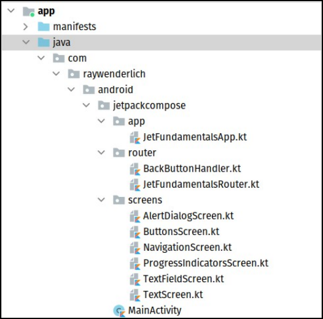

**项目包** 以下是你应该知道的内容。

• 应用。只有一个可组合的函数，它在你的应用程序中充当根布局。你不需要改变它，因为它只是应用程序的导航，这已经为你设置好了!

• 路由器。有两个辅助类来处理屏幕之间的导航和返回按钮。你也不需要在这里改变什么。

• 屏幕。由多个用于不同屏幕的可组合函数组成。你将在本章中实现这些功能，但NavigationScreen.kt除外，它包含一个已经为你制作好的导航布局。

• MainActivity.kt。包含setContent()调用，设置第一个可组合的函数，并作为一个根UI组件。

一旦你熟悉了文件组织，就可以建立并运行该应用程序。你会看到一个有基本导航的屏幕，如下图所示。

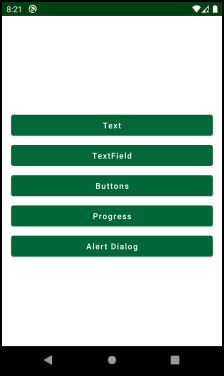

**导航屏幕**

该屏幕包含五个按钮，当你点击时，每个按钮都通向一个空屏幕。按 "返回"，你就会回到主屏幕。

你的目标是为每个空屏幕实现一个可组合的函数。所以，快去做吧!:]

### 文本

当你想到用户界面时，首先想到的是一个基本的文本元素，或称TextView。在Jetpack Compose中，该元素的可组合函数被称为Text。接下来，你会看到如何将基本的文本元素添加到用户界面中。

打开TextScreen.kt，你会看到两个可组合的函数。TextScreen()和MyText()。

```kotlin
@Composable
fun TextScreen() {
  Column(
      modifier = Modifier.fillMaxSize(), // 1
      horizontalAlignment = Alignment.CenterHorizontally, // 2
      verticalArrangement = Arrangement.Center // 3
  ) {
    MyText()
  }

  BackButtonHandler {
    JetFundamentalsRouter.navigateTo(Screen.Navigation)
  }
}

@Composable
fun MyText() {
  //TODO add your code here
}
```


TextScreen已经完成了。它是一个简单的可组合的函数，使用Column组件以垂直顺序列出项目。在这个意义上，Column就像一个垂直的LinearLayout!

它还使用了**modifiers**和两个Column属性来为Column设计样式，并将它和它的子节点对齐。这里有更多关于你所使用的属性的信息。

1. 通过使用**modifiers**，你可以以多种不同的方式对每个Compose元素进行样式设计。你可以改变它的对齐方式、大小、背景、形状和更多。在本例中，通过使用Modifier.fillMaxSize()，你告诉Column要与它的父元素的宽度和高度一致。

2. 通过使用horizontalAlignment，你是在告诉Column将其子代水平居中。

3. 使用verticalArrangement，你将其项目放在其父级的中心。

你将在第6章 "使用Compose  Modifiers"中学习更多关于修改器的知识，现在重要的是如何向你的可组合函数添加文本元素。 

同时忽略BackButtonHandler()，因为它是为处理后退点击而建立的一个特殊的可组合的，你不需要改变它!现在，将MyText()的代码改为如下。

```kotlin
@Composable 
fun MyText() {
  Text(text = ) 
}
```


你会看到有多种选择来导入文本，但要确保选择来自androidx.compose.material的。你还会得到一个提示，让你提供一个要显示的文本。添加以下代码作为文本参数。

```kotlin
stringResource(id = R.string.jetpack_compose)
```


Compose有一个非常简洁和易于使用的方法，可以将strings, drawables, colors其他resources文件导入你的用户界面元素。通常，要从资源中获得一个字符串，你会在一个给定的Context上调用getString()。由于你正在使用可组合的函数，你需要一个可组合的函数来让你这样做。

幸运的是，有许多可组合的函数可以让你检索到不同类型的资源。在这种情况下，你将使用stringResource()，它接收你想要加载的字符串资源的ID。

建立并运行该应用程序。然后在主屏幕上，点击文本按钮。你应该看到以下屏幕。

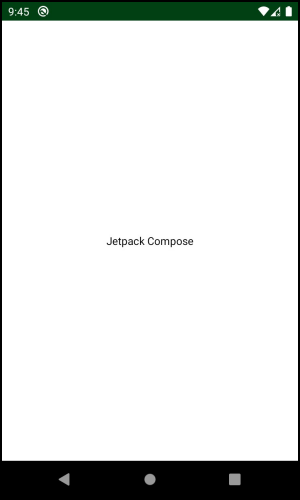

**非类型化的文本**

棒极了!现在在屏幕中间有一个简单的文字，写着Jetpack Compose。]

现在你已经实现了基本的Text()，最好是看看这类元素还暴露了哪些功能。花点时间检查一下Text()的源代码，看看它能提供什么。

```kotlin
@Composable
fun Text(
    text: String,
    modifier: Modifier = Modifier,
    color: Color = Color.Unspecified,
    fontSize: TextUnit = TextUnit.Unspecified,
    fontStyle: FontStyle? = null,
    fontWeight: FontWeight? = null,
    fontFamily: FontFamily? = null,
    letterSpacing: TextUnit = TextUnit.Unspecified,
    textDecoration: TextDecoration? = null,
    textAlign: TextAlign? = null,
    lineHeight: TextUnit = TextUnit.Unspecified,
    overflow: TextOverflow = TextOverflow.Clip,
    softWrap: Boolean = true,
    maxLines: Int = Int.MAX_VALUE,
    onTextLayout: (TextLayoutResult) -> Unit = {},
    style: TextStyle = LocalTextStyle.current
)
```


它为不同的风格提供了广泛的参数。第一个，文本，让你设置你想显示的文本，是唯一需要的参数。

第二种，修改器，更加复杂，提供许多不同的功能。在前面的例子中，你看到Column()使用了修改器来填充父体的大小，但如前所述，你将在第6章 "使用组合修改器 "中学习更多关于修改器的知识。

现在，花点时间来探索Text()元素暴露的一些参数。

#### 文本元素参数

• color: 让你设置文本颜色。

• fontSize。改变字体大小。你用可扩展的像素（sp）来衡量它。

• fontStyle。让你在正常字体和斜体字体之间进行选择。

• fontWeight。将文本的重量设置为粗体、黑色、细体和类似类型。

• textAlign：设置文本的水平对齐。

• overflow。决定应用程序如何处理溢出，使用Clip或Ellipsis。

• maxLines。设置最大行数。

• style。让你建立一个特定的风格并重用它，而不是明确设置所有其他参数。当前的应用程序主题定义了默认的风格，使之更容易支持不同的主题(themes)。

还有许多参数，但这些是最重要和最常用的参数。

如果你想了解更多关于Text()的信息，在Mac上使用Command-Click或在Windows或Linux上使用ControlClick来点击Text函数的调用，并预览源代码和文档。

现在你已经在你的用户界面中显示了文本，现在是时候让它看起来更漂亮了！ :] 。

#### 为你的文本造型

现在，你要用黑体字显示文本。你还将改变颜色，使用应用程序的主色调，并将文本大小改为30sp。

将MyText()的代码改为如下。

```kotlin
@Composable 
fun MyText() {
  Text(text = stringResource(id = R.string.jetpack_compose),fontStyle = FontStyle. Italic, // 1    
       color = colorResource(id = R.color.colorPrimary), // 2    
       fontSize = 30.sp, // 3    
       fontWeight = FontWeight.Bold // 4  
      ) 
}
```


再一次，有几件事情发生了。

1. 使用fontStyle，你可以使文本**变成斜体**。

2. 传入一个颜色，你就改变了文本的颜色。也注意到colorResource()如何让你轻松地从你的资源中获取一种颜色。

3. fontSize参数可以让你传入可扩展的像素大小。注意.sp属性的调用。Compose有一种方法可以通过调用各自的属性将Integer值转化为dp和sp!这些是扩展属性，所以要确保添加.操作符。

4. 最后，fontWeight使文本变粗。

现在构建并运行该项目，打开 "文本 "屏幕，查看新版本的样式文本。

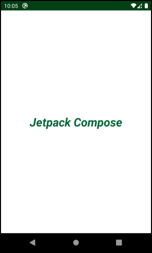

**风格化的文本**

你已经应用了所有的样式，文本看起来更漂亮了请自由尝试其他参数，并根据自己的喜好改变文本。

直到现在，每次你在文本中做了改变，你都必须建立和运行你的应用程序，然后才能看到结果。这使得你很难构建一个复杂的用户界面，因为你必须在脑海中描绘出一切。现在你将学会如何避免这种情况，使你的生活更加轻松

### 预览变化

当你使用XML时，有一个选项可以分割屏幕，这样你可以同时看到代码和用户界面的预览。你会很高兴地知道，Compose也提供了类似的选项

要使用它，你需要用@Preview来注释你的可组合函数，像这样。

```kotlin
@Composable 
@Preview fun MyText() {
  Text(...) 
}

```

这允许Compose编译器分析可合成的函数，并在Android Studio中生成它的预览。现在，在Android Studio的右上方选择分割选项。你会看到一个像这样的预览。

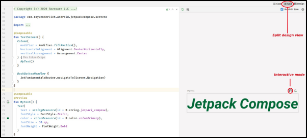

**预览**

你还可以点击预览上方的小图标，进入互动模式。这可以让你执行动作并看到状态的变化。对于当前的屏幕来说，你不需要这样做，但当你构建更大的UI组件时，它是有帮助的。

需要记住的一点是，如果你使用预览，你的功能需要或者。

• 没有参数

• 所有参数都有默认参数

• 提供一个@PreviewParameter以及一个特殊的工厂，提供你想在UI上绘制的参数。

但显示静态文本有点枯燥无味!接下来，你将看到如何实现一个输入字段，这样用户就可以在应用程序中写东西了

### 文本字段

在传统的Android UI工具包中，你会使用EditText来向用户显示输入字段。与之对应的可组合函数被称为TextField。打开TextFieldScreen.kt，你会看到两个可组合的函数。

```kotlin
@Composable
fun TextFieldScreen() {
  Column(
      modifier = Modifier.fillMaxSize(),
      horizontalAlignment = Alignment.CenterHorizontally,
      verticalArrangement = Arrangement.Center
  ) {
    MyTextField()
  }

  BackButtonHandler {
    JetFundamentalsRouter.navigateTo(Screen.Navigation)
  }
}

@Composable
fun MyTextField() {
  //TODO add your code here
}
```

你将在MyTextField()中制作你的第一个TextField，与你在前面的例子中的做法类似。改变MyTextField()中的代码，像这样。

```kotlin
@Composable fun MyTextField() {
  val textValue = remember { mutableStateOf("") }

	TextField( 
    value = textValue.value, 
    onValueChange = { textValue.value = it }, 
    label = {} 
  )
}
```


确保从androidx.compose.material导入TextField包，从androidx.compose.runtime导入remember()和mutableStateOf()包。

对于一个简单的输入字段来说，这似乎是很多的代码，但它在一分钟内就会有意义！ :]

为了让你的TextField正常工作，你必须提供一个在重组过程中不改变的值--换句话说，一个状态值。使用mutableStateOf()，你把一个空的字符串包成一个状态保持器，你将用它来存储和显示输入字段中的文本。

你还将状态包装到 remember() 中，这是 Compose 告诉重组器该值应该通过重组来保持的方式。如果你不在这里使用remember()，每次你改变状态时，它就会丢失并被设置为默认值--一个空字符串。

接下来，你将textValue持有人的值连接到TextField，在onValueChange回调中，你改变了状态持有人的内部值。

现在要发生的是，每当用户点击一个键盘按钮，内部状态就会改变。这将触发重新组合，并用新的文本重新绘制TextField。这一切都会发生得非常快，而你将无法注意到其中的差别

构建并运行该应用程序以查看你的改动。点击导航中的TextField按钮，你会看到这样一个屏幕。

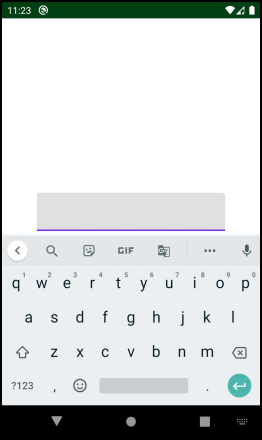

**非类型化的文本字段**

这是一个有一个空TextField的屏幕。当你点击该文本时，一个键盘打开，你可以正常书写，正如你所期望的。

#### 改进TextField

如果你仔细看一下屏幕，你会发现当前的TextField是非常基本的。它缺少一个提示和一些样式，如边框。

为了添加提示和边框，你将使用一种特殊类型的TextField，叫做OutlinedTextField。但在你这样做之前，先探索一下TextField的签名，这样你就知道如何对该组件进行样式设计。

看一下TextField的签名，你会看到这样的东西。

```kotlin
@Composable 
fun TextField( 
  value: String, 
  onValueChange: (String) -> Unit, 
  label: @Composable () -> Unit, 
  keyboardOptions: KeyboardOptions = KeyboardOptions.Default, 
  onImeActionPerformed: (ImeAction, SoftwareKeyboardController?) -> Unit = { _, _ -> }, ...

)
```


像Text的可组合函数一样，TexField有许多参数可以改变它的风格。由于有些参数是相同的，本节将只解释最重要的新参数。

• value。显示在TextField内的当前文本。注意，它的类型是TextFieldValue而不是String。

• onValueChange。一个回调，每次用户输入新的东西时都会触发。该回调提供了一个新的TextFieldValue，因此你可以更新显示的文本。

• label。显示在容器内的标签。当用户将注意力集中在文本上时，标签将在书写光标上方产生动画并停留在那里。

• keyboardOptions。设置键盘选项，如键盘类型和ImeAction。一些可用的键盘类型是。电子邮件、密码和数字，而重要的ImeAction是。Go, Search, Previous, Next and Done。

• onImeActionPerformed。一个回调，在每次用户做出执行ImeAction的输入动作时触发。

还有很多参数，但这些是你在大多数应用程序中会用到的一些核心功能。

请自由探索更多的这些参数和玩法，但现在，请进入OutlinedTextField组件，一个受材料设计启发的输入字段。:]

#### 用OutlinedTextField添加一个电子邮件字段

你的下一步是创建一个电子邮件输入，这是最常见的文本字段之一。把MyTextField的代码替换成以下内容。

```kotlin
@Composable
fun MyTextField() {
    val textValue = remember { mutableStateOf("") }

    val primaryColor = colorResource(id = R.color.colorPrimary)

    OutlinedTextField(
        label = { Text(text = stringResource(id = R.string.email)) },
        colors = TextFieldDefaults.outlinedTextFieldColors(
            focusedBorderColor = primaryColor,
            focusedLabelColor = primaryColor,
            cursorColor = primaryColor
        ),
        keyboardOptions = KeyboardOptions.Default.copy(keyboardType = KeyboardType.Email),
        value = textValue.value,
        onValueChange = { textValue.value = it },
    )
}
```


OutlinedTextField只是一个样式化的TextField，因为它使用一个特殊的内部函数在字段周围绘制和动画化一个边框和一个描述文本。

要添加一个提示，或者像在 Compose 中所说的那样添加一个标签，你可以使用标签属性并传入另一个可组合函数。这就是 Compose 的魅力所在--只要你需要某些功能，你就可以使用其他可组合的函数来满足这个需要。在这个例子中，你需要显示一个文本，通过使用Text()给用户一个关于输入数据的提示。

你添加的第二个参数是颜色。它为TextField的不同部分改变颜色。在这种情况下，你用资源中的原色来改变聚焦状态下的边框和标签颜色以及光标颜色。

最后一个变化是将键盘类型改为键盘类型.Email。要做到这一点，你要使用KeyboardOptions.Default的实例，并以所需的键盘类型制作一个新的对象副本。这将打开一个键盘，使其在TextField处于焦点时更容易书写电子邮件域。

建立并运行你的应用程序来测试你的新的电子邮件输入。TextField屏幕将看起来像这样。

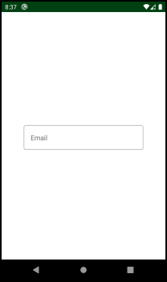

**风格化的文本字段**

该文本字段有一个边框和一个提示，上面写着："。电子邮件。点击它以获得焦点。

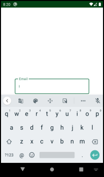

**聚焦的文本字段**

暗示动画到边框的顶部，你的文本字段用raywenderlich.com著名的绿色变得生动起来。很好!:]

下一步，你将学习如何按钮元素以及如何处理点击事件。

### Buttons

到目前为止，你已经学会了，你知道如何从屏幕上读取文本以及如何显示它。制作一个基本的屏幕，你需要的最后一样东西是一个按钮。

在Android世界中，有许多类型的按钮，但它们都有一个共同点：它们可以被点击。接下来，你将看到如何实现一个按钮，以及如何处理点击的动作

打开ButtonsScreen.kt，看一下代码。

```kotlin
@Composable
fun ExploreButtonsScreen() {
  Column(modifier = Modifier.fillMaxSize(),
      horizontalAlignment = Alignment.CenterHorizontally,
      verticalArrangement = Arrangement.Center) {

    MyButton()
    MyRadioGroup()
    MyFloatingActionButton()

    BackButtonHandler {
      JetFundamentalsRouter.navigateTo(Screen.Navigation)
    }
  }
}

@Composable
fun MyButton() {
  //TODO add your code here
}

@Composable
fun MyRadioGroup() {
  //TODO add your code here
}

@Composable
fun MyFloatingActionButton() {
  //TODO add your code here
}
```


你可以看到文件中有四个可组合的函数。 

ExploreButtonsScreen()集中并显示主布局。你将使用这三个空函数来练习不同类型的按钮。

#### 建立一个登录按钮

首先，你要做一个你期望在登录时看到的基本按钮。首先在MyButton()中添加以下代码。

```kotlin
@Composable
fun MyButton() {
    Button(
        onClick = {},
        colors = ButtonDefaults.buttonColors(backgroundColor = colorResource(id = R.color.colorPrimary)),
        border = BorderStroke(1.dp, color = colorResource(id = R.color.colorPrimaryDark))
    ) { Text(text = stringResource(id = R.string.button_text), color = Color.White) }

}
```


在上面的代码中，当用户点击按钮时，你并没有执行任何操作。然而，你使用了一个空的lambda表达式作为onClick来保持它的启用。

要改变按钮的背景颜色，你可以使用ButtonDefaults实例，并以所需的背景颜色为参数调用 buttonColors 方法。如果需要，这个方法还允许你改变disabledBackgroundColor、contentColor和disabledContentColor。

你还可以使用BorderStroke来设置背景颜色，并添加一个宽度为1dp的边框和一个深色的主色调。每个BorderStroke都必须定义一个颜色和宽度。你可以将它们添加到许多组件中，如按钮、卡片等。

最后，你添加一个Text()作为按钮的内容，就像你上面学到的那样，并将文本颜色设置为Color.White。颜色组件是Compose框架的另一部分，它定义了常用的颜色，如白色、黑色、灰色等等。

现在，建立并运行该应用程序，并打开按钮屏幕。

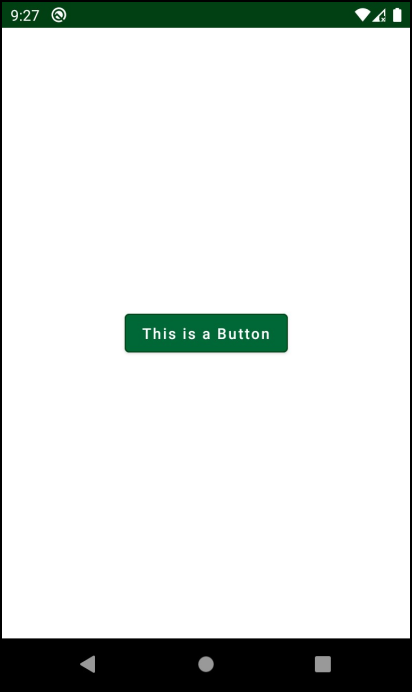

**钮扣**

这就是Jetpack Compose中带边框的按钮的样子。它是一个遵循Material Design的相当简单的组件。你没有在onClick处理程序中添加任何具体的动作，但你知道这个想法！你可以把它设置为调用任何你想执行的函数或其他代码。你可以把它设置为在用户点击按钮时调用任何你想执行的函数或其他代码。

##### 探索按钮

现在，看看一个Button可组合函数的签名，看看它能做什么。

```kotlin
@Composable
fun Button(
    onClick: () -> Unit,
    enabled: Boolean = true,
    elevation: ButtonElevation? = ButtonDefaults.elevation(),
    shape: Shape = MaterialTheme.shapes.small,
    border: BorderStroke? = null,
    content: @Composable RowScope.() -> Unit
)
```


阅读关于每个最重要的参数的作用，以获得更好的理解。

• onClick。这是你在按钮上最常用的属性，当用户点击按钮的时候，它会调用一个函数。如果你不提供onClick，该按钮将被禁用。

• enabled。允许你控制一个按钮何时可被点击。

• elevation。设置一个按钮的海拔高度。默认标高为2dp。

• shape。定义了按钮的形状和阴影。通过MaterialTheme.shapes，你可以选择一个形状的大小：小、中、大。

• border。在你的按钮周围画一个边框。

• content。一个可组合的函数，显示按钮内的内容，通常是文本。

同样，还有许多参数，但为了简单起见，只列出最重要的参数。

现在你知道了Button的可能性，你可以根据你的需要创建尽可能多的按钮，以及它们的边框和背景颜色。

接下来，你将制作一个单选按钮，或者更确切地说，制作一组单选按钮。

#### RadioButton

正如你所期望的那样，你用来制作单选按钮的可组合函数被命名为RadioButton。单选按钮是一个小的、圆形的按钮，用户可以选择。它们通常用于多选表格或过滤器，在那里你一次只能选择一个选项。例如，你可能有一个单选按钮选择接收新闻简报，另一个选择退出，同时只能选择这两个选项中的一个。这种类型的组件被称为单选组。

在这个时候，Jetpack Compose还没有一个广播组的实现，所以你必须自己做一个自定义的组。:]

将MyRadioGroup中的代码改为如下。

```kotlin
@Composable
fun MyRadioGroup() {
    val radioButtons = listOf(0, 1, 2) // 1

    val selectedButton = remember { mutableStateOf(radioButtons.first()) } // 2

    Column {
        radioButtons.forEach { index -> // 3 
            val isSelected = index == selectedButton.value
            val colors = RadioButtonDefaults.colors( // 4 
                selectedColor = colorResource(id = R.color.colorPrimary),
                unselectedColor = colorResource(id = R.color.colorPrimaryDark),
                disabledColor = Color.LightGray
            )

            RadioButton( // 5 
                colors = colors,
                selected = isSelected,
                onClick = { selectedButton.value = index } // 6 
            )
        }
    }
}
```


要建立一个广播组，你必须采取许多步骤。

1. 你创建了一个包含三个不同选项的列表，其数值范围从0到2，这些选项是代表每个单选按钮的索引。

2. 你创建一个selectedButton状态，记住当前选择的按钮。它也默认选择第一个按钮。

3. 使用for循环，你在循环的每一次迭代中向你的Column添加一个按钮。

4. 你可以用以下方法改变RadioButton的颜色 

RadioButtonDefaults.color()。你为RadioButton可以出现的每一种不同的状态传入一种颜色。

5. 在每个循环迭代结束时，你建立一个RadioButton，并在它被选中时设置onClick处理器和它的颜色。

6. 每当用户点击按钮时，你将改变状态中选择的按钮。这就触发了一个重新组合，你的用户界面就会更新!

现在，构建并运行你的应用程序，试试你的新创作。

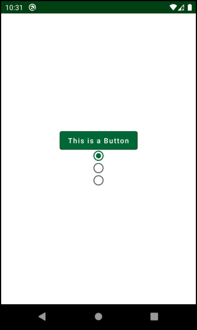

**单选按钮**

现在你在屏幕上看到三个单选按钮。第一个是默认的。当你选择另一个单选按钮时，你可以看到按钮之间的切换动画。

##### 探索RadioButton

要了解更多关于RadioButton的信息，请看它的签名。

```kotlin
@Composable
fun RadioButton(
    selected: Boolean,
    onClick: (() -> Unit)?,
    modifier: Modifier = Modifier,
    enabled: Boolean = true,
    interactionSource: MutableInteractionSource = remember { MutableInteractionSource() },
    colors: RadioButtonColors = RadioButtonDefaults.colors()
)
```


参数比平时少，但这里是最重要的参数。

• selected。将按钮的当前状态在选定和未选定之间切换。

• interactionSource。允许你定义互动，如拖动手势和触摸。

• colors。RadioButton的颜色组合。使用 

RadioButtonDefaults实例调用color()来改变不同状态下的默认颜色。不同状态的可用颜色是selectedColor、unselectedColor和disabledColor。

这篇关于常用UI组件的深度概述，你差不多已经看完了。 

还有一种类型的按钮需要你去完成--浮动操作按钮（FloatingActionButtons）。

#### FloatingActionButton

浮动的动作按钮之所以这样命名，是因为它们有一个很高的高度，将它们置于屏幕上的其他内容之上，就像它们漂浮在空中一样。 

它们被用于应用程序内部的主要操作，最常见的是创建新项目。

下一步，你将创建一个使用图标的简单浮动动作按钮。首先，将MyActionButton中的代码改为如下。

```kotlin
@Composable
fun MyFloatingActionButton() {
    FloatingActionButton(
        onClick = {},
        backgroundColor = colorResource(id = R.color.colorPrimary),
        contentColor = Color.White,
        content = {
            Icon(
                Icons.Filled.Favorite, contentDescription = "Test FAB"
            )
        })
}
```


在这里，你添加一个空的lambda表达式来保持按钮的启用。接下来，你设置背景和内容的颜色。最后，你通过使用Icon()和预定义的、填充的、Favorite的图标和一个测试的contentDescription来设置图标的可访问性。

图标对象包含了一些预定义的、在Android世界中常用的图标。类似于颜色对象对颜色的作用，你可以选择填充式、默认式、轮廓式和其他类型的图标，以及预定义的矢量，如收藏夹、添加、箭头返回和其他矢量资产。

##### 探索浮动操作按钮

要了解更多关于FloatingActionButton的信息，请查看其签名。

```kotlin
@Composable
fun FloatingActionButton(
    onClick: () -> Unit,
    modifier: Modifier = Modifier,
    interactionSource: MutableInteractionSource = remember { MutableInteractionSource() },
    shape: Shape = MaterialTheme.shapes.small.copy(CornerSize(percent = 50)),
    backgroundColor: Color = MaterialTheme.colors.secondary,
    contentColor: Color = contentColorFor(backgroundColor),
    elevation: FloatingActionButtonElevation = FloatingActionButtonDefaults.elevation(),
    content: @Composable () -> Unit
)
```


你已经熟悉了大部分（如果不是全部）参数。这里要记住的最重要的事情是，一个浮动行动按钮有一个高度，可以点击，你可以通过使用另一个可组合的函数给它添加一个内容。在大多数情况下，你会想使用Icon()来表示内容。Icon()的签名非常简单。

```kotlin
@Composable 
fun Icon(
	imageVector: ImageVector,
	contentDescription: String?,
	modifier: Modifier = Modifier,
	tint: Color = LocalContentColor.current.copy(alpha = LocalContentAlpha.current) 
)
```


Icon的主要特点是它允许你设置一个ImageVector类型的矢量，作为一个图标。Icon有多种实现，允许你提供不同类型的资产，如ImageBitmap和Painter!

现在你已经完成了FloatingActionButton，构建并运行该应用程序以查看结果。

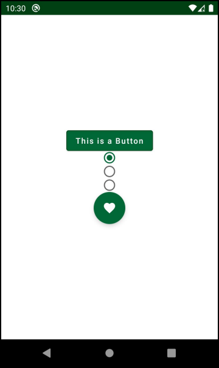

**行动按钮**

你的浮动行动按钮现在出现了一个心形的喜爱图标。当你点击它时，它会产生一个波纹效果。你还可以注意到它下面有一个小阴影，因为它的高度。

这些纽扣看起来很不错，而且你也学到了很多关于它们的知识!干得好!:]

##### 有更多的按钮可以使用

下面是对Jetpack Compose中其他类型按钮的简要介绍。

• IconButton。类似于浮动的行动按钮，但没有浮动的部分--它没有海拔高度。它通常用于导航。

• OutlinedButton。与OutlinedTextField类似，它提供了额外的功能，如边框。

• IconToggleButton。有两种状态的图标，你可以切换开启和关闭。

• TextButton:最常见于卡片和对话框中，使用这个按钮进行不太明显的操作。

在了解了所有这些按钮之后，你准备继续前进，发现新的元素。

### Progress Bars

当你执行长时间的操作，如从服务器或数据库中获取数据时，显示一个进度条是很好的做法。进度条通过显示一个动画来减少等待时间过长的感觉，它让用户感觉到有事情正在发生。比起在数据加载前什么都不做的僵硬屏幕，这是个更好的用户体验。

当你只想让用户知道工作正在进行时，旋转的动画进度条是一个不错的选择。如果你想跟踪进度，并向用户显示他们离完成工作有多远，你需要一个进度条，在进度发生时用一种颜色填充。这种情况在下载或上传文件时非常常见。

Jetpack Compose提供了处理这两种情况的解决方案。打开

ProgressIndicatorScreen.kt，注意这个文件中只有一个可组合的函数。

```kotlin
@Composable
fun ProgressIndicatorScreen() {

  Column(
      modifier = Modifier.fillMaxSize(),
      horizontalAlignment = Alignment.CenterHorizontally,
      verticalArrangement = Arrangement.Center
  ) {
    //TODO add your code here
  }

  BackButtonHandler {
    JetFundamentalsRouter.navigateTo(Screen.Navigation)
  }
}
```


这是因为用Jetpack Compose显示进度条非常容易，你不需要额外的自定义可组合函数。

试着在Column()内添加一个圆形和一个线性进度条，像这样。

```kotlin
Column(
        modifier = Modifier.fillMaxSize(),
        horizontalAlignment = Alignment.CenterHorizontally,
        verticalArrangement = Arrangement.Center
    ) {
        CircularProgressIndicator(
            color = colorResource(id = R.color.colorPrimary),
            strokeWidth = 5.dp
        ) 
        LinearProgressIndicator (progress = 0.5f)
    }
```


这一列应该保持原样--它只是用来定位里面的元素，并使它们居中。

你在这里建立两种类型的进度指示器。首先，你建立了CircularProgressIndicator，定义了一个指标的颜色和一个strokeWidth。这些属性可以作为样式设计。你不需要自己定义动画，它已经被预置在组件中了。

然后，你建立了LinearProgressIndicator，并设置其进度为50%。通常情况下，当你的操作在系统中被计算时，你会更新这个进度，但是为了简单起见，在这个练习中你会让它成为静态的。

#### 探索进展指标

由于这些组件的实现非常简单，它们的定义也非常简单。打开CircularProgressIndicator的可组合函数，你会看到下面的内容。

```kotlin
@Composable
fun CircularProgressIndicator(
    modifier: Modifier = Modifier,
    color: Color = MaterialTheme.colors.primary,
    strokeWidth: Dp = ProgressIndicatorDefaults.StrokeWidth
)

```


这个函数提供了一个小范围的风格设计。最重要的参数是进度，范围从0.0到1.0 - 这个数字决定了进度条的填充比例。如果你不设置进度，进度条将运行一个无限的旋转动画。

其他造型选项改变颜色和笔画宽度。默认的笔画宽度是4分。

另一方面，LinearProgressIndicator的源代码看起来像这样。

```
@Composable
fun LinearProgressIndicator(
    progress: Float,
    modifier: Modifier = Modifier,
    color: Color = MaterialTheme.colors.primary,
    backgroundColor: Color = color.copy(alpha = IndicatorBackgroundOpacity)
)
```


选项几乎相同，只是它不提供改变笔画宽度的功能。虽然你通常使用线性进度条来表示静态进度，但你也可以通过不设置进度参数来使用它的无限动画。然后，动画将从左到右，直到操作完成。

现在你已经探索了这些进度条，构建并运行应用程序，然后从导航菜单中打开进度屏幕。

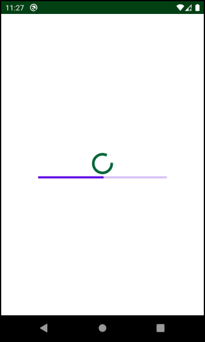

**进度条**

你可以看到屏幕上有两个进度条。圆形的总是在动画中旋转，而线性的则在一半的地方保持静止。

这个例子显示了Jetpack Compose使你在制作应用程序时实现最常见的功能是多么简单和容易!:]

现在，是时候学习一个更复杂的元素了，在那里你必须处理状态和动作。

### AlertDialog

你要实现的下一个可组合函数是一个AlertDialog。对话框用于向用户显示一条信息，通常要求用户采取某种行动。例如，你可以用一个对话框来确认用户是否要删除一个项目，要求他们对应用程序进行评价等等。它们在应用程序中非常常见，并在所有操作系统中使用--不仅仅是安卓系统

处理一个对话框的最重要部分是处理决定何时显示或取消该对话框的状态。你将从添加一个只有一个按钮的警报对话框开始。确认。当用户点击该按钮或在对话框外点击时，该对话框将关闭。

为了实现这一行为，打开AlertDialogScreen.kt，将MyAlertDialog里面的代码改为如下。

```kotlin
@Composable
fun MyAlertDialog() {
    val shouldShowDialog = remember { mutableStateOf(true) } // 1

    if (shouldShowDialog.value) { // 2
        AlertDialog( // 3
            onDismissRequest = { // 4
                shouldShowDialog.value = false                JetFundamentalsRouter.navigateTo(Screen.Navigation)
            },
          // 5
            title = {
                Text(
                    text = stringResource(
                        id =
                        R.string.alert_dialog_title
                    )
                )
            },
            text = {
                Text(
                    text = stringResource(
                        id =
                        R.string.alert_dialog_text
                    )
                )
            },
            confirmButton = { // 6
                Button(
                    colors = ButtonDefaults.buttonColors(
                        backgroundColor =
                        colorResource(id = R.color.colorPrimary)
                    ),
                    onClick = {
                        shouldShowDialog.value = false
                        JetFundamentalsRouter.navigateTo(Screen.Navigation)
                    }
                ) {
                    Text(
                        text = stringResource(id = R.string.confirm),
                        color = Color.White
                    )
                }
            }
        )
    }
}
```


有很多代码你不得不添加，但主要是使用你以前遇到过的组件，如文本和按钮元素！这是很重要的。按部就班地进行吧。

1. 你添加了一个代表是否显示对话框的状态，并将初始状态设置为真。

2. 使用if语句，你可以添加逻辑来显示AlertDialog，只有当状态值为真时。  因为 Compose 通过调用函数来渲染用户界面，如果值为假，它就不会调用函数--反过来，它也不会显示对话框

3. 使用AlertDialog()，你创建了你的对话框，它有一个标题、一个文本信息、一个解雇请求处理程序和一个confirmButton()。

4. 在onDismissRequest中，你改变了对话框的状态，将其驳回，然后告诉Navigation返回到主导航屏幕。JetFundamentalsRouter是一个用于导航的预焙烧类。你需要调用navigateTo并添加你想去的屏幕作为参数。

5. 你将标题和文本设置为两个Text()，并使用提供的stringResources()来填充。

6. 最后，你添加一个Button()作为confirmButton。点击该按钮，就像在onDismissRequest()中一样，可以撤销对话框并导航到主导航屏幕。你添加一个Text()来显示按钮内的文本，并使用白色和预定义的字符串资源。

现在你已经准备好了对话框，构建并运行该应用程序。在导航菜单上，选择警报对话框界面。

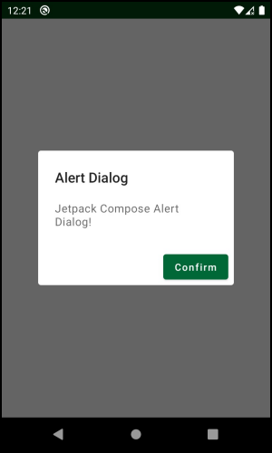

**警报对话框**

打开屏幕后，会自动出现一个警报对话框。它有一个基本的标题和你设置的文本。在对话框外或在确认按钮内点击，就会撤销对话框，并返回到前一个屏幕。

由于代码的大小，实现警报对话框可能看起来很复杂，但大部分的代码只涉及到警报的样式和处理点击事件。

对话框在Jetpack Compose中很容易创建，但请记住，你必须处理状态，当你想在多个屏幕上重复使用对话框时，这需要更多的努力。

#### 探索AlertDialog

还需要注意的是，Jetpack compose使用Material Design对话框。最常见的类型是你使用的AlertDialog，所以打开它的签名，看看它能做什么。

```kotlin
@Composable
fun AlertDialog(
    onDismissRequest: () -> Unit,
    confirmButton: @Composable () -> Unit,
    modifier: Modifier = Modifier,
    dismissButton: @Composable (() -> Unit)? = null,
    title: @Composable (() -> Unit)? = null,
    text: @Composable (() -> Unit)? = null,
    shape: Shape = MaterialTheme.shapes.medium,
    backgroundColor: Color = MaterialTheme.colors.surface,
    contentColor: Color = contentColorFor(backgroundColor),
    properties: DialogProperties = DialogProperties()
)
```


这里有新的参数需要通过。

• onDismissRequest:当用户在对话框外点击或按下返回按钮时执行。

• confirmButton。一个确认提议的行动的按钮。它通常是一个TextButton。

• dismissButton。这个按钮可以解除一个动作。它通常也是一个TextButton。

• title。用一个可组合的函数设置标题文本。

• text。用一个可组合的函数设置对话框内的文本。

• contentColor：AlertDialog中的元素所使用的颜色。

• properties。用于进一步定制的平台特定属性。

做得很好，经历了所有这些组件，学到了很多关于Jetpack Compose的知识!:]

### 关键点

• 用@Composable创建可组合函数。

• 在一个活动中使用setContent()作为你的可组合函数的根。

• 使用remember()来保存你的状态的值，通过重新组合。

• 通过添加@Preview来预览你的可组合函数。

• Text()显示一个简单的文本，但它也被用作其他可组合函数中的一个子组件。

• TextField()允许你检索来自用户的输入。对于更多的样式选择，请使用OutlinedTextField()。

• 使用Button()作为你应用中处理点击事件的主要元素。

• 使用RadioButton()作为用户可以选择的一个元素。要制作一组单选按钮，你必须自己编写逻辑。

• 当你需要一个显示在其他元素之上的按钮时，使用FloatingActionButton()。

• CircularProgressIndicator()和LinearProgressIndicator()允许你跟踪进度或显示一个加载动画。

• AlertDialog()很容易使用，但需要状态处理才能工作。

• 回顾一下可组合函数所提供的所有参数，以便更好地了解它们能做什么。

• 使用图标和颜色对象来访问由Jetpack Compose框架准备的现有图标和颜色列表。

### 今后该何去何从？

在本章中，你学习了如何创建可组合的函数，以及它们是如何在引擎盖下工作的。你写了一些代表UI元素的基本函数，几乎所有的应用程序都在使用这些函数。

目前缺少的一件事是帮助你在屏幕上定位元素的东西。如果你想了解更多关于不同的基于Material Design的组件，请查看[官方参考指南](https://developer.android.com/reference/kotlin/androidx/compose/material/package-summary)

在下一章中，你将学习如何使用容器，如Column, Row, Box，以及如何对不同的元素进行分组，以创建一个更复杂的用户界面!:]
