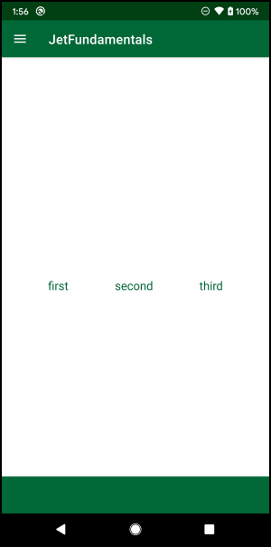

# 第三章：在Compose中构建布局 

在本章中，你将学习Jetpack Compose的布局。由于每个布局都有不同的目的，你将学习如何为你想建立的用户界面选择正确的布局。然后，你将在不同类型的布局中组合可组合的功能，以制作一个更复杂的用户界面。

在上一章中，你专注于在屏幕上显示元素；这一次，你将专注于定位这些元素。

像往常一样，最好从基本的东西开始。请继续阅读，了解Jetpack Compose在安卓系统中的基本布局的替代方案。

## 在Jetpack Compose中使用基本布局

在上一章中，你学会了如何编写基本的可组合函数。下一步是通过将这些元素以特定的方式定位--安排它们，来建立一个更复杂的用户界面。

在使用XML时，你通过使用布局来实现，布局是一个扩展了ViewGroup的类。ViewGroup可以容纳0个或更多的视图，并负责测量其所有的子代，并根据不同的规则将它们放置在屏幕上。

在Jetpack Compose中，取代ViewGroup的只是叫Layout。看一下源代码，了解Layout()是如何工作的。

```kotlin
@Composable inline fun Layout( 
  content: @Composable () -> Unit, 
  modifier: Modifier = Modifier, 
  measurePolicy: MeasurePolicy 
)
```

这里有两个重要的参数。

1. content。一个可组合的函数，持有Layout的孩子。

2. measurePolicy。负责定义测量和布局行为。

测量和定位元素是一项复杂的工作。这就是为什么Jetpack Compose提供预定义的布局类型，为你处理这个问题。

这些预定义布局的每个实现都有自己的逻辑来定位子项目。考虑到这一点，有垂直或水平排列项目的布局，有用导航抽屉构建复杂UI的布局，还有更简单的布局，在一个盒子里堆叠在一起。所有这些布局都使用measurePolicy，以不同的方式定位项目，所以你不必自己去做

当考虑到基本的布局时，你首先想到的可能是LinearLayout。你的下一步是了解LinearLayout的可组合对应物。

## 线型布局

要遵循本章的代码，请确保打开本章的启动项目，在本章材料中。

LinearLayout的特点是将它的子代定位在一个线性流中。这种流动被称为方向，可以是水平的或垂直的。在Jetpack Compose中，有两个不同的可组合函数来替代LinearLayout，每个方向都有一个。你将从水平方向的版本开始--行。

### 使用Rows

打开RowScreen.kt，看看里面。你会看到一个空的可组合函数，MyRow()，你将在这里写下你的代码。当涉及到水平布局时，你将添加一个Row，一个LinearLayout的对应物。

首先，用以下代码替换MyRow()。

```kotlin
@Composable
fun MyRow() {
  Row(verticalAlignment = Alignment.CenterVertically,
    horizontalArrangement = Arrangement.SpaceEvenly,
    modifier = Modifier.fillMaxSize()) {

    THREE_ELEMENT_LIST.forEach { textResId ->
      Text(
        text = stringResource(id = textResId),
        fontSize = 18.sp
      )
    }
  }
}
```


在这里，你添加了一个带有几个不同参数的Row()。

你使用了Alignment.CenterVertically来使孩子们垂直居中，使用了Arrangement.SpaceEvenly来使每个孩子有相等的空间，使用了Modifier.fillMaxSize()来使布局充满整个屏幕。

这最后一步很重要，因为否则的话，一个行将只占用画出其子项所需的空间，因为它的子项都没有定义重量。如果不填满屏幕尺寸，排列和对齐就不重要了，所有项目都会被放在屏幕的左上方，一个接一个。稍后你会了解更多关于权重的知识。

在Row()中，你使用一个预定义的列表放置了三个文本，该列表用于存放字符串资源。你还增加了它们的字体大小以利于阅读。

建立并运行，然后从导航菜单中点选 "行 "按钮，看一下屏幕。


**行**

你可以看到三个文本字段被垂直居中，并被安排在四边有相等的间距。

注意：这是一个尝试不同安排并观察其结果的好时机。

现在你知道了如何在行内水平定位元素，现在是时候探索Row()签名，看看你还能做什么。

### 探索Rows

打开Row()签名，看看你能用它做什么。

```kotlin
@Composable
inline fun Row(
  modifier: Modifier = Modifier, 
  horizontalArrangement: Arrangement.Horizontal = Arrangement.Start, 
  verticalAlignment: Alignment.Vertical = Alignment.Top,    	content: @Composable RowScope.() -> Unit 
)
```

如你所见，有两个新参数供你使用。 

水平排列（horizontalArrangement）和垂直排列（verticalAlignment）。

你用排列方式来定位孩子们彼此之间的关系。可能的水平排列是：。

• SpaceBetween:Row()为每个孩子安排了等量的空间，没有计算第一个孩子之前或最后一个孩子之后的间隔。

• SpaceEvenly:与SpaceBetween类似，Row()以等量的空间放置孩子，但这次它包括起始或结束间距。

• SpaceAround。Row()与SpaceEvenly一样放置子代，但在连续的子代之间减少一半的空间。

• 中心，开始，结束。Row()将孩子放在中心、开始或结束处，中间没有空格。

使用Alignment，你可以以特定的方式在父类中定位子类。具体来说，verticalAlignment以三种不同的方式垂直排列子代。

• 顶部：将子代与父代的顶部对齐。

• CenterVertically:将子节点垂直排列在父节点的中心。

• 底部。将子代与父代的底部对齐。

在行中定位孩子的最后一种方法是使用权重。要添加权重，你需要使用一种特殊的方式来访问Compose中的weight()修改器。在上面这个有三个文本元素的例子中，你可以这样使用它。

```kotlin
@Composable 
fun RowScope.MyRow() { // 这个组合式是在Row内部调用的 Text( 
   modifier = Modifier.weight(1 / 3f), // 这里 
   ... 
  )   
}
```

你可以通过使用一个修改器参数来设置一个可组合的权重。权重只能在RowScope内设置，RowScope是Row()的子对象的范围。如果你直接在Row()里面写代码，你可以使用Modifier.weight()而不需要额外的代码。

如果你需要制作一个在行中使用的自定义可组合函数，你的可组合函数需要是RowScope的一个扩展函数，就像上面的例子一样。请注意，在这种情况下，你将不能在Row()之外使用这个可组合函数。

在weight()中，你定义了子代将占父代的多大比例。在这个例子中，你给了每个孩子三分之一的父本！ :]

如果一个孩子没有权重，该行将首先使用首选的宽度来计算其宽度，例如使用size()修改器。然后，它将根据剩余的可用空间，按比例计算有权重的孩子的尺寸。

这意味着，如果有一个元素占用了200dp的宽度，而你使用了权重，那么加权的子元素将占用屏幕的宽度，减去已经占用的200dp。如果没有一个子元素有权重，Row()将尽可能的小，以容纳所有的子元素而不产生间隔。

行代表项目的**水平**排列，这就是它的名字。按照这个逻辑，项目的垂直排列被称为列。让我们看看如何使用它!

### 使用Rows

纵向的LinearLayout的Compose对应物是Column。

打开ColumnScreen.kt，你会看到一个与之前类似的情况--一个空的MyColumn()，你将实现它。

填入函数，所以它看起来像这样。

```kotlin
@Composable
fun MyColumn() {
  Column(
    horizontalAlignment = Alignment.CenterHorizontally,
    verticalArrangement = Arrangement.SpaceEvenly,
    modifier = Modifier.fillMaxSize()
  ) {

    THREE_ELEMENT_LIST.forEach { textResId ->
      Text(
        text = stringResource(id = textResId),
        fontSize = 22.sp
      )
    }
  }
}
```


Column()的实现和Row()是一样的，只是你把安排和排列从垂直方向换成了水平方向。这是因为在Column中，项目已经被垂直放置了，你需要定义它们在水平方向上的行为，以及如何在垂直方向上的空间。对于行，情况正好相反--项目是水平放置的，而行需要知道它们在垂直方向上的表现以及如何在水平方向上给它们留出空间。

建立并运行，并从导航菜单中选择 "列 "按钮。


**栏目**

这一次，你看到这些项目是垂直排列，而不是水平排列，间距相同。

现在，你已经看到了Column和Row是如何与LinearLayouts相似的。然而，它们更强大，因为你可以用几种不同的方式来安排子节点--这是 LinearLayout 所不允许的。

### 探索Column

现在你已经学会了如何使用列，通过打开Column()签名，检查它们与行有什么不同。

```kotlin
@Composable 
inline fun Column( 
  modifier: Modifier = Modifier, 
  verticalArrangement: Arrangement.Vertical = Arrangement.Top, 
  horizontalAlignment: Alignment.Horizontal = Alignment.Start, 
  content: @Composable ColumnScope.() -> Unit 
)
```

正如你之前学到的，参数几乎是一样的，但仔细看看，你会发现布局交换了安排和排列。这意味着你可以在列中做所有与行中相同的事情，但方向不同。

接下来，你会了解到FrameLayout的一个可组合的对应物，叫做Box。

## 使用Boxes

FrameLayout的可组合对应物被称为Box。就像 

FrameLayout，它用于显示相对于其父辈边缘的子女，并允许你堆叠子女。当你有需要显示在那些特定位置的元素时，或者当你想显示重叠的元素时，例如对话框，这很有用。

现在，打开BoxScreen.kt，你会发现通常的空函数，MyBox()。添加下面的代码来完成它。

```kotlin
@Composable
fun MyBox(
  modifier: Modifier = Modifier,
  contentModifier: Modifier = Modifier
) {
  Box(modifier = modifier.fillMaxSize()) {
    Text(
      text = stringResource(id = R.string.first),
      fontSize = 22.sp,
      modifier = contentModifier.align(Alignment.TopStart)
    )

    Text(
      text = stringResource(id = R.string.second),
      fontSize = 22.sp,
      modifier = contentModifier.align(Alignment.Center)
    )

    Text(
      text = stringResource(id = R.string.third),
      fontSize = 22.sp,
      modifier = contentModifier.align(Alignment.BottomEnd)
    )
  }
}
```


这一次，该函数有两个参数--修改器和内容修改器，默认参数为修改器，即空的修改器实现。这样，你可以传入自定义的修改器，改变父框或每块内容的行为方式。之后，每个元素可以连锁调用更多的修改器函数，以应用额外的定制。

这是一个很好的做法，因为你可以传入一个自定义修改器，将填充或样式应用于父修改器，然后在整个应用程序中重复使用自定义样式，而最终的组件会根据组件的情况增加一些自定义。你可以对基于内容的修改器做同样的事情。

这里，Box()有三个文本字段，就像前面的例子一样，并使用align修改器将这些文本字段定位在三个不同的地方。

构建并运行，然后从导航菜单中选择方框选项来查看结果。


**箱子**

文本字段斜着出现在屏幕上，第一个字段在左上角，第二个字段在中间，最后一个字段在右下角。

在特定情况下，使用方框真的很有用，它们使定位元素变得非常容易。

### 探索Boxes

当你在一个盒子里有多个孩子时，他们会按照你在盒子里的顺序来渲染。下面是实现的方法。

```kotlin
@Composable 
fun Box( 
  modifier: Modifier = Modifier, 
  contentAlignment: Alignment = Alignment.TopStart,	
  propagateMinConstraints: Boolean = false, 
  content: @Composable BoxScope.() -> Unit 
)
```

contentAlignment允许你为它的子节点设置默认对齐方式。如果你想在每个子节点之间有不同的对齐方式，你需要通过在子节点上使用Modifier.align()来设置对齐方式。

propagateMinConstraints定义了最小约束是否应该被传递并用于内容。默认情况下，Box()的约束在测量孩子时不会被考虑。

你可以使用以下任何一种对齐方式，将对齐方式设置为屏幕的任何边缘，以及与中心的关系。

- TopStart

- TopCenter

- TopEnd

- CenterStart

- Center

- CenterEnd

- BottomStart

- BottomCenter

- BottomEnd

其中每个排列方式指的是方框将把一个项目附加到屏幕的哪个部分。

接下来，你会了解到Jetpack Compose中最早引入的布局之一：Surface。

### 使用Surfaces

Surface是一个新的布局，作为Material Design的一个核心隐喻。Surface的独特之处在于它一次只能容纳一个孩子，但它为其孩子的内容提供了许多造型选项，如标高、边框等等。

现在是时候看看Surface的运行情况了。打开SurfaceScreen.kt，看看其中的内容。

```kotlin
@Composable
fun SurfaceScreen(modifier: Modifier = Modifier) {

  Box(modifier = modifier.fillMaxSize()) {
    MySurface(modifier = modifier.align(Alignment.Center))
  }

  BackButtonHandler {
    JetFundamentalsRouter.navigateTo(Screen.Navigation)
  }
}

@Composable 
fun MySurface(modifier: Modifier) {  
  //TODO在这里写下你的代码 
}
```


为了展示Surface的所有功能，这个例子被设置在一个全屏的Box()和Alignment.Center里面。剩下的就是实现空的MySurface()。 

要做到这一点，请添加以下代码来完成它。

```kotlin
@Composable
fun MySurface(modifier: Modifier) {
  Surface(
    modifier = modifier.size(100.dp), // 1
    color = Color.LightGray, // 2
    contentColor = colorResource(id = R.color.colorPrimary), // 2
    elevation = 1.dp, // 3
    border = BorderStroke(1.dp, Color.Black) // 4
  ) {
    MyColumn() // 5
  }
}
```


这个代码中有许多小步骤，所以要一个一个地去看。

1. 你首先用Modifier.size()将曲面的高度和宽度都设置为100dp。

2. 然后你把表面的颜色设置为Color.LightGray，其内容的颜色设置为colorPrimary。表面将是灰色的，而Surface将把内容颜色设置为它所适用的所有元素--如Text元素。

3. 你增加一个1dp的海拔高度，使表面高于其他元素。

4. 你还可以添加一个黑色的边框来勾勒出Surface的轮廓。

5. 最后，你将Surface的子节点设置为你之前定义的MyColumn()。

这是一个完美的例子，说明了Jetpack Compose的力量。你可以重复使用你之前实现的每一个屏幕和可组合函数。这一次，你重用了MyColumn()，有三个垂直的Text元素。

建立并运行，并从导航菜单中选择Surface。


**表面**

在屏幕的中心是浅灰色的Surface，有黑色的边框。里面是之前实现的自定义列。

以前，所有的文本元素都使用默认的黑色，但使用contentColor，你改变了Column的孩子的文本颜色，使用raywenderlich.com的绿色。

如果你读的是灰度版的书，你可能不容易注意到颜色的变化，所以一定要建立并运行应用程序，直接在你的手机上预览这些变化

现在让我们看看Surface()还允许你做什么。

### 探索Surfaces

要看Surface()还有什么功能，请打开它的签名。

```kotlin
@Composable 
fun Surface( 
  modifier: Modifier = Modifier, 
  shape: Shape = RectangleShape, 
  color: Color = MaterialTheme.colors.surface,
  contentColor: Color = contentColorFor(color), 
  border: BorderStroke? = null, 
  elevation: Dp = 0.dp, 
  content: @Composable () -> Unit 
)
```


这些参数定义了Surface的目的。总共有五个目的。

• Shape。用定义的形状夹住孩子。

• color：用你定义的颜色填充形状。

• border。绘制边框，如果它们被设置了的话。

• elevation。设置标高并画出适当的阴影。

• content。用定义的contentColor为其内容设置默认颜色。

使用Surface最常见的方式是作为你的组件的根布局。因为它只能容纳一个子节点，这个子节点通常是另一个布局，用来定位其他的元素。Surface()并不处理定位问题，它的子代会处理。

注意：有一种流行的自定义Surface实现，叫做Card。一个Card有完全相同的五个用途，并且只能容纳一个孩子。Card和Surface的唯一区别是它的默认参数。卡片有一个预定义的标高，并使用一个带有圆角的材料主题形状。

现在你已经学会了Jetpack Compose中所有的基本布局，你的下一步是学习一个更高级的布局，让你创建一个功能齐全的用户界面。这个元素被称为 "支架"。

## Scaffold

Scaffold是Jetpack Compose推出的一个新的布局。你用它来实现一个遵循材料设计结构的视觉布局。它结合了几个不同的材料组件来构建一个完整的屏幕。因为Scaffold()提供了多种方法来构建你的用户界面，所以最好是跳到代码中去，玩一玩!

### 使用Scaffold

打开ScaffoldScreen.kt，看看里面。你会看到三个空的可组合函数。

```kotlin
@Composable fun MyScaffold() { 
  //todo write your code here 
}

@Composable fun MyTopAppBar(scaffoldState: ScaffoldState){ //todo write your code here 
}

@Composable fun MyBottomAppBar() { 
  //todo write your code here 
}
```


你将使用这些空函数来实现你自己的Scaffold，并添加顶部和底部的应用栏。

首先，在MyScaffold()中输入以下代码。它应该看起来像这样。

```kotlin
@Composable
fun MyScaffold() {
  val scaffoldState: ScaffoldState = rememberScaffoldState()
  val scope: CoroutineScope = rememberCoroutineScope()

  Scaffold(
    scaffoldState = scaffoldState,
    contentColor = colorResource(id = R.color.colorPrimary),
    content = { MyRow() },
    topBar = { MyTopAppBar(scaffoldState = scaffoldState, scope = scope) },
    bottomBar = { MyBottomAppBar() },
    drawerContent = { MyColumn() }
  )
}
```


首先，你通过调用rememberScaffoldState()来创建脚手架状态，然后你把它分配给Scaffold()。你将contentColor设置为应用程序的主色调，将内容设置为你之前实现的MyRow()。

然后你创建一个范围，使用rememberCoroutineScope()。你需要使用coroutines来触发某些Scaffold()行为，例如打开和关闭抽屉。

接下来，你将顶部和底部的条形内容设置为你还没有实现的可合成物。在这里你传递scaffoldState和将被coroutines使用的范围。

最后，你把MyColumn()设置为你的抽屉。这里有很多事情要做，但你一会儿就会看到它是如何连接在一起的。

请确保将MyTopAppBar的签名更新为以下内容。

```kotlin
@Composable fun MyTopAppBar(scaffoldState:ScaffoldState, scope:CoroutineScope) {
  
}
```


构建并运行，然后从导航菜单中点击脚手架选项。


Scaffold

你可以看到屏幕上有三个文本元素的MyRow()，但顶部和底部的应用程序栏没有显示。这并不奇怪，因为你还没有实现它们。]

此外，你可以通过从屏幕的左侧向右侧滑动来打开导航抽屉，以显示之前的MyColumn。现在让我们通过实现顶部和底部的栏来完成屏幕。

### 完成屏幕

为了完成这个屏幕，要实现剩下的两个可合成的东西。添加以下代码来完成MyTopAppBar()。

```kotlin
@Composable
fun MyTopAppBar(scaffoldState: ScaffoldState, scope: CoroutineScope) {
  val drawerState = scaffoldState.drawerState

  TopAppBar(
    navigationIcon = {
      IconButton(
        content = {
          Icon(
            Icons.Default.Menu,
            tint = Color.White,
            contentDescription = stringResource(R.string.menu)
          )
        },
        onClick = {
          scope.launch { if (drawerState.isClosed) drawerState.open() else drawerState.close() }
        }
      )
    },
    title = { Text(text = stringResource(id = R.string.app_name), color = Color.White) },
    backgroundColor = colorResource(id = R.color.colorPrimary)
  )
}
```


首先，你使用scaffoldState创建一个名为drawerState的新值。你将用它来访问脚手架的抽屉。

然后，你添加一个现有的预定义的TopAppBar()的实现。你添加一个IconButton()，将菜单图标和白色内容颜色作为导航图标。

对于IconButton()的点击动作，你通过改变scaffoldState里面的drawerState来启动打开抽屉。

要改变drawerState，你必须从一个coroutine或另一个暂停函数中进行。在这种情况下，你通过使用从父级可组合程序传递过来的范围来启动一个coroutine。这将在你点击菜单图标时打开抽屉。

navigationIcon是一个预定义的参数，你可以用来定义TopAppBar中的第一个元素，它通常代表一个Home或Back按钮。

然后你定义标题，代表一个简单的文本元素，显示应用程序的名称。在顶栏中显示标题是大多数Android应用程序的常见行为。

TopAppbar是一个相当简单的组件，它可以让你单独定义一个标高、一个背景颜色、标题和导航图标，或结合在一个内容函数中，以及为菜单动作定义另一个可组合函数的特殊动作。玩一玩其他的参数，看看它们是如何为TopAppBar设计风格的。

现在，实现MyBottomAppBar()。

```kotlin
@Composable
fun MyBottomAppBar() {
  BottomAppBar(
    content = {},
    backgroundColor = colorResource(id = R.color.colorPrimary))
}

```


对于MyBottomAppBar()，你添加了一个现有的底部应用栏的实现，内容为空。你还定义了colorPrimary作为背景色。

再次构建并运行，检查屏幕的变化。



带App Bar的Scaffold

现在屏幕上也显示了顶栏和底栏。顶栏包含菜单图标，当用户点击它时，就会打开抽屉。


**抽屉**

抽屉显示了来自MyColumn()的三个文本字段。要取消抽屉，只需点击屏幕上抽屉外的任何地方，或者向左滑动抽屉。

你现在已经学会了如何在布局中分组你的可合成物，定位它们并赋予它们共同的属性。你可以通过使用多个基本布局或一个高级布局来实现这一点。

除了Scaffold，高级布局还包括一个ConstraintLayout。ConstraintLayout让你在元素之间进行约束，就像你在XML中找到的版本。

你将在第9章 "在可组合程序中使用约束集 "中深入研究和学习更多关于约束布局的知识。但在这之前，让我们来探讨一下Scaffold()的签名。

### 探索Scaffold

要了解更多关于Scaffold()让你使用的所有参数，请打开其签名。

```kotlin
@Composable 
fun Scaffold( 
  modifier: Modifier = Modifier, 
  scaffoldState: ScaffoldState = rememberScaffoldState(),
  topBar: @Composable () -> Unit = {}, 
  bottomBar: @Composable () -> Unit = {}, 
  snackbarHost: @Composable (SnackbarHostState) -> Unit = { SnackbarHost(it) }, 
  floatingActionButton: @Composable () -> Unit = {},
  floatingActionButtonPosition: FabPosition = FabPosition.End, 
  isFloatingActionButtonDocked: Boolean = false,
  drawerContent: @Composable (ColumnScope.() -> Unit)? = null, 
  drawerGesturesEnabled: Boolean = true, 
  drawerShape: Shape = MaterialTheme.shapes.large,
  drawerElevation: Dp = DrawerDefaults.Elevation,
  drawerBackgroundColor: Color = MaterialTheme.colors.surface, 
  drawerContentColor: Color = contentColorFor(drawerBackgroundColor), 
  drawerScrimColor: Color = DrawerDefaults.scrimColor,
  backgroundColor: Color = MaterialTheme.colors.background, 
  contentColor: Color = contentColorFor(backgroundColor),
  content: @Composable (PaddingValues) -> Unit 
)
```


你可以看到，它有很多的功能和组件。这个细目会让你清楚地了解每个人的作用，以及你是如何使用它们的。

• scaffoldState。布局的状态。与基本布局不同，Scaffold需要对其状态进行自定义处理。这很重要，因为它可以容纳几个不同的组件，这些组件可以改变其可见性或内容。处理状态的一个常见例子是改变一个抽屉是否显示。

• topBar。一个可以渲染顶部应用栏的组合。虽然你可以创建一个自定义的组合，但Jetpack Compose为你提供了一个预定义的组合以节省你的精力。

• bottomBar。这个可合成的渲染底部应用栏。和前面的参数一样，你可以选择是使用自定义的可组合的还是预定义的BottomAppBar。

• SnackbarHost。顾名思义，这个组件承载着一个SnackBar。它处理SnackBars应该被显示的状态。

• floatingActionButton。让你为主按钮设置一个可组合的 

在屏幕上的FloatingActionButton。为了保持一致性，推荐使用默认的FloatingActionButton。

• drawerContent。对于需要自定义实现的抽屉，使用这个可组合的。

• content。Scaffold内部显示的可组合的内容。这是你放置屏幕的主要内容的地方。

还有许多其他参数，这些参数不太重要，但如果你想玩玩你的支架，你可以探索它们。

现在，你可以利用在前几章中获得的知识，继续在Compos中构建更多的组件和复杂的UI了:]

## 关键点

• 使用 "布局 "来定位你的元素或赋予它们共享属性。

• 行让你在屏幕上水平定位元素。

• 栏目让你在屏幕上垂直定位元素。

• 使用垂直或水平排列来改变行或列内元素的位置。

• 使用权重来改变你的元素将使用的屏幕的比例。

• 箱子允许你把元素放在屏幕的角落里，或把它们堆叠在一起。

• 在行、列、盒或其他函数中，你可以分别从RowScope、ColumnScope、BoxScope和其他范围类型中获得隐藏的修改器。

• 如果你想建立只应在行、盒或其他分组组合中使用的组件，你可以让它们分别成为相应的RowScope、BoxScope或其他范围的扩展函数。

• 使一个扩展函数可与任何Scope组合，使你可以在函数中访问Scope的修饰符。

• 将多个基本布局分组，以创建一个更复杂的屏幕。

• 使用Surface夹住里面的元素，有一个选项可以添加边框和立面。

• 表面只能容纳一个孩子。

• 在Surface里面再添加一个布局，来定位元素。

• 卡片只是一个带有默认参数的表面。

• 脚手架让你通过添加不同的材料组件来构建整个屏幕。

• 使用ScaffoldState来处理脚手架内部组件的状态。

• 使用DrawerState来处理抽屉状态，在Scaffold()中。

• rememberScaffoldState()将记住状态，并在重构过程中保留它。

• rememberCoroutineScope()可以让你创建一个可组合约束的 

CoroutineScope用于启动coroutines并执行关闭或打开抽屉等动作。

## 今后该何去何从？

你现在知道如何使用多个预定义的合成物来实现不同的功能。你还学会了如何在布局中对它们进行分组和定位，以形成一个完整的屏幕。

接下来，你将学习制作列表的不同方法，如何制作适配器以及如何获得与使用RecyclerView时相同的结果。最后，你将学习如何实现自定义网格。

下一章见!
