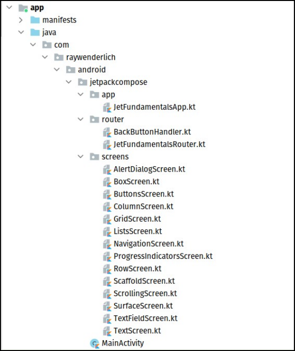
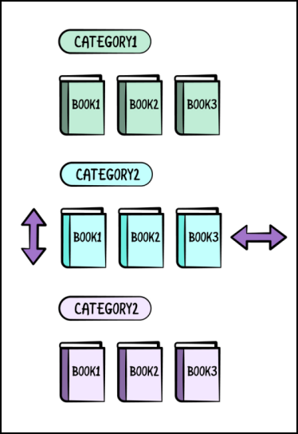
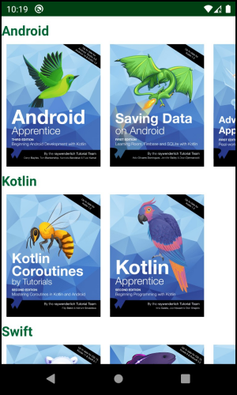
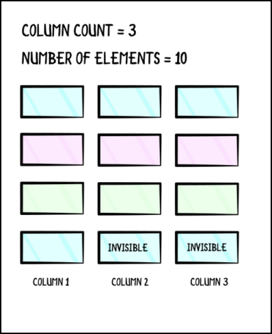
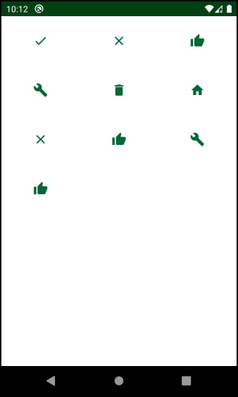

# 第四章：在Compose中构建列表

在前几章中，你了解了Compos中的不同元素，以及如何在布局中对它们进行分组和定位以构建复杂的UI。利用这些知识，你有可能构建任何屏幕。

然而，你错过了一些你最终需要的功能。当你要显示的元素多于屏幕上能容纳的元素时，会发生什么？在这种情况下，元素都是组成的，但有限的屏幕尺寸使你无法看到所有的元素。甚至还有这样的情况：你想在屏幕上动态地添加无限多的新元素，并且仍然能够看到它们。

解决这个问题的方法是允许你的内容滚动，无论是垂直还是水平。实现这一功能的传统方法是使用ScrollView，它允许你垂直滚动内容。对于水平滚动，你使用HorizontalScrollView。两者都只能有一个子视图在里面，所以要添加多个元素，你需要用一个布局来包装这些元素。

Jetpack Compose为你提供了一种新的方式来实现同样的结果--使用可滚动的、懒散地组成的容器。

在本章中，你将学习如何在Jetpack Compose中制作列表和网格，以帮助你在屏幕上容纳所有的内容。你将学习如何显示垂直或水平滚动的内容，以及如何使用可组合的函数为传统的RecyclerView构建一个替代品。

## 使用垂直滚动modifiers

正如你现在所知道的，Column在垂直方向上是LinearLayout的替代品。在Jetpack Compose中，你可以使用同样的Column，它可以用额外的修改器来实现滚动。让我们看看如何实现一个简单的滚动Column。

要跟随代码示例，请打开Android Studio，选择打开一个现有的项目。然后，导航到04-building-lists-with-jetpack-compose/projects，并选择starter文件夹。

一旦项目建立起来，你会看到以下结构。



**项目结构**

你将从建立一个垂直滚动的Column开始，之后你将探索它的水平对应物。要做到这一点，打开ScrollingScreen.kt，你会看到两个可组合的函数 - ScrollingScreen() 和 MyScrollingScreen()。

```kotlin
@Composable
fun MyScrollingScreen() {
  //TODO add your code here
}

@Composable
fun BookImage(@DrawableRes imageResId: Int, @StringRes contentDescriptionResId: Int) {
  Image(
    bitmap = ImageBitmap.imageResource(imageResId),
    contentDescription = stringResource(contentDescriptionResId),
    contentScale = ContentScale.FillBounds,
    modifier = Modifier.size(476.dp, 616.dp)
  )
}
```


如同前几章，ScrollingScreen()已经被设置为处理返回导航，所以你只需要实现MyScrollingScreen()。还有一个预定义的BookImage composable。它可以创建一个特定尺寸的书的图像，图像和 内容作为参数传递。

将MyScrollingScreen()的代码改为以下内容，并在Android Studio的帮助下包含必要的导入。

```kotlin
@Composable
fun MyScrollingScreen(modifier: Modifier = Modifier) {
  Row(modifier = modifier.horizontalScroll(rememberScrollState())) {
    BookImage(R.drawable.advanced_architecture_android, R.string.advanced_architecture_android)
    BookImage(R.drawable.kotlin_aprentice, R.string.kotlin_apprentice)
    BookImage(R.drawable.kotlin_coroutines, R.string.kotlin_coroutines)
  }
}
```


在这里，你向Column添加了三个现有的BookImage组合。你使用现有的drawable和字符串资源作为参数。为了使Column可滚动，你调用了verticalScroll()，并传入了rememberScrollState()。这将在滚动配置的基础上创建一个滚动状态，并在重构过程中处理滚动行为，以便位置不会丢失。

这里发生的情况是，你会显示一个柱子，一个垂直的项目列表。但如果项目太大，不能一次全部显示，它将是可滚动的，你将能够分别浏览每个项目。

建立并运行该应用程序，然后从导航菜单中选择滚动。你会看到三张图片，一张在另一张下面--但不幸的是，它们在屏幕上并不合适。幸运的是，你使屏幕可以滚动!:]

向下滚动可以看到还没有显示的图片。


**滚动列**

使用可滚动的Column是非常容易的，但你可以用它做更多的事情。 

让我们探讨一下它是如何工作的。

### 探索可滚动的modifiers

看看它的源代码，看看verticalScroll能做什么，以及当你使用它时它是如何工作的。

```kotlin
fun Modifier.verticalScroll( 
  state:ScrollState, 
  enabled:Boolean = true。  
  flingBehavior:FlingBehavior? = null,
  reverseScrolling:Boolean = false 
)
```


首先，看一下函数的参数。其中一些你已经知道了，但还有一些重要的新参数。

• scrollState是滚动的当前状态。它决定了从顶部开始的偏移量，也可以启动或停止平滑滚动和翻转动画。

• enabled启用或禁用滚动功能。如果它被禁用，你仍然可以使用状态属性以编程方式滚动到一个特定的位置。但用户不能使用滚动的手势。

• flingBehavior用于以给定的速度执行一个翻转动画。

• reverseScrolling允许你扭转滚动的方向。换句话说，把它设置为 "true "可以让你向上滚动。注意，它的默认值是false。

重要的是要理解 verticalScroll() 是一个修改器。这意味着你也可以通过将它应用于你的自定义组件的修改器，使其成为可滚动的，如果这适合你的使用情况。

你把垂直滚动应用到了一列。如果你想应用水平滚动，你可以用行来代替。

## 使用水平滚动modifiers

垂直滚动现在可以在你的屏幕上工作 - 但在某些情况下，你需要一个水平滚动，而不是。

就像你不得不使用一个不同的组件来进行水平滚动，称为 

HorizontalScrollView，Jetpack Compose提供了自己的可组合的称为Row，但你需要设置修改器。为了实现水平滚动，你需要应用horizontalScroll()，其工作原理与verticalScroll()相同，但方向不同。

让我们来实现一个可滚动的行。在MyScrollingScreen()中，用Row替换Column，用horizontalScroll替换 verticalScroll。

```kotlin
@Composable 
fun MyScrollingScreen(modifier: Modifier = Modifier) {
  Row(modifier =
      modifier.horizontalScroll(rememberScrollState())){ // 修改这里
  ... 
 } 
}
```


你不需要做任何其他的事情！就默认行为而言，可滚动行与可滚动列几乎完全相同。它使用horizontalScroll()自动设置了水平滚动。

建立并运行该应用程序，然后在导航菜单中再次选择滚动。你仍然会看到同样的三张图片，但现在，滚动是水平的。你只需改变一行代码就能做到这一点!


**滚动行**

当你有静态内容时，可滚动的列和行是很好的，就像前面的例子。然而，对于在运行时发生变化的数据集合来说，它们并不是一个好主意。这是因为可滚动的组合物会急切地组成和渲染里面的所有元素，当你有大量的元素需要显示时，这可能是一个沉重的操作。

在这种情况下，正如你在传统的View系统中所知道的，你会用一个 

RecyclerView来优化屏幕上可见元素的加载和渲染。但Jetpack Compose是如何处理这个问题的呢？让我们来了解一下!:]

## Compose的列表

为了在Android中显示大量的元素集合，你使用了RecyclerView。RecyclerView渲染的唯一元素是屏幕上可见的那些。只有在用户开始滚动后，它才会渲染新的元素并显示在屏幕上。然后，它将那些离开屏幕的元素回收到一个视图库中。

当你向后滚动查看之前的元素时，它会从池中渲染它们。由于这种行为，重新渲染的速度非常快，几乎就像这些元素一开始就没有从屏幕上移走一样。这种优化机制使RecyclerView得名。

只有在需要的时候才加载数据被称为懒加载，而Jetpack Compose在处理列表时加倍使用了这种方法。你在Compose中用于懒惰列表的主要两个组件是LazyColumn和LazyRow。

### 介绍LazyColumn和LazyRow

LazyColumn和LazyRow分别用于垂直和水平场景。

RecyclerView使用LayoutManager来设置其方向，但Jetpack Compose没有LayoutManagers。相反，你使用两个不同的可组合函数来改变方向。这些可组合函数的工作方式与RecyclerView几乎相同，但不需要回收。

当你使用LazyColumn或LazyRow时，框架只组成它应该在屏幕上显示的元素。当你滚动时，新的元素被组成，旧的元素被处理掉。当你向后滚动时，旧的元素被重新组合。Jetpack Compose不需要一个循环的ViewHolder池，因为它的重新组合可以更有效地处理缓存。

让我们同时实现垂直和水平列表，对你之前展示的书籍进行分类。

### 用LazyColumn和LazyRow创建列表

在我们的raywenderlich.com图书馆中，有许多令人敬畏的书籍，而且分属不同的类别。最好是将它们全部分类展示，这样你就可以轻松地挑选你的最爱。

要做到这一点，你将建立一个带有垂直列表的屏幕，列表内的每个可组合项目是另一个水平列表。你将把垂直列表分成图书类别，每个图书类别将有一个属于那里的图书的水平列表。请看下面的图片，以获得更好的理解。



**书籍类别**

你可以看到图书类别的列表是垂直滚动的，而类别本身包含的图书是水平滚动的。你的任务是重复这个实现，只是要有一个动态的类别和书籍的数量。这样，当你写出更多的书时，你就可以把它们添加到列表中去了。

现在，打开ListsScreen.kt。这个文件包含一个名为items的预定义属性，其中有一个图书类别的列表。这就是你要在屏幕上显示的数据。在文件的底部，你会发现以下的可组合函数。

```kotlin
@Composable
fun ListScreen() {
  MyList()

  BackButtonHandler {
    JetFundamentalsRouter.navigateTo(Screen.Navigation)
  }
}

@Composable
fun MyList() {
  //TODO add your code here
}

@Composable
fun ListItem(bookCategory: BookCategory, modifier: Modifier = Modifier) {
  //TODO add your code here
}

```

ListsScreen()是一个提供的可组合的，它为你处理导航，所以你不需要担心这个问题。你的任务是实现MyList（）和ListItem（）。

在MyList()中添加以下代码，并包括所需的导入。 

androidx.compose.material包用于Text composable，androidx.compose.foundation用于其他 composable。

```kotlin
@Composable 
fun MyList(){
  LazyColumn {
    items(items) { item -> ListItem(item) }
  }
}
```


在这里，你添加了一个LazyColumn()，并用包含你的数据的items属性来设置items参数。items是一个BookCategory类型的对象列表。每个BookCategory包含一个包含类别名称的字符串和一个显示应该出现在该类别中的书籍的图片列表。

在尾部的lambda中，对于项目列表内的每个项目参数，你创建一个新的ListItem。这个lambda表示将items内的每个对象转换为可组合元素的列表的函数。

这样，你可以调用任何数量的可组合的函数来表示你的项目，你可以根据项目的类型、它的位置和更多的情况来添加特殊的逻辑!

接下来，你将实现ListItem()。用下面的代码替换ListItem()，再一次，不要忘记在Android Studio的帮助下包含所需的导入。

```kotlin
@Composable
fun ListItem(bookCategory: BookCategory, modifier: Modifier = Modifier) {
  Column(modifier = Modifier.padding(8.dp)) {
    Text(
      text = stringResource(bookCategory.categoryResourceId),
      fontSize = 22.sp,
      fontWeight = FontWeight.Bold,
      color = colorResource(id = R.color.colorPrimary)
    )
    Spacer(modifier = modifier.height(8.dp))

    // TODO
  }
}
```


这看起来像很多代码，但它所做的是非常简单的。首先，你添加了一个Column()作为可组合布局的父布局，这样你就可以垂直地对齐它的孩子。Column()使用一个padding修改器在边界附近增加一些空间。

Column()的顶端子节点是一个Text()。你需要它来显示类别的标题，它被作为文本参数传递。注意你是如何通过改变字体大小、重量和颜色对文本进行风格化的。

下一个元素是Spacer，它在类别名称和其他内容之间增加一些空间。这将让你在水平的书籍列表的顶部显示类别名称。

现在在Spacer下面添加以下代码，以添加水平的书籍列表。

```kotlin
LazyRow { 
  items(bookCategory.bookImageResources) { items ->
     BookImage(items) 
  } 
}
```


类似于你如何建立一个垂直的列表，使用LazyRow你创建一个水平的列表。它接收图书图片的列表作为参数和一个建立BookImages的lambda。

同时在一个单独的函数中添加BookImage()。

```kotlin
@Composable
fun BookImage(imageResource: Int) {
  Image(
    modifier = Modifier.size(170.dp, 200.dp),
    painter = painterResource(id = imageResource),
    contentScale = ContentScale.Fit,
    contentDescription = stringResource(R.string.book_image)
  )
}
```


BookImage是一个Image的封装器。Image()为列表中的每个元素显示图书图像。你使用了一个尺寸修改器来设置一个宽度为170dp、高度为200dp的静态尺寸。

由于你作为参数传递给LazyRow()的列表包含了资源ID而不是实际的图像，你需要使用painterResource()来检索正确的资产。最后，通过使用ContentScale.Fit，你使图像适应你先前指定的尺寸，并以提供的字符串设置 内容。

现在，构建并运行该应用程序。一旦主屏幕加载，点击导航菜单中的列表按钮。你的应用程序将显示以下屏幕。



**列表**

正如你所看到的，书籍是按类别排序的。你可以垂直滚动来浏览图书类别，水平滚动来浏览每个类别的图书。

顺便说一下，如果你对你看到的任何书籍感兴趣，你可以在我们的书库中找到它们!:]

列表是非常容易使用和理解的，特别是因为它们的签名只需要几个参数就可以使它们工作。让我们深入了解一下它们的实现。

### 探索Lists

现在你明白了区别以及如何实现特定的列表，看看LazyColumn和LazyRow的签名。

```kotlin
@Composable 
fun LazyColumn( 
  modifier: Modifier = Modifier, 
  state: LazyListState = rememberLazyListState(),
  contentPadding: PaddingValues = PaddingValues(0.dp),
  reverseLayout: Boolean = false, 
  verticalArrangement: Arrangement.Vertical = if (!reverseLayout) Arrangement.Top else Arrangement.Bottom,
  horizontalAlignment: Alignment.Horizontal = Alignment.Start, 
  flingBehavior: FlingBehavior = ScrollableDefaults.flingBehavior(), 
  content: LazyListScope.() -> Unit 
)

@Composable 
fun LazyRow( 
  modifier: Modifier = Modifier, 
  state: LazyListState = rememberLazyListState(),
  contentPadding: PaddingValues = PaddingValues(0.dp),
  reverseLayout: Boolean = false, 
  horizontalArrangement: Arrangement.Horizontal = if (!reverseLayout) Arrangement.Start else Arrangement.End,
  verticalAlignment: Alignment.Vertical = Alignment.Top,
  flingBehavior: FlingBehavior = ScrollableDefaults.flingBehavior(), 
  content: LazyListScope.() -> Unit 
)
```


这里需要注意的最重要的参数是content，它被用于列表中的内容。这个内容是LazyListScope类型的，而不是你通常的Composable类型。

看看LazyListScope接口，了解它为什么如此重要。

```kotlin
interface LazyListScope {
  fun item(key: Any? = null, content: @Composable LazyItemScope.() -> Unit)

  fun items( 
    count: Int, 
    key: ((index: Int) -> Any)? = null, 
    itemContent: @Composable LazyItemScope.(index: Int) -> Unit )

	@ExperimentalFoundationApi 
  fun stickyHeader(key: Any? = null, content: @Composable LazyItemScope.() -> Unit) 
}
```


该界面提供了一系列的功能，在建立列表时对你有所帮助。

• items()允许你设置一个你想在每个列表项中使用的项目数据的列表。一旦你设置了数据，你还需要提供一个 itemContent，它是用于显示你的列表中的每个项目的可组合的。

• item()允许你向你的列表添加一个新的可组合项。注意，你每次都可以使用不同的可组合类型。

• stickyHeader()允许你设置在列表顶部保持可见的标题组合，即使你向下滚动查看新的项目。请注意，这个函数有@ExperimentalFoundationApi的注释，这意味着它仍处于实验阶段，将来可能会改变或被删除。

与RecyclerView不同，Jetpack Compose中的列表不需要适配器、视图持有者布局管理器和你的XML文件中的RV元素来使它工作。使用这两个非常简单的函数之一，你可以显示一个水平或垂直的列表，它是高性能和可定制的

还有一些扩展函数，比如itemsIndexed，它的功能与items()相同，但也为你的每个项目提供了一个索引。

理论就讲到这里。到目前为止，你已经为你的书实现了简单的列表和一个水平列表。你需要学习的最后一件事是建立网格。

## Compose中的Grids

在使用RecyclerView时，你可以使用不同类型的LayoutManagers，以不同的方式在屏幕上放置你的元素。例如，为了制作网格，你可以使用一个GridLayoutManager，然后设置网格内的列数。

不幸的是，Jetpack Compose并不包括一个现成的、稳定的、可以完成同样事情的组件。然而，由于Compose的强大功能，建立你自己的组件并不难。你将在本节中看到如何一步一步地完成这个任务。

你要实现的网格与你在上一个列表例子中看到的相似。但这次，这些元素不会水平滚动，而是固定在原地。为了更直观地了解这个问题，请看下面的图片。



**网格计算**

正如你所看到的，你的网格包含十个元素，分布在三列。最后一行只显示第一列中的一个元素，因为那是你列表中的最后一个元素。在它旁边还有两个元素，但它们在图片中被标记为不可见。这是一个将最后一个元素正确定位在第一列的小技巧--你添加了不可见的元素来占据剩余的空间。否则，最后一个元素就会在行的中心位置。

有了网格的基本要求，但让我们深入研究代码，制作你自己的网格。

### 实施网格

打开 GridScreen.kt，花点时间看看里面。你会发现处理导航的常规函数和一个包含图标的列表，你将使用这些图标作为网格的内容。在文件的底部，你会发现以下你需要实现的可组合函数。

```kotlin
@Composable
fun GridView(columnCount: Int) {
  //TODO add your code here
}

@Composable
fun RowItem(rowItems: List<IconResource>) {
  //TODO add your code here
}

@Composable
fun RowScope.GridIcon(iconResource: IconResource) {
  //TODO add your code here
}
```

#### 实现GridView

首先，你要处理GridView()。这个组合式需要一个名为columnCount的参数，它决定了你需要放置在每一行的最大元素数量。

在GridView的正文中添加以下代码。

```kotlin
@Composable
fun GridView(columnCount: Int) {
  val itemSize = items.size
  val rowCount = ceil(itemSize.toFloat() / columnCount).toInt()
  val gridItems = mutableListOf<List<IconResource>>()
  var position = 0
}
```


为了填充网格，你使用准备好的图标列表，称为项目。首先，你要存储项目的大小，因为你会多次使用它。

然后，你要计算出显示项目所需的行数。你通过用项目数除以列数来得到这个值，并使用ceil()来确保你包括最后一行，即使它不是满的。现在添加下一段代码开始构建一个网格。

```kotlin
@Composable
fun GridView(columnCount: Int) {
  val itemSize = items.size
  val rowCount = ceil(itemSize.toFloat() / columnCount).toInt()
  val gridItems = mutableListOf<List<IconResource>>()
  var position = 0

  for (i in 0 until rowCount) {
    val rowItem = mutableListOf<IconResource>()
    for (j in 0 until columnCount) {
      if (position.inc() <= itemSize) {
        rowItem.add(IconResource(items[position++], true))
      }
    }
    // TODO
 }
```


接下来，对于每一行，你创建一个持有IconResource的项目列表。这是一个模型类，包含一个图标资源，并持有一个布尔属性来设置图标的可见性。

所有以这种方式添加到行内的项目都会通过传递true作为第二个构造函数参数来设置为可见。因为网格有行和列，你需要使用一个嵌套的for循环来准备所有的项目。下一步是添加空的虚拟视图，最后建立列表。

```kotlin
@Composable
fun GridView(columnCount: Int) {
  ...

  for (i in 0 until rowCount) {
    val rowItem = mutableListOf<IconResource>()
    for (j in 0 until columnCount) {
      if (position.inc() <= itemSize) {
        rowItem.add(IconResource(items[position++], true))
      }
    }
    // here
    val itemsToFill = columnCount - rowItem.size

    for (j in 0 until itemsToFill) {
      rowItem.add(IconResource(Icons.Filled.Delete, false))
    }
    gridItems.add(rowItem)
  }
  // here
  LazyColumn(modifier = Modifier.fillMaxSize()) {
    items(gridItems) { items ->
      RowItem(items)
    }
  }
}
```


你通过从所需的columnCount中减去当前行的大小来计算是否有必要包括虚拟的隐形项目。如果columnCount大于rowItem.size，这意味着你在最后一行，而且还没有满。在这种情况下，你可以在isVisible属性为false的情况下添加虚拟图标，使其不可见。

最后，你使用一个LazyColumn，传递你在gridItems中计算的行。

RowItem()是一个可组合的，可以渲染列内的每一行。实现它是你的下一个任务。]

#### 实现RowItem

每个RowItem()将代表该行的一系列GridIcons。将RowItem()的代码替换为以下内容。

```kotlin
@Composable
fun RowItem(rowItems: List<IconResource>) {
  Row {
    for (element in rowItems)
      GridIcon(element)
  }
}
```


在这里，你用一个Row来布置一个给定行中的不同项目。然后每个项目都是一个GridIcon，接下来你将实现它。

#### 实现GridIcon

每个GridItem()都会显示你传入的图标，如果你需要在网格中添加虚拟元素，则会显示一个不可见的图标，以填充该行。用下面的代码替换GridIcon来实现这种行为。

```kotlin
@Composable
fun RowScope.GridIcon(iconResource: IconResource) {
  val color = if (iconResource.isVisible)
    colorResource(R.color.colorPrimary)
  else Color.Transparent

  Icon(
    imageVector = iconResource.imageVector,
    tint = color,
    contentDescription = stringResource(R.string.grid_icon),
    modifier = Modifier
      .size(80.dp, 80.dp)
      .weight(1f)
  )
}
```


下面是对前面的代码块的分解。首先，你用可见性属性计算了图标的颜色。由于Jetpack Compose没有一个选项可以将一个可合成的设置为不可见，你将通过使用透明的颜色来实现这个结果。

接下来，你将计算出的颜色作为色调添加到Icon上，并设置大小和重量修改器。为了使用权重修改器，Compos需要一个Scope，你可以从GridIcon的Row父级得到这个Scope，通过使GridIcon成为RowScope的扩展函数，你可以使用RowScope的所有成员，比如weight()。weight()对于将图标均匀地分布在Row()内的其他图标之间非常重要。

构建并运行该应用程序，然后点击导航菜单中的网格按钮。你会看到以下屏幕。



**有三栏的网格**

真棒!你在屏幕上有一个图标网格，分三列放置。你可以增加项目列表中的图标数量，使网格可以滚动。要试验不同的列数，用所需的值替换GridScreen()里面的columnCount的值，就可以看到结果。请记住，你被限制在适合屏幕的列数范围内。

还有一个内置的可组合的网格，叫做LazyVerticalGrid，属于@ExperimentalFoundationApi。这意味着这个可组合的东西很可能会在未来发生剧烈的变化或者被删除。如果你仍然愿意尝试，把GridScreen里面的代码替换成以下内容。

```kotlin
@ExperimentalFoundationApi
@Composable
fun GridScreen() {
  LazyVerticalGrid(
    modifier = Modifier.fillMaxSize(),
    cells = GridCells.Fixed(3),
    content = {
      items(items) { item ->
        GridIcon(IconResource(item, true))
      }
    }
  )

  BackButtonHandler {
    JetFundamentalsRouter.navigateTo(Screen.Navigation)
  }
}
```


同时增加一个GridIcon()的对应函数，这不是一个扩展函数。

```kotlin
@Composable
fun GridIcon(iconResource: IconResource) {
  val color = if (iconResource.isVisible)
    colorResource(R.color.colorPrimary)
  else Color.Transparent

  Icon(
    imageVector = iconResource.imageVector,
    tint = color,
    contentDescription = stringResource(R.string.grid_icon),
    modifier = Modifier
      .size(80.dp, 80.dp)
  )
}
```


构建并运行该应用程序，然后点击导航菜单中的网格按钮。你会看到与自定义版本相同的结果。

你添加了一个LazyVerticalGrid，有三个参数：修改器、单元格和内容。单元格描述了列的形成方式。有两种类型的GridCells。

• 固定设置屏幕上的单元格的固定数量。

• 自适应添加尽可能多的行或列以适应屏幕，提供的最小尺寸参数为minSize。

其内容与LazyRow或LazyColumn的工作原理相同。你提供数据的集合和一个可组合的，用于每一个网格单元。 

LazyVerticalGrid然后根据单元格参数计算并定位你的可组合的网格。

恭喜你！你已经学到了很多关于如何在Jetpack Compose中布置大量元素的知识。你已经学到了很多关于如何在Jetpack Compose中布置大量元素的方法。

## 关键点

• 如果内容不适合屏幕，可以使用column和verticalScroll修改器来使内容垂直排列。

• 使用Row和horizontalScroll修改器来使内容在不适合屏幕的情况下水平滚动。

• 你可以通过添加垂直滚动（verticalScroll）或水平滚动（horizontalScroll）修饰符来使你自己的可合成物可以滚动。

• 只对固定数量的内容使用滚动器。

• 对于动态和大量的内容，使用列表代替。

• RecyclerView的可组合替代方案被称为LazyColumn和LazyRow，分别用于垂直和水平场景。

• 你可以将列表分组，使内容可以向两个方向滚动。

• 要制作网格，请使用一个自定义的实现。

• 如果你使用LazyVerticalGrid，请记住，它可能很快就会被改变或删除。

• 使用透明的颜色或将阿尔法设置为零来使一个不可见的合成。

• 另外，如果你想手动添加项目到列表中，你可以使用LazyRow和LazyColumn组件，允许你建立页眉和页脚。[在这里](https://developer.android.com/reference/kotlin/androidx/compose/foundation/lazy/package-summary#lazycolumn)了解更多关于它们的信息。

## 今后该何去何从？

在本章中，你学到了如何制作可滚动的内容，动态创建的元素的可滚动列表和自定义网格。

你已经准备好在你自己的应用程序中实现这个UI功能了。这就结束了整个第一节的学习在下一节和下一章中，你将学习如何利用你到目前为止所获得的所有知识来构建更复杂的自定义组件。

到时见!:]
