# 第5章 组合Composables

完成本书第一部分的工作很好!现在你已经知道了Compose的基本支柱，你已经具备了应对第二部分的挑战所需的一切。

第二部分的目标是向你展示Jetpack Compose的实际应用。在本节中，你将建立Jet Notes，一个简单而实用的管理笔记的应用程序。

本节的每一章都将解释某些概念，你将应用这些概念来逐步构建应用程序的不同部分。请注意，你可能会在某一章中构建一些组件，但在下一章中整合它们。同样地，你可能会开始研究一个特定的组件，但在另一章中完成。但是不要担心，当你完成整个章节时，你就会有一个完全用Jetpack Compose编写的自己的应用程序，并按预期工作！ :] 。

到现在为止，你已经听说了很多关于Jetpack Compose为你提供的基本可合成物。在这一章中。

• 你将学会在用Jetpack Compose构建时如何考虑UI设计。

• 你将看到你如何结合基本的可合成物来创建复杂的用户界面。

• 你将为Jet Notes创建两个具有不同复杂性的组件。

让我们首先探讨一下你将为你的应用程序建立的功能。

## 应用特点

在你开始写代码之前，先看一下应用程序的概念和它的功能。

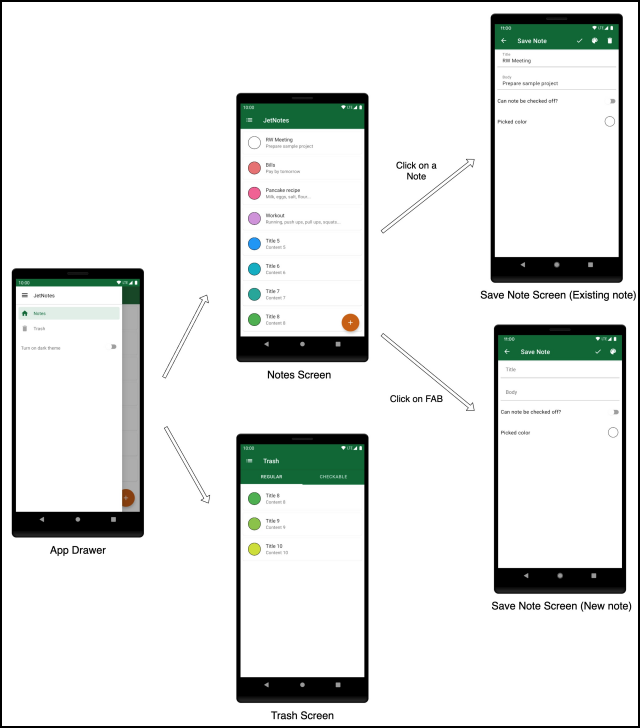

**应用概述**

不要担心每个屏幕上的细节。当你开始实施每个屏幕时，你将有机会更仔细地看到它。正如你所看到的，Jet Notes包含四个主要部分：笔记屏幕、保存笔记屏幕、垃圾箱屏幕和应用抽屉。

笔记屏幕显示创建的笔记列表。从这里，用户可以打开一个现有的笔记，创建一个新的笔记，或打开应用程序的抽屉。

保存笔记屏幕有两种模式：编辑模式和创建新笔记模式。当用户在笔记屏幕上点击一个笔记时，保存笔记屏幕将以编辑模式打开。然后，用户可以编辑该笔记或简单地通过点击应用栏上的垃圾桶图标将其移至垃圾桶屏幕。

要创建一个新的笔记，用户可以点击笔记屏幕上的浮动操作按钮（FAB）。这将在创建新笔记的模式下打开保存笔记屏幕。

有两种类型的笔记：普通笔记和可检查笔记。可检查的笔记是用户可以标记--或检查--为完成的笔记。用户可以通过使用保存笔记屏幕中的开关组件使任何笔记成为可检查的。在笔记界面中，可检查的笔记有一个复选框来标记该笔记为已完成。

点击应用栏上的导航图标或从屏幕的左边边界轻扫，就能打开应用抽屉。应用抽屉在笔记和垃圾桶屏幕之间切换。使用抽屉，用户还可以将应用程序的主题从浅色改为深色。

在垃圾桶界面，用户可以通过两个标签在普通笔记和可检查笔记之间进行切换。用户可以选择笔记并恢复它们或永久删除它们。

在第二部分结束时，你的应用程序将拥有上面提到的所有功能。

现在你已经熟悉了这个应用程序和它的功能，是时候开始编码了!:]

## 项目概述

要跟上代码实例，请用Android Studio打开本章的启动项目，并选择打开一个现有的项目。导航到05-creatingcustom-composables/projects，选择starter文件夹作为项目根。

一旦项目打开，让它建立和同步，你就可以开始工作了!

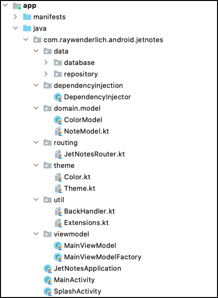

**项目结构**

以下是已经为你设置好的套餐以及它们所包含的内容。

• **data**。包含与存储笔记的数据库有关的代码。它可以让你添加、删除和更新笔记。

• **dependencyinjection**。有一个负责创建和提供你需要的依赖的类。

• **domain**包含两个名为NoteModel和ColorModel的领域模型，分别代表音符和颜色。

• **routing**。具有让你在屏幕之间导航的逻辑。

• **theme**。包含颜色定义和一个可组合的功能，让你改变应用程序的主题。

• util:包含一个实用的可组合的函数来处理回按。它还提供了一个扩展方法，用于从字符串颜色十六进制定义中创建颜色实例。

• viewmodel。包含你需要实现的管理笔记的ViewModel。

• JetNotesApplication.kt。一个初始化依赖性注入器的应用程序。

• MainActivity.kt。包含setContent()调用，它设置了第一个可组合的函数，并作为根UI组件行事。

• SplashActivity.kt。负责你打开应用程序时看到的闪屏。

一旦你熟悉了文件组织，就可以构建(build)并运行(run)该应用程序。你会看到一个没有内容的空屏幕，如下图所示。

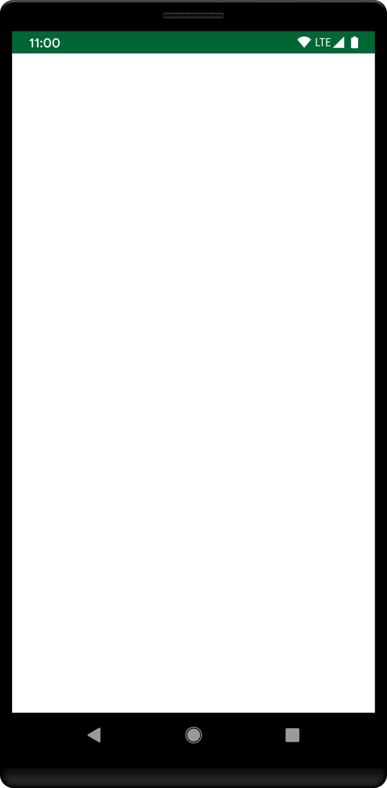 

**初始项目-APP state**

跳到最终项目，你会看到你将在本章中构建组件，但你还不会完全完成它们或将它们集成到Jet Notes中。不过，你可以把最终项目作为一个参考，在你构建组件时跟踪你的进展。在接下来的章节中，你将对它们进行迭代，并改进该应用程序。

## 以Compose的方式思考

在你开始编码之前，再看一遍Notes的屏幕设计，并尝试用Compose来思考。换句话说，把设计分成模块化的组件，你可以把它们组合起来形成整个屏幕。

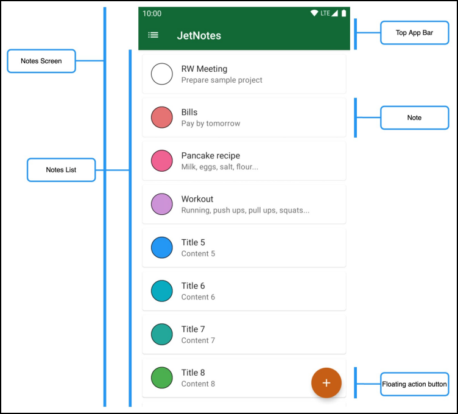

**注释屏幕 - 组件**

例如，你可以把 "笔记 "屏幕分成以下几个部分。

• **Notes Screen**。这个组件代表整个笔记屏幕。

• **Top App Bar**。负责显示顶部的应用栏，它拥有导航动作和标题。

• **Notes List**。呈现已创建的笔记列表。

• **Floating Action Button**。打开 "保存笔记 "屏幕，用户可以创建一个新的笔记。

• **Note**：代表一个单独的票据。

• **App Drawer**。包含当用户从侧面扫过或点击导航图标时显示的抽屉。

在Compose中，这些组件都是由可组合的函数表示的。作为一个开发者，你可以决定你想把一个特定的设计分解成多深的组件。

考虑你将如何使用每个组件也是很重要的。例如，看一下笔记和垃圾箱屏幕的设计。这两个屏幕都使用相同的Note组件，所以创建一个可重复使用的Note组件是有意义的。

这是一个用Compose思考的好例子。

## 自下而上的方法

当用Jetpack Compose构建你的应用程序时，明智的做法是，从较小的可合成物开始，然后通过设计来建立你的方式。你把这种工作方式称为自下而上的方法。

这很聪明，因为从最小的组件开始构建你的应用程序，可以让你从一开始就解耦并重复使用你的代码。当你达到最高级别的组件时，比如笔记和垃圾桶屏幕，你已经建立了所有的基本组件，所以你可以很容易地在这两个屏幕上重复使用它们。这可以通过减少你需要编写的代码量来节省时间和帮助提高稳定性。

现在，再看一下 "笔记 "屏幕，考虑哪一个组件是一个好的候选者，可以从它开始。

如果你遵循自下而上的方法，选择最基本的组件，你需要从Note的可组成开始。构建完Note后，你就可以在整个应用中使用它了。

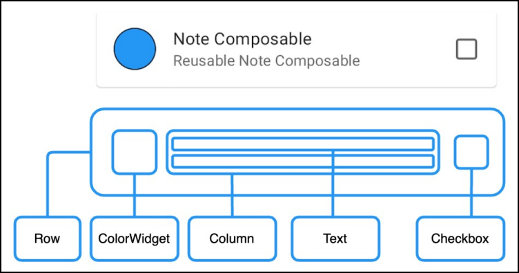

**注释成分**

当你尝试分解Note组件时，你会注意到你可以用你在上一节学到的基本可组合物来构建它。颜色部件、笔记的描述和复选框被组织在一个行中。注释的标题和它的描述被组织在一个列里。

现在，你对如何分解你的可组合性有了一个想法，是时候开始编码了:]

## 创建可合成的注释

使用Android Studio创建一个名为ui.component的新包。然后，在该包中，创建一个名为Note.kt的新Kotlin文件。最后，在Note.kt中添加以下代码。

```kotlin
import androidx.compose.runtime.Composable
import androidx.compose.ui.tooling.preview.Preview

@Composable
fun Note() {
}
```


在这段代码中，你简单地创建了一个可组合函数来表示你的笔记。你还添加了一个NotePreview()来预览你在Android Studio中构建的composable。

要做到这一点，请确保你已经在Android Studio中选择了右上角的分割选项。这个选项允许你在设计面板中预览你的可合成物，同时仍然能够修改代码。

现在建立你的项目。在这个阶段，你仍然不会在预览面板中看到任何东西，因为你还没有添加任何发出用户界面的可合成物。让我们接下来做这个!

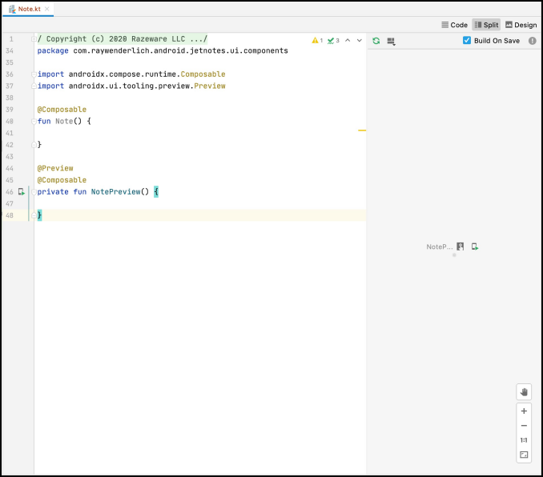

**Android Studio - 预览**

### 发出音符的内容

现在你已经建立了Note的可组合性，你的下一步是添加代码，以发射出Note的内容。在Note()的正文中添加以下代码。

```kotlin
Box(
  modifier = Modifier
    .size(40.dp)
    .background(rwGreen)
)
Text(text = "Title", maxLines = 1)
Text(text = "Content", maxLines = 1)
Checkbox(
  checked = false,
  onCheckedChange = { },
  modifier = Modifier.padding(start = 8.dp)
)
```

为了使其发挥作用，在Note.kt中添加以下导入。

```kotlin
import androidx.compose.foundation.background
import androidx.compose.foundation.layout.Box
import androidx.compose.foundation.layout.padding
import androidx.compose.foundation.layout.size
import androidx.compose.material.Checkbox
import androidx.compose.material.Text
import androidx.compose.ui.Modifier
import androidx.compose.ui.unit.dp
import com.raywenderlich.android.jetnotes.theme.rwGreen
```


你刚刚添加了表示颜色小组件、标题、内容和复选框的可合成物。现在不要去管颜色部件--在本章中你不会对它进行样式设计。那个小组件在很大程度上依赖于修改器，你将在第6章 "使用合成修改器 "中学习。在这一点上，如果你在代码中看到修改器，不要花太多时间去想它们。只要知道它们使用户界面看起来更漂亮一些就可以了。 

:]

建立你的项目，你应该在预览中看到类似这样的东西。

 

**注释可组合式 - 预览**

通过添加这些可合成物，你已经成功地完成了一些事情：笔记的组件现在出现在预览面板中。然而，正如你所看到的，它们是相互堆叠在一起的。记住，当你添加可组合函数时，你是在描述要在屏幕上呈现的元素的层次结构。

之前，你读到过，在其核心部分，Compose只知道如何与树一起工作，以发出特定的项目。所以，你可以用一棵树来表示你用可组合函数描述的层次结构，其中的节点是可组合的。

Note()里面的四个可合成物将产生以下有四个节点的树。

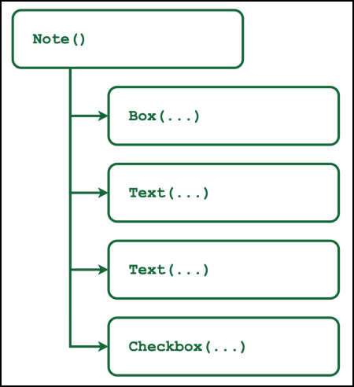

**注释可组合式--树状层次结构**

这正是将Jetpack Compose描述为一个声明式工具包的意思。函数的主体**描述了**用户界面将是什么样子。在这种情况下，用户界面将包含四个元素。因为这里没有描述布局策略，所以这些可组合的元素将相互堆叠。这正是预览面板所显示的内容。

然而，这并不是你想要的。对于你的下一步，你将为你的可组合式添加布局结构。首先，用下面的代码替换Note()主体。

```kotlin
Row(modifier = Modifier.fillMaxWidth()) {
  Box(
    modifier = Modifier
      .size(40.dp)
    	.background(rwGreen)
  )
  Column(modifier = Modifier.weight(1f)) {
    Text(text = "Title", maxLines = 1)
    Text(text = "Content", maxLines = 1)
  }
  Checkbox(
    checked = false,
    onCheckedChange = { },
    modifier = Modifier.padding(start = 8.dp)
) }
```


也要添加必要的导入。

```kotlin
import androidx.compose.foundation.layout.Column
import androidx.compose.foundation.layout.Row
import androidx.compose.foundation.layout.fillMaxWidth
```


在前面的代码中，你在一列中组织了标题和内容。然后，你将产生的列与Box()和Checkbox()的组合物一起排列在一行中。

再次建立你的项目或刷新预览面板，你会看到像这样的东西。

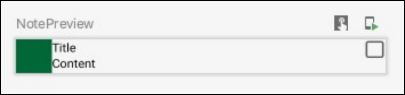

在这一点上，你的Note()看起来和最初设计时不太一样。为了使它们匹配，你需要修改器。但是，嘿，不用担心!你将在第6章 "使用合成修改器 "中继续工作。

现在，你将专注于构建构成你的应用程序的其余复杂的可合成物。

## 构建可组合的应用程序抽屉

你要做的下一件事有点复杂。你将创建一个AppDrawer()来切换屏幕和改变应用程序的主题。

再一次，在你开始编码之前，看看设计，并尝试把它分成更小的组件。

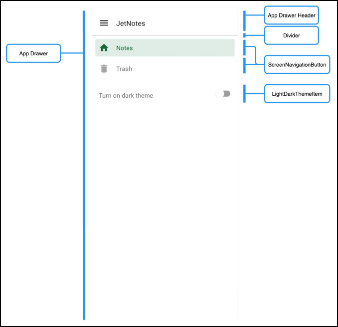

**应用程序抽屉 - 组件**

如图所示，你可以把这个UI组件分成以下几个部分。

• AppDrawer。你的抽屉的根可组合性。

• AppDrawerHeader。包含一个带有抽屉图标和应用程序的标题的页眉。

• ScreenNavigationButton。代表一个按钮，用户可以点击该按钮在屏幕之间切换。

• LightDarkThemeItem。让用户在浅色和深色主题之间转换。

让我们来建造这些组件吧!

### 在抽屉里添加一个header

再一次，你将采取自下而上的方法来构建AppDrawer()。你将首先实现较小的组件，然后再组合它们。在ui.component中，创建一个名为AppDrawer.kt的新文件。然后，在其中添加以下代码。

```kotlin
@Composable
private fun AppDrawerHeader() {
  Row(modifier = Modifier.fillMaxWidth()) {
    Image(
      imageVector = Icons.Filled.Menu,
      contentDescription = "Drawer Header Icon",
      colorFilter = ColorFilter
        .tint(MaterialTheme.colors.onSurface),
      modifier = Modifier.padding(16.dp)
) Text(
      text = "JetNotes",
      modifier = Modifier
        .align(alignment = Alignment.CenterVertically)
    )
} }
@Preview
@Composable
fun AppDrawerHeaderPreview() {
  JetNotesTheme {
    AppDrawerHeader()
  }
}
```


为使其发挥作用，还需添加以下import。

```kotlin
import androidx.compose.foundation.Image
import androidx.compose.foundation.layout.Row
import androidx.compose.foundation.layout.fillMaxWidth
import androidx.compose.foundation.layout.padding
import androidx.compose.material.MaterialTheme
import androidx.compose.material.Text
import androidx.compose.material.icons.Icons
import androidx.compose.material.icons.filled.Menu
import androidx.compose.runtime.Composable
import androidx.compose.ui.Alignment
import androidx.compose.ui.Modifier
import androidx.compose.ui.graphics.ColorFilter
import androidx.compose.ui.tooling.preview.Preview
import androidx.compose.ui.unit.dp
import com.raywenderlich.android.jetnotes.theme.JetNotesTheme
```


通过这段代码，你已经为应用程序的抽屉头创建了一个可组合的代码。这是一个相对简单的组合，你使用一个Image()和一个Text()，并将它们组织在一个Row()中。

你还添加了修改器来为这些组件添加填充和对齐。同样，不要为修改器而烦恼。你将在下一章中学习更多关于它们的知识。

对于Image()，你使用了一个colorFilter来设置其颜色。具体来说，你用MaterialTheme.colors.onSurface来设置色调。MaterialTheme.colors调色板是从系统和你使用的可组合的根函数中提取的。如果你查看AppDrawerHeaderPreview()的代码，你会看到以下内容。

```kotlin
@Preview
@Composable
fun AppDrawerHeaderPreview() {
  JetNotesTheme {
    AppDrawerHeader()
  }
}
```


在你的例子中，根可合成的是JetNotesTheme()。这是一个在Theme.kt文件中预定义的可组合函数。当你对根组件使用这个函数时，它将所有定义的颜色传递给其他的组件，有效地以同样的方式对它们进行造型。然而，该主题还没有指定onSurface的颜色，所以默认值是Color.Black。

现在，这就是你需要知道的关于主题设计的全部内容。你会在第8章 "将Material Design应用于合成 "中了解更多。不过你也可以在没有它的情况下预览你的composable，如果它令人困惑的话。

建立你的项目，你会在预览面板中看到以下结果。

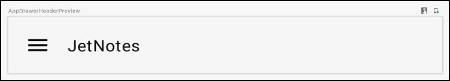

**可供使用的AppDrawerHeader - 预览**

### 创建可组合的导航按钮

接下来，你将创建一个可组合的，用于建模在屏幕之间切换的导航按钮。要做到这一点，请在AppDrawer.kt.中添加以下代码。

```kotlin
@Composable
private fun ScreenNavigationButton(
  icon: ImageVector,
  label: String,
  isSelected: Boolean,
onClick: () -> Unit ){
  val colors = MaterialTheme.colors
  // Define alphas for the image for two different states
  // of the button: selected/unselected
  val imageAlpha = if (isSelected) {
1f
} else {
0.6f
}
  // Define color for the text for two different states
  // of the button: selected/unselected
  val textColor = if (isSelected) {
    colors.primary
  } else {
    colors.onSurface.copy(alpha = 0.6f)
  }
  // Define color for the background for two different states
  // of the button: selected/unselected
  val backgroundColor = if (isSelected) {
    colors.primary.copy(alpha = 0.12f)
  } else {
    colors.surface
  }
}
```


同时添加以下import 。

```kot
import androidx.compose.ui.graphics.vector.ImageVector
```


在设计中，屏幕导航按钮有一个图标和一个标签。在这里，你已经为你的可组合添加了两个参数，以允许：图标和标签。

你也给了这个按钮两种状态：选中和未选中。为了跟踪按钮处于哪种状态，你添加了参数isSelected。

每种状态的渲染方式不同。你添加到函数主体中的代码为两种状态准备了颜色。注意你使用了primary、onSurface和surface的颜色；这些颜色是在你的JetNotesTheme()中从Theme.kt定义的。如前所述，如果在你为主题创建调色板时没有指定其中的一些颜色，就会使用默认值。

还注意到你已经添加了onClick参数。因为你的按钮是可点击的，所以通过一个lambda函数来暴露这个行为是一个很好的做法，这样父级的可组合程序就可以对它负责了。你将在第7章 "在组合中管理状态 "中了解更多关于如何处理点击和其他事件的信息。

接下来，在ScreenNavigationButton()的底部添加以下代码。

```kotlin
Surface( // 1
  modifier = Modifier
    .fillMaxWidth()
    .padding(start = 8.dp, end = 8.dp, top = 8.dp),
  color = backgroundColor,
  shape = MaterialTheme.shapes.small
){
Row( // 2
    horizontalArrangement = Arrangement.Start,
    verticalAlignment = Alignment.CenterVertically,
    modifier = Modifier
      .clickable(onClick = onClick)
      .fillMaxWidth()
      .padding(4.dp)
){ Image(
      imageVector = icon,
      contentDescription = "Screen Navigation Button",
      colorFilter = ColorFilter.tint(textColor),
      alpha = imageAlpha
    )
    Spacer(Modifier.width(16.dp)) // 3
    Text(
      text = label,
      style = MaterialTheme.typography.body2,
      color = textColor,
      modifier = Modifier.fillMaxWidth()
) }
}
```


同时添加以下import。

```kotlin
import androidx.compose.foundation.layout.Arrangement
import androidx.compose.material.Surface
import androidx.compose.foundation.clickable
import androidx.compose.foundation.layout.Spacer
import androidx.compose.foundation.layout.width
```


这里有相当多的代码，但这里有一个细分。

1. 你使用Surface()来为你的按钮提供背景颜色和形状。

2. 在Surface()里面，你用Row()来对齐按钮的图标和标签。

3. 最后，你用Spacer()在图标和标签之间添加一些空间。

现在，你需要创建一个预览函数，以便在预览面板中使你的按钮可视化。在同一个文件中，添加以下函数。

```kotlin
@Preview
@Composable
fun ScreenNavigationButtonPreview() {
  JetNotesTheme {
    ScreenNavigationButton(
      icon = Icons.Filled.Home,
      label = "Notes",
      isSelected = true,
      onClick = { }
)}
}

```

不要忘记导入主页图标。

```kotlin
import androidx.compose.material.icons.filled.Home
```


如你所见，ScreenNavigationButtonPreview()只是调用你的 

ScreenNavigationButton()，传入它需要的参数。除了按钮的图标和标签外，请注意你是如何用isSelected = true来定义它的状态为选中。此外，注意onClick()是如何使用一个空的lambda作为参数的，因为你不需要在预览中使用这种行为。

建立你的项目，你应该看到以下结果。

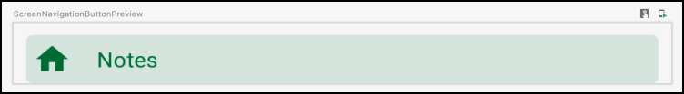

**屏幕导航按钮可组合式 - 预览**

很好!现在，你的抽屉按钮已经完成，你已经准备好进入下一个任务。

### 添加一个主题切换器

主题切换器是一个切换按钮，让用户将应用程序的主题从浅色变为深色。

在AppDrawer.kt的末尾添加以下代码。

```kotlin
@Composable
private fun LightDarkThemeItem() {
  Row(
Modifier
.padding(8.dp) ){
    Text(
      text = "Turn on dark theme",
      style = MaterialTheme.typography.body2,
      color = MaterialTheme.colors.onSurface.copy(alpha = 0.6f),
      modifier = Modifier
        .weight(1f)
        .padding(start = 8.dp, top = 8.dp, end = 8.dp, bottom =
8.dp)
        .align(alignment = Alignment.CenterVertically)
    )
    Switch(
      checked = JetNotesThemeSettings.isDarkThemeEnabled,
      onCheckedChange =
{ JetNotesThemeSettings.isDarkThemeEnabled = it },
      modifier = Modifier
        .padding(start = 8.dp, end = 8.dp)
        .align(alignment = Alignment.CenterVertically)
    )
} }
@Preview
@Composable
fun LightDarkThemeItemPreview() {
  JetNotesTheme {
    LightDarkThemeItem()
  }
}
```


还包括以下导入，以避免Android Studio警告。

```kotlin
import androidx.compose.material.Switch
import
com.raywenderlich.android.jetnotes.theme.JetNotesThemeSettings
```


你刚刚添加的代码是非常直接的。对于这个可组合的，你使用了一个Row()来水平对齐内容。正如你所看到的，这些内容只是一个Text()和一个Switch()。有趣的部分是Switch()的作用。

看看这个可组合的，你会发现checked和onCheckedChange参数依赖JetNotesThemeSettings.isDarkThemeEnabled来处理状态。这里有一些新的概念，但你会在第7章 "在组合中管理状态 "中了解到更多。现在，不要担心这些。只要考虑到这种机制允许你在内部改变应用程序的主题。

建立该项目，在预览中，你会看到以下内容。

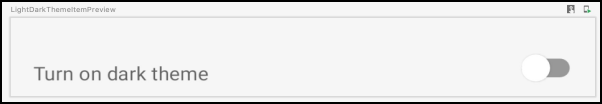

**可组合的LightDarkThemeItem - 预览**

干得好!有了这个，你已经完成了应用程序抽屉的所有必要组件。

### 收拾好应用程序抽屉

在前面的章节中，你创建了建造抽屉所需的不同构件。现在，你需要把它们全部放在一起。要做到这一点，请在AppDrawer.kt中添加以下代码。

```kotlin
@Composable
fun AppDrawer(
  currentScreen: Screen,
  closeDrawerAction: () -> Unit
){
Column(modifier = Modifier.fillMaxSize()) {
    AppDrawerHeader()
    Divider(color = MaterialTheme.colors.onSurface.copy(alpha
= .2f))
    ScreenNavigationButton(
      icon = Icons.Filled.Home,
      label = "Notes",
      isSelected = currentScreen == Screen.Notes,
      onClick = {
        JetNotesRouter.navigateTo(Screen.Notes)
        closeDrawerAction()
      }
)
ScreenNavigationButton(
      icon = Icons.Filled.Delete,
      label = "Trash",
      isSelected = currentScreen == Screen.Trash,
      onClick = {
        JetNotesRouter.navigateTo(Screen.Trash)
        closeDrawerAction()
      }
)
    LightDarkThemeItem()
  }
}
```


同时添加以下导入。

```kotlin
import androidx.compose.material.icons.filled.Delete
import com.raywenderlich.android.jetnotes.routing.JetNotesRouter
import com.raywenderlich.android.jetnotes.routing.Screen
import androidx.compose.material.Divider
import androidx.compose.foundation.layout.Column
import androidx.compose. foundation.layout.fillMaxSize
```


这段代码中没有什么新东西，你只是使用了你之前创建的可合成物。你在这里采取的重要步骤是，你把这些可合成物组织到一个Column()中，给你的抽屉一个适当的布局。

在设计中，你可以看到在抽屉的页眉和按钮之间有一条线。为了增加那条线，你用了一个Divider()。然后，对于颜色，你用onSurface的颜色创建了一个新的对象，但有一个不同的alpha属性。

检查AppDrawer的参数：currentScreen和closeDrawerAction。通过currentScreen，你可以控制哪个屏幕导航按钮被选中。例如，如果你想选择Notes按钮，你可以用Screen.Notes作为参数来调用AppDrawer的组合。

还记得你是如何在ScreenNavigationButton()中暴露点击事件的吗？在这里，你使用类似的技术，用closeDrawerAction参数来暴露关闭抽屉的事件。通过这样做，你让父类的可组合性对该事件做出反应。

请注意这个可组合式如何将lambda参数传递给每个导航按钮的onClick()。这是用来通知系统你选择了一个新的屏幕。

最后，在AppDrawer.kt的底部添加以下代码。

```kotlin
@Preview
@Composable
fun AppDrawerPreview() { 

JetNotesTheme { 

  AppDrawer(Screen.Notes, {}) 

 } 

}
```


在这里，你把Screen.Notes作为currentScreen来传递。通过这样做，你选择了Notes按钮。

由于你是在一个带有@Preview的可组合标记中调用AppDrawer()，你不需要为应用抽屉关闭时指定任何动作。因此，你只是传递了一个空函数作为参数。

再一次建立你的项目，你会在预览中看到你完成的抽屉。


**可组合的LightDarkThemeItem - 预览**

你已经看到调用可组合函数的结果是一棵树。每当你调用AppDrawer()，Compose就会生成一棵树，其中每个节点都是用来创建它的可组合函数。

现在，这棵树只包含UI元素。以后，你会看到还有其他类型的节点。当你比较AppDrawer()和Note()的时候，你会发现第一个节点更复杂。然而，如果你注意的话，你会注意到两者都是由几乎相同的基本成分组成。

这就是Jetpack Compose的魅力所在。从最基本的合成物创建复杂的合成物是如此容易。

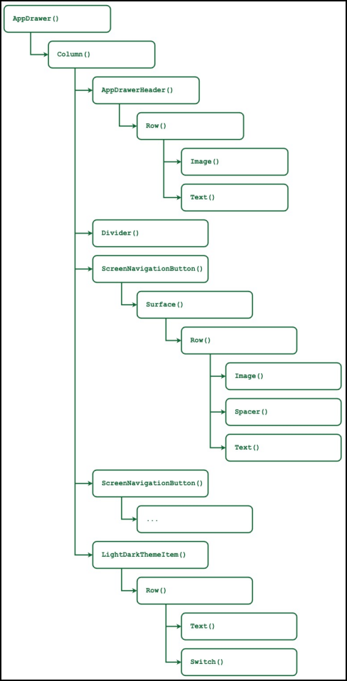

**AppDrawer可组合式--组合树**

## 把所有的碎片放在一起

在做了这些工作之后，如果不能看到你建立的不同的组合物在你的应用程序中一起工作，那就太遗憾了。因此，你的最后一步将是把这些拼图放在一起。

转到MainActivity.kt，在setContent()里面添加以下代码。

```kotlin
JetNotesTheme {
  val coroutineScope = rememberCoroutineScope()
  val scaffoldState: ScaffoldState = rememberScaffoldState()
  Scaffold(
    scaffoldState = scaffoldState,
    drawerContent = {
      AppDrawer(
        currentScreen = Screen.Notes,
        closeDrawerAction = {
          coroutineScope.launch {
            scaffoldState.drawerState.close()
          }
} )
},
content = {
Note() }
) }
```

同时添加以下导入，以避免编译错误。

```kotlin
import androidx.compose.material.Scaffold
import androidx.compose.material.ScaffoldState
import androidx.compose.material.rememberScaffoldState
import androidx.compose.runtime.rememberCoroutineScope
import com.raywenderlich.android.jetnotes.routing.Screen
import com.raywenderlich.android.jetnotes.theme.JetNotesTheme
import
com.raywenderlich.android.jetnotes.ui.components.AppDrawer
import com.raywenderlich.android.jetnotes.ui.components.Note
import kotlinx.coroutines.launch
```


如果你不理解这段代码中的一些概念或可合成物，也不要自寻烦恼。只要注意你的AppDrawer()和Note()的使用。其他的代码在这里是为了让你能够轻松地整合这些可合成物。

你将在第8章 "将材料设计应用于Compose "中了解更多关于Scaffold()和主题设计的信息。你将在第7章 "Compose中的状态管理 "中获得更多关于ScaffoldState的内容。

构建并运行该应用程序。你会看到屏幕上的Note组合，如下图所示。要看到你的应用抽屉在运行，请将屏幕的左边缘向右拉。

现在，这个应用程序并不那么令人印象深刻，但不要担心。在接下来的章节中，你会让它看起来像预期的设计。

 

**笔记可组合和应用抽屉可组合**

你可以在05-creating-custom-composables/ projects/final中找到本章的最终代码。

## 关键点

• 在实施UI设计之前，将其分解为模块化的组件，这些组件共同组成整个屏幕。

• 在实现一个特定的用户界面设计时，使用自下而上的方法。从较小的组件开始，然后通过设计来建立你的方式。这将使你从一开始就能解耦和重用代码。

• 使用Android Studio中的预览功能来可视化和检查你的可合成物。

• 每一个复杂的可合成物都是由基本的可合成物建立起来的，它们共同发挥作用。这是一个简单元素的小拼图。

• 当你添加可组合函数时，你在描述将在屏幕上呈现的元素的层次结构。

• 调用可组合函数会产生一棵树，其中每个节点是一个可组合函数。

## 今后该何去何从？

祝贺你完成这一章!我希望这对你来说是一次愉快的旅程!如果你喜欢构建你的自定义组件，请做好准备，因为在接下来的章节中事情会变得更加有趣。]

在这一章中，你学到了如何使用基本的可合成物来创建复杂的可合成物。你还看到了你应该如何考虑你的用户界面设计，以及在实现它时应该采取什么方法。

在下一章中，你将学习如何使用修改器为你的可合成物设置样式。 

你还会继续添加更多的可合成物来改进Jet Notes。