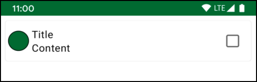

# 第六章：使用Compose

一个漂亮的用户界面对每个应用程序来说都是必不可少的。它不仅看起来漂亮，而且还能使你的应用程序使用起来**更有趣**。在上一章中，你学会了如何使用基本的合成器来创建复杂的合成器。你还开始了Note和AppDrawer合成器的工作。现在，你将学习如何使你的合成物在你的理想设计中看起来一样漂亮。

在本章中，你将

• 学习如何使用修改器为你的可合成物造型。

• 样式说明，以使它在最终设计中看起来像它应该有的样子。

• 在Jet Notes中添加更多的可合成物。

从现在开始，你完成的每一个可合成的东西都会像在你的设计中一样漂亮，通过添加那些你在过去几章中听说过的修饰语。 :]

## 修改器

修改器告诉一个UI元素如何在其父级布局中进行布局、显示或行为。你也可以说它们装饰了UI元素或为其添加了行为。

在上一章中，你开始了Note()的工作。


**注意可组合性--当前和最终状态**

在上图中，你可以比较你离开的地方（上图）和本章结束时的样子（下图）。

要跟上代码实例，请在Android Studio中打开本章的启动项目，并选择打开一个现有的项目。

接下来，导航到06-using-compos-modifiers/projects，选择启动器文件夹作为项目根。一旦项目打开，让它构建和同步，你就可以开始了

注意，如果你跳到最后一个项目，你就能看到完成的Note()和其他一些你在本章中要实现的可合成物。

无论你选择什么，我们将从建立NoteColor小组件开始。

### 添加NoteColor

在你的Note()中，你要改进的第一件事是NoteColor。在ui.component包中，创建一个名为NoteColor.kt的新Kotlin文件，然后在其中添加以下代码。

```kotlin
@Composable
fun NoteColor() {
  Box(
    modifier = Modifier
      .size(40.dp)
      .background(Color.Red)
) 
}

@Preview
@Composable
fun NoteColorPreview() {
  NoteColor()
}
```


为了使其发挥作用，添加以下导入。

```kotlin
import androidx.compose.foundation.background
import androidx.compose.foundation.layout.Box
import androidx.compose.foundation.layout.size
import androidx.compose.runtime.Composable
import androidx.compose.ui.Modifier
import androidx.compose.ui.graphics.Color
import androidx.compose.ui.tooling.preview.Preview
import androidx.compose.ui.unit.dp
```


现在看一下代码，你可以看到你创建了一个方框，并向它传递了一个修改器。在这个例子中，你使用了两个修改器函数。Modifier.size()和Modifier.background()。

Modifier.size()声明了内容的大小。你以与密度无关的像素（dp）为单位传递该值，并将元素的宽度和高度设置为相同的值。

Modifier.background()在内容后面画一个带有纯色的形状。在这个例子中，你传递了Color.Red。

正如你所看到的，你可以很容易地把几个修改器连锁起来，一个接一个地把它们组合起来。在这个例子中，你用Modifier开始修改器链，它代表一个空的修改器对象。

最后，你用NoteColorPreview()在预览面板中预览你的可合成。

建立你的项目并检查预览，你会看到像这样的东西。


**注释颜色 - 预览**

恭喜你，你刚刚创建了一个非常简单的可合成的，大小为40dp，背景为红色的作品。让我们看看我们是否能让它变得更漂亮吧!

## 链式修改器

现在你有了基本的NoteColor()，但你仍然要添加几个修饰符，使其与设计相匹配。

你要做的下一件事是使你的可组合的内容变成圆形。在前面的例子中，你看到了如何将多个修改器连在一起。在这里，你将应用同样的原则并改变代码，使其包括一个额外的修饰符。

```kotlin
@Composable
fun NoteColor() {
  Box(
    modifier = Modifier
      .size(40.dp)
      .background(Color.Red)
      .clip(CircleShape) // here
) }
```


不要忘记把这些导入也包括在内。

```kotlin
import androidx.compose.foundation.shape.CircleShape
import androidx.compose.ui.draw.clip
```


现在，建立你的项目并检查预览。你会看到像这样的东西。


**注释颜色 - 预览**

惊讶吗？如果你试图刷新预览面板，期待一个不同的结果，请不要责怪自己。:]

链中修饰语的顺序很重要。每个修饰符不仅为链中的下一个修饰符准备好可合成物，而且还同时修改可合成物。

考虑到这一点，试着分解一下你写的代码。通过Modifier.size()，你定义了可组合的宽度和高度。

之后，你有Modifier.background(Color.Red)。由于UI元素是由矩形块表示的，你最终得到的是一个红色的正方形。

然后你添加了Modifier.clip()，它将内容夹在一个特定的形状中。因为之前的两个修改器已经修改了可组合的内容，所以你的可组合的内容并没有改变。内容保持不变。

为了更清楚地说明这一点，试着在链上添加另一个Modifier.background的可组合性。

```kotlin
@Composable
fun NoteColor() {
  Box(
    modifier = Modifier
      .size(40.dp)
      .background(Color.Red)
      .clip(CircleShape)
      .background(Color.Yellow) // here
) }
```


建立该项目并检查预览。你会看到类似这样的东西。


**注释颜色 - 预览**

现在，你可以直观地看到Modifier.clip()对你的可组合的效果。它把未来的内容剪成一个圆的形状，所以当你应用 

Modifier.background(Color.Yellow)，你最终在红色的方块中得到了一个黄色的圆。

考虑到这一行为，你现在可以继续在NoteColor()上下功夫，使其看起来像设计图。重新排列修改器的顺序，得到一个具有特定颜色的圆形。

```kotlin
@Composable
fun NoteColor() {
  Box(
    modifier = Modifier
      .size(40.dp)
      .clip(CircleShape)
      .background(Color.Red)
) }
```


在这里，你把Modifier.clip()移到了你指定可组合背景的位置之前。这样，你就把你的可组合背景的内容剪成了一个圆形，其宽度和高度被设置为你用Modifier.size()指定的值。

建立项目并检查预览。


**注释颜色 - 预览**

很好！你刚刚创建了一个可塑体，可以发射一个你指定的彩色圆圈。你刚刚创建了一个可合成的，能发射出你指定大小的彩色圆圈。

## 完善NoteColor

在你结束这个可组合性之前，还有一些东西你需要添加。缺少的一个东西是边框。要添加这个，请像这样更新NoteColor()的代码。

```kotlin
@Composable
fun NoteColor() {
  Box(
    modifier = Modifier
      .size(40.dp)
      .clip(CircleShape)
      .background(Color.Red)
      .border( // new code
        BorderStroke(
          2.dp,
          SolidColor(Color.Black)
        ),
        CircleShape
      )
) }
```


为了让Android Studio高兴，也添加以下导入。

```kotlin
import androidx.compose.foundation.BorderStroke
import androidx.compose.foundation.border
import androidx.compose.ui.graphics.SolidColor
```


在这里，你添加了Modifier.border()，它给你一个具有你用边界和形状指定的外观的边界。对于边框，你通过 

BorderStroke()，它定义了边界的宽度和颜色。对于形状，你使用了与剪裁内容时相同的形状。建立项目，你会在预览面板中看到这样的东西。

 

**注释颜色 - 预览**

### 添加一些填充物

如果你检查设计，你会发现在NoteColor()周围应该有一些填充。要解决这个问题，可以这样更新代码。

```kotlin
@Composable
fun NoteColor() {
  Box(
    modifier = Modifier
      .padding(4.dp) // here
      .size(40.dp)
      .clip(CircleShape)
      .background(Color.Red)
      .border(
        BorderStroke(
          2.dp,
          SolidColor(Color.Black)
        ),
        CircleShape
      )
) }
```


不要忘记添加必要的导入。

```kotlin
import androidx.compose.foundation.layout.padding
```


Modifier.padding()在内容周围的每条边缘上应用额外的空间。在上面的代码中，你使用了4.dp。请注意，当你没有指定要填充的边缘时，填充将被应用于所有的边缘。你也可以用以下命名的参数来指定你要应用哪条边的padding：开始、顶部、结束和底部。

重要的是要注意你在链中添加修改器的顺序。你希望你的圆圈是你用Modifier.size指定的尺寸。你也希望你的填充物被应用在这个圆周围。所以，把Modifier.padding放在Modifier.size之前是最好的位置。

通过这样做，你将首先把填充物应用到你的可组合的，然后你将为你的内容保留指定大小的空间。

建立该项目并检查预览。现在它将看起来像这样。

 

**注释颜色 - 预览**

### 提高NoteColor的实用性

关于NoteColor()，你有所有必要的代码来完成这个设计。然而，使可组合的可重复使用的一个实质性改进是允许用户指定不同的参数。

现在，你已经硬编码了尺寸、背景颜色、填充和边框宽度的值，但你的用户应该能够改变它们。

要实现这一点，只需用以下代码取代NoteColor()，将这些值作为参数公开。

```kotlin
@Composable
fun NoteColor(
  color: Color,
  size: Dp,
  padding: Dp = 0.dp,
  border: Dp
){ Box(
    modifier = Modifier
      .padding(padding)
      .size(size)
      .clip(CircleShape)
      .background(color)
      .border(BorderStroke(
          border,
          SolidColor(Color.Black)
        ),
        CircleShape
      )
) }
```


不要忘记这个导入。

```kotlin
import androidx.compose.ui.unit.Dp
```


在这里，你改变了NoteColor()的签名，接受颜色、大小、padding和border。然后你用新的参数替换了硬编码的值。

现在，你需要调整NoteColorPreview()并指定正确的参数。用以下代码替换NoteColorPreview()。

```kotlin
@Preview
@Composable
fun NoteColorPreview() {
  NoteColor(
    color = Color.Red,
    size = 40.dp,
    padding = 4.dp,
    border = 2.dp
) }
```


在这里，你已经使用了与之前相同的值，所以你的预览应该保持不变。

构建该项目，以确保一切按预期工作。


**注释颜色 - 预览**

下一步是将你的新组件添加到Note中。

## 将NoteColor添加到Note中

在完成NoteColor()方面做得很好!你现在可以在你的Note中使用它，使其与设计相匹配。

在Note.kt中，用以下代码替换Note()的实现。

```kotlin
@Composable
fun Note() {
  Row(modifier = Modifier.fillMaxWidth()) {
    NoteColor( // NoteColor instead of Box
      color = rwGreen,
      size = 40.dp,
      padding = 4.dp,
      border = 1.dp
    )
    Column(modifier = Modifier.weight(1f)) {
      Text(text = "Title", maxLines = 1)
      Text(text = "Content", maxLines = 1)
    }
    Checkbox(
      checked = false,
      onCheckedChange = { },
      modifier = Modifier.padding(start = 8.dp)
) }
}
```


在上面的代码中，你删除了用作占位符的方框，然后添加了你美丽的NoteColor。

现在建立该项目，你会在预览面板中看到类似这样的东西。


**可供使用的笔记--用NoteColor预览**

当你在这里的时候，看看你在上一章中添加的修改器，当你在Note上工作时。

对于Row()，你使用了Modifier.fillMaxWidth()。这个修改器允许你指定可合成的宽度的一部分。默认情况下，这个分数是1f。所以在这种情况下，你指定Row应该使用最大的可用宽度。

对于Column()，你使用了Modifier.weight()。如果你熟悉XML布局中的weight属性，那么你已经知道它的作用。通过权重，你可以将元素的宽度与它相对于其他加权同级元素的权重成正比。

检查这个修改器的定义。它被定义在RowScope中，这意味着你可以在一个行中的元素上使用它。在这个例子中，你用它来使Column占用NoteColor和Checkbox之间的可用宽度。

## 为Note添加背景

看看Note的设计，注意它有一个白色的背景，它的角是圆的，周围有一个小阴影。幸运的是，你可以很容易地使用修改器来添加这些功能!

更新Note()代码，给Row()添加必要的修饰语，如下图所示。

```kotlin
@Composable
fun Note() {
  val backgroundShape: Shape = RoundedCornerShape(4.dp)
  Row(
    modifier = Modifier
      .padding(8.dp)
      .shadow(1.dp, backgroundShape)
      .fillMaxWidth()
      .heightIn(min = 64.dp)
.background(Color.White, backgroundShape) ){
... }
}
```


像往常一样，不要忘记添加必要的导入。

```kotlin
import androidx.compose.foundation.shape.RoundedCornerShape
import androidx.compose.ui.draw.shadow
import androidx.compose.ui.graphics.Color
import androidx.compose.ui.graphics.Shape
import androidx.compose.foundation.layout.heightIn
```


通过这个代码，你引入了四个修改器，其中两个对你来说是完全新的。

• **Modifier.padding**。在音符和屏幕边缘之间添加一些空间。

• **Modifier.shadow**：创建DrawLayerModifier，它绘制阴影。仰角定义了一个物理对象的视觉深度。此外，物理对象有一个形状。在这个例子中，你定义了标高应该是1.dp，对于形状，你用RoundedCornerShape()定义了角落应该是半径为4dp的圆角。

• **Modifier.background**。这是一个简单的例子。正如你已经学过的，它在内容后面画一个带有纯色的形状。

• **Modifier.heightIn**。将内容的高度限制在最小和最大值之间。在这种情况下，你不需要一个最大值，但你需要一个最小值，因为你希望你的可组合内容的高度至少是64dp。

现在，建立你的项目并运行应用程序以检查Note的外观。


**可与背景相融合的注释**

太好了!你已经成功地为你的笔记添加了背景。请注意边角。它们现在是圆的，并且在纸条周围有一个阴影。另外，请看纸条的高度与你指定的一致。

然而，在这一点上，你可能已经注意到，整体的可组合性看起来很笨拙。这是因为它的内容不在中心位置。修复对齐问题将是你的下一个任务。

## 文本和复选框的居中组合

你离完成你的Note()越来越近了。它现在有正确的形状和正确的元素，但它们的位置还不正确。

你的第一步是固定文本和复选框的位置。要做到这一点，请更新Note()中的Column和Checkbox的代码，使其看起来像这样。

```kotlin
Column(
  modifier = Modifier
.weight(1f)
.align(Alignment.CenterVertically) ){
  Text(text = "Title", maxLines = 1)
  Text(text = "Content", maxLines = 1)
}
Checkbox(
  checked = false,
  onCheckedChange = { },
  modifier = Modifier
    .padding(16.dp)
    .align(Alignment.CenterVertically)
)
```


为使其发挥作用，请添加此导入。

```kotlin
import androidx.compose.ui.Alignment
```


在这段代码中，对准你的可组成元素的关键是Modifier.align(alignment: Alignment.CenterVertically)。这个修改器允许你在行中垂直对齐元素，使它们居中。

就像Modifier.weight()一样，这个修改器被定义在一个RowScope中。这意味着你只能在一个行中使用它。注意，你还向CheckBox()添加了Modifier.padding()，以使它看起来更漂亮。这并不影响可组合的对齐方式，但注意细节是个好做法。构建并运行该应用程序，你的注释将看起来像这样。


**注：可组合的居中文本**

现在，文本和复选框都很好地集中在注释中。

## 居中注释颜色

当你看NoteColor时，你意识到你不能像对Column和Checkbox那样给它应用一个修改器。NoteColor没有暴露一个修改器作为其参数。现在是解决这个问题的时候了。

在NoteColor.kt中，更新NoteColor()，使其看起来像这样。

```kotlin
@Composable
fun NoteColor(
  modifier: Modifier = Modifier, // 1
  color: Color,
  size: Dp,
  padding: Dp = 0.dp,
  border: Dp
){ Box(
    modifier = modifier // 2
      .padding(padding)
      .size(size)
      .clip(CircleShape)
      .background(color)
      .border(
        BorderStroke(
          border,
          SolidColor(Color.Black)
        ),
        CircleShape
      )
) }
```


这里有两件事需要注意。

1. 你添加了一个修改器作为参数给你的自定义可组合，你用一个空的修改器初始化了它。

2. 你在Box()中使用了那个修改器作为你的修改器链中的第一个。请记住，早些时候，你在这里使用了一个空的修改器来代替。

注意：花点时间消化一下使用修饰语与修改语之间的区别。两者之间只有一个单字符的区别，但意义完全不同。了解这一点可以帮助你在未来避免相当多的错误。

你刚才所做的被认为是用Jetpack Compose创建自定义可合成物时的一个良好做法。将修改器作为一个参数公开，并允许该合成器的用户根据需要添加其他修改器，这总是很有用的。

现在，回到Note.kt，把NoteColor也对齐。

```kotlin
NoteColor(
  modifier = Modifier.align(Alignment.CenterVertically),
  color = rwGreen,
  size = 40.dp,
  padding = 4.dp,
  border = 1.dp
)
```


正如你所看到的，你现在可以应用与文本和复选框相同的逻辑，所以你将Modifier.align()添加到NoteColor。

构建并运行该应用程序。



**注：可组合式中心化**

很好!现在每一个组件都很好地在纸条的中心位置。然而，NoteColor和Text在纸条的左边有点拥挤。下一步你将解决这个问题。

## 利用修改器参数的优势

正如之前提到的，在进行自定义可组合的工作时，考虑到有人会如何使用该可组合是一个好的做法。

对于NoteColor，你暴露了颜色、大小、padding、border和修改器，使其更加灵活。然而，你必须注意**不要**做得太过分。拥有大量的参数会带来比你需要的更多的复杂性。

通过将修改器作为一个参数公开，你突然允许对你的可组合性进行大量的定制。这意味着你可能会删除一些参数，因为它们提供的行为现在可以由修改器来接管。

对于NoteColor，注意你把padding作为一个参数传递。当你没有把修改器作为参数时，这很有用，但现在，你不需要它了。你接下来要做的就是解决这个问题。]

打开NoteColor.kt并更新代码，看起来像这样。

```kotlin
@Composable
fun NoteColor(
  modifier: Modifier = Modifier,
  color: Color,
  size: Dp,
  border: Dp
){ Box(
    modifier = modifier
      .size(size)
      .clip(CircleShape)
      .background(color)
      .border(
        BorderStroke(
          border,
          SolidColor(Color.Black)
        ),
        CircleShape
      )
) }
@Preview
@Composable
fun NoteColorPreview() {
  NoteColor(
    color = Color.Red,
    size = 40.dp,
    border = 2.dp
) }
```


在上面的代码中，你把padding从composable的参数中移除。你也从盒子的修改器链中删除了Modifier.padding()。你还更新了NoteColorPreview，使其不包括参数中的padding。

现在，你将通过修改器调用可组合性来获得填充物。

### 应用填充物

在Note.kt中，像这样更新NoteColor。

```kotlin
NoteColor(
  modifier = Modifier
    .align(Alignment.CenterVertically)
    .padding(start = 16.dp, end = 16.dp), // here
  color = rwGreen,
  size = 40.dp,
  border = 1.dp
)
```


为了给NoteColor添加水平填充，你将Modifier.padding()添加到你作为参数之一传递的Modifier中。

构建并运行该应用程序，你会看到以下结果。


**可以用修饰符的纸条** 干得好，你的纸条现在几乎与设计相匹配了。

然而，魔鬼在细节中，还有一件事没有做：文本样式。现在，标题和内容都有相同的文本样式。你接下来要做的就是解决这个问题。

## 标题和内容的样式

再看一次纸条设计，你会发现标题和内容有特定的文字风格。内容的文字比较小，而且有不同的颜色。在这种情况下，你不会使用修饰符，但这是一个很好的地方来包装你的笔记的用户界面。

在Note.kt中，编辑Column()的代码，使其看起来像这样。

```kotlin
Column(
  modifier = Modifier
.weight(1f)
.align(Alignment.CenterVertically) ){
  Text(
    text = "Title",
    color = Color.Black,
    maxLines = 1,
    style = TextStyle(
      fontWeight = FontWeight.Normal,
      fontSize = 16.sp,
      letterSpacing = 0.15.sp
) )
  Text(
    text = "Content",
    color = Color.Black.copy(alpha = 0.75f),
    maxLines = 1,
    style = TextStyle( // here
      fontWeight = FontWeight.Normal,
      fontSize = 14.sp,
      letterSpacing = 0.25.sp
) )
}
```


为了避免Android Studio的投诉，添加这些导入。

```kotlin
import androidx.compose.ui.text.TextStyle
import androidx.compose.ui.text.font.FontWeight
import androidx.compose.ui.unit.sp
```


在这里，你使用了文本中的样式和颜色，将Material Design应用于你的笔记。

TextStyle()是一个文本的样式配置。它暴露了不同的参数，如fontWeight、fontSize、letterSpacing等，让你对文本进行样式配置。

在第8章，"将Material Design应用于Compose "中，你会看到如何使用Jetpack Compose中提供的Material组件来轻松完成同样的结果。但是现在，注意到你可以用基本的组件来完成同样的事情是很好的。

建立并运行该应用程序。现在的注释看起来像这样。


**注：可组合式**

干得好!你的纸条可合成现在和它的设计一样漂亮。 :]

现在你已经完成了Note，如果能在Jet Notes中添加一些新的可合成物就更好了。

## 添加可合成的颜色

不，你没有遇到**似曾相识的情况**。这将是一个与以前的NoteColor不同的可合成的东西。]既然你已经完成了NoteColor，增加一个依靠它来建立额外功能的可组合性是有意义的。

所以现在，你将开始着手制作一个可组合的颜色选择器，就像下面所示的那样。

 

**颜色选择器**

颜色选择器允许用户通过给他们的笔记指定特定的颜色来对其进行颜色编码。用户可以通过点击应用栏中的调色板图标或从屏幕的底部边缘拉动来打开颜色选择器。


**颜色选择器 - 组件**

你可以把这个可组合的东西分解成更小的东西，如上图所示。按照自下而上的方法，你先在ColorItem上做文章。

你将在 "保存笔记 "屏幕中使用这种可组合的方式。

### 创建ColorItem

首先，在ui包中创建一个名为screen的新包。然后，在这个包中，创建一个名为SaveNoteScreen.kt的新Kotlin文件。最后，在SaveNoteScreen.kt中添加以下代码。

```kotlin
@Composable
fun ColorItem(
  color: ColorModel,
  onColorSelect: (ColorModel) -> Unit
){ Row(
    modifier = Modifier
      .fillMaxWidth()
      .clickable(
onClick = {
          onColorSelect(color)
        }
) ){
    NoteColor(
      modifier = Modifier.padding(10.dp),
      color = Color.fromHex(color.hex),
      size = 80.dp,
      border = 2.dp
) Text(text = color.name,
      fontSize = 22.sp,
      modifier = Modifier
        .padding(horizontal = 16.dp)
        .align(Alignment.CenterVertically)
    )
} }
```


为了使其发挥作用，你需要添加必要的导入。

```kotlin
import androidx.compose.material.Text
import androidx.compose.foundation.clickable
import androidx.compose.foundation.layout.Row
import androidx.compose.foundation.layout.fillMaxWidth
import androidx.compose.foundation.layout.padding
import androidx.compose.runtime.Composable
import androidx.compose.ui.Alignment
import androidx.compose.ui.Modifier
import androidx.compose.ui.unit.dp
import androidx.compose.ui.unit.sp
import
com.raywenderlich.android.jetnotes.domain.model.ColorModel
import
com.raywenderlich.android.jetnotes.ui.components.NoteColor
import androidx.compose.ui.graphics.Color
import com.raywenderlich.android.jetnotes.util.fromHex
```


好了，现在是分解代码的时候了。在设计中，有两个组件一起工作，使ColorItem可以组合。NoteColor和Text。它们彼此对齐，所以你用一个行来定位它们。

这里有一个新的修改器，你到目前为止还没有使用。Row中的Modifier.clickable()。通过这个修改器，你使整个ColorItem成为可点击的。正如之前提到的，将点击事件暴露给父组合物是一个好的做法。为了达到这个目的，你为onClick传递了onColorSelect(color)的调用。onColorSelect的类型是(ColorModel) -> Unit，这被称为函数类型。这个特定的函数类型说的是，将传递给它的函数应该以ColorModel作为参数。

为了执行它，你使用了默认的调用操作符：onColorSelect(color)，使用函数名称。这意味着，当用户点击一个音符时，传递给onColorSelect参数的函数将被执行。

ColorItem有两个参数。

• 一个ColorModel类型的颜色参数，它代表颜色的模型类。

• onColorSelect参数的类型（ColorModel）->单位。这是一个以ColorModel作为参数的lambda。这样一来，你就可以让父类的可组合性知道用户选择了哪种颜色。

### 预览ColorItem

最后，在SaveNoteScreen.kt的底部添加以下预览函数，以便你可以预览你的ColorItem。

```kotlin
@Preview
@Composable
fun ColorItemPreview() {
  ColorItem(ColorModel.DEFAULT) {}
}
```


不要忘记添加预览的导入。

```kotlin
import androidx.compose.ui.tooling.preview.Preview
```


这里，你只是用ColorModel.kt中定义的默认颜色调用了Color。对于onColorSelect，你传递了一个空的lambda，因为你不需要它来使预览工作。感谢Kotlin，你可以把第二个参数作为尾部的lambda来传递。

现在，建立该项目。在预览面板上，你会看到这个。


**ColorItem - 预览**

伟大的工作!你已经完成了另一个可合成的!:]

现在，你可以用这个可组合的方式来完成颜色选择器。

### 对ColorPicker的可组合性进行总结

有了ColorItem，构建ColorPicker()就小菜一碟了。

在SaveNoteScreen.kt的顶部添加以下代码，就在ColorItem上面。

```kotlin
@Composable
private fun ColorPicker(
  colors: List<ColorModel>,
  onColorSelect: (ColorModel) -> Unit
){
Column(modifier = Modifier.fillMaxWidth()) {
    Text(
      text = "Color picker",
      fontSize = 18.sp,
      fontWeight = FontWeight.Bold,
      modifier = Modifier.padding(8.dp)
    )
    LazyColumn(modifier = Modifier.fillMaxWidth()) {
      items(colors.size) { itemIndex ->
        val color = colors[itemIndex]
        ColorItem(
          color = color,
          onColorSelect = onColorSelect
        )
} }
} }
```


像往常一样，你也需要添加一些导入。

```kotlin
import androidx.compose.foundation.lazy.LazyColumn
import androidx.compose.foundation.layout.Column
import androidx.compose.ui.text.font.FontWeight
```


为了创建上面代码中的ColorPicker，你使用了一个Column来对齐它的标题和颜色列表。你希望用户能够滚动浏览这些颜色，所以你用了一个LazyColumn来包装它们。

ColorPicker有两个参数。它接受ColorModels的列表，并且像ColorItem一样，它暴露了点击事件参数。

为了直观地看到你到目前为止所建立的东西，在SaveNoteScreen.kt的底部添加可合成预览。

```kotlin
@Preview
@Composable
fun ColorPickerPreview() {
  ColorPicker(
    colors = listOf(
      ColorModel.DEFAULT,
      ColorModel.DEFAULT,
      ColorModel.DEFAULT
) ){}
}
```


在这里，你调用了ColorPicker()并向它传递了一个默认颜色的列表。对于onColorSelect，你传递了一个空的lambda，因为在这个阶段你对与可组合的交互不感兴趣。

构建项目并检查预览面板以看到这一点。


**选色器 - 预览**

干得好!你的腰带上又多了一个可合成的东西。]

你会在第7章 "Compose中的状态管理 "中看到颜色选择器的作用。

本章到此结束。希望你现在能感受到修改器的强大。你可以通过浏览06-usingcompos-modifiers/projects/final找到本章的最终代码。

## 关键点

• 修改器告诉一个UI元素如何在其父级布局中进行布局、显示或行为。你也可以说它们装饰了UI元素或为其添加了行为。

• 你可以把几个修饰语连锁起来，一个接一个地组成。

• 链中修饰语的顺序很重要。每个修饰符都是为链中的下一个修饰符准备的，但它也同时修饰了可合成物。

• 避免在你的可组合函数中硬编码这些值。相反，将这些值作为可组合函数的属性公开。

• 在创建自定义的可组合物时，将修改器作为一个参数公开是一个很好的做法，允许该可组合物的用户在必要时添加其他修改器。

## 今后该何去何从？

修改器是你为你的合成物设计风格时使用的一个伟大工具。到此为止，你应该对你能用它们完成的任务有了一个认识。

这一章并没有涵盖 Compose 所提供的所有修改器，因为它们有很多。好消息是，这些原则是相同的，所以你应该用你所获得的知识放心地使用它们。

当你玩可合成物时，不要害怕深入研究你可以在哪些组件上使用哪些修改器。你可能会有惊喜的发现。]

在下一章中，你将学习Jetpack Compose最重要的事情之一：如何管理状态。当你完成这一章时，Jet Notes将离成为一个全功能的应用程序更近一步。