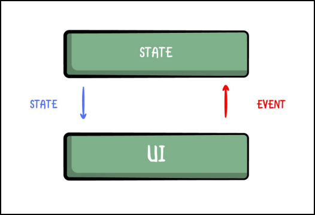

# 第七章：管理应用状态

完成了本节的前两章，做得很好。现在你知道了组成用户界面的基本原则，并使其变得漂亮。

在这一章中，你将把注意力从JetNotes的用户界面转移到使其具有功能性。为了使任何应用程序具有功能性，你需要知道如何管理状态，这就是本章的主题。

在本章中，你将学习。

• 什么是应用状态。

• 什么是单向的数据流。

• 在创建stateless组合物时，如何考虑状态和事件的问题。

• 如何使用Android架构组件中的ViewModel和LiveData来管理Compose的状态。

• 如何在笔记屏幕上添加功能。

通过深入了解什么是状态以及为什么它对你的应用程序至关重要，准备好深入了解。

## 了解状态

在你理解状态管理理论之前，你需要定义什么是状态。

在其核心部分，每个应用程序都与可以改变的特定值一起工作。例如，JetNotes管理笔记，用户可以对笔记的列表进行更改。他们可以

• 添加新的笔记。

• 删除当前笔记。

• 改变一个笔记。

• 完成一个笔记。

状态是任何可以随时间变化的值。这些值可以包括从数据库中的一个条目到一个类的一个属性的任何东西。随着状态的变化，你需要更新用户界面以反映这些变化。

### UI更新循环

当你考虑到用户如何与安卓应用互动时，你可以说它就像在进行对话。用户通过点击、拖动和说话等事件进行交流，而应用程序则通过显示应用程序的状态进行回应。

事件是应用程序外部产生的输入，而状态是应用程序对事件的反应结果。在两者之间，你有更新状态的逻辑。


**UI更新循环**

这三个概念构成了用户界面更新循环。

• 事件。由用户或程序的另一部分产生的输入。

• 更新状态。一个事件处理程序，对事件作出反应并更新状态。

• 显示状态。UI更新并显示新的状态。

这就是所有Android应用程序的工作方式。理解这个概念是理解 Compose 如何管理状态的关键。

## 用Android UI Toolkit处理状态

在进一步讨论之前，请提醒自己目前的Android UI工具包是如何管理状态的。

在第1章 "在Android中开发UI "中，你有机会探索一个基本的Android组件--Spinner--的UI和业务逻辑之间的数据流。

在那里，你看到，如果用户界面也拥有和管理状态，那么就很难建立一个代表模型的用户界面--或者说，在这种情况下，一个状态。

这种设计有一些问题，包括。

• 测试。如果用户界面的状态与它们混在一起，就很难测试像Activity或Fragment这样的视图。

• 部分状态的更新。如果屏幕上有很多事件，很容易忘记更新部分状态，这可能导致不正确的用户界面。

• 部分的用户界面更新。每当状态改变时，你必须手动更新用户界面。你要更新的东西越多，就越容易忘记一些东西，再次导致不正确的用户界面。

• 代码的复杂性。使用这种模式时，很难提取一些逻辑。从长远来看，代码往往会变得难以阅读和理解。

• 没有单一的真理来源：因为用户界面和模型都拥有状态，你必须确保它们是同步的。

• 更新责任。你并不总是知道是你在改变视图的状态，还是事件来自于用户。

在你学习单向数据流以及它如何能提供帮助时，请记住这一点。

## 处理具有单向数据流的状态

在之前的Spinner例子中，数据流有多个方向，它可以来自多个方向，也可以去到多个方向，这取决于它反映的触发事件和UI更新。这意味着很难保持一切同步，也很难随时知道变化来自哪里。

另一方面，单向数据流是一个概念，其中状态变化和用户界面更新都只有一个方向，正如其名称所述。这意味着状态变化事件只能来自一个来源，通常是来自用户交互，而用户界面更新只能来自状态管理器、事件处理程序或模型，无论你怎么称呼它。

单向数据流并不是编程中的一个新概念。将在用户界面中显示状态的组件与应用程序中存储和改变状态的部分解耦是个好主意，这一点已得到公认。

Compose在构建时考虑到了单向的数据流。



**单向的数据流**

这里的关键概念是，状态向下流动，事件向上流动，如上图所示。

另一个关键概念是，用户界面观察状态。每当有新的状态出现时，用户界面就会显示出来。

下面是一个使用单向数据流的应用程序的UI更新循环的样子。

• 事件。一个UI组件产生输入并将其传递上去。

• 更新状态。一个事件处理程序可能会也可能不会改变状态。对于一些UI组件，新的状态已经有了正确的格式，所以不需要改变。

• 显示状态。UI观察状态。在创建时，新的状态被传递给显示它的用户界面。

尽管在写这篇文章时，金豪还没有一个内置的Spinner，但你可以重新想象一下你在第一章 "在Android中开发UI "中如何使用一个单向的数据流。

 

**单向的数据流**

在图中，你可以看到单向数据流的两个不同部分。

1. UI，由旋转器代表。

2. 状态，由State属性代表。

旋转器观察状态并能产生事件。当新的事件发生时，一个事件处理程序可能会也可能不会更新状态。当状态发生变化时，Spinner会意识到并显示这一变化。

就像你在前面的例子中工作时一样，用户可以与Spinner进行交互--现在的主要区别是你在代码中如何与它交互。在代码中，你并不直接与Spinner互动；你只是更新状态。由于Spinner观察到了该状态，所以当状态发生变化时，用户界面会正确地更新。

在使用Jetpack Compose时遵循这种模式有几个好处。

• 可测试性。由于用户界面与状态解耦，你可以孤立地测试每个组件。

• 状态封装。因为状态只能在一个地方更新，所以你不太可能创建不一致的状态。

• UI的一致性。由于你的UI观察到了状态，所以UI会立即反映所有的状态更新。

• 单一真相来源：用户界面和模型不再共享状态。状态只存在于一个地方，这就是现在的单一真相来源。

• 明确更新的责任。UI组件只能产生新的事件，而且只有用户可以与之交互。在代码中，你与状态本身互动，而不是与UI组件互动。

很好!现在你知道了Jetpack Compose所建立的状态管理的基本原则，你已经准备好动手了，向JetNotes添加你的第一个功能。 :]

## 构成与ViewModel

正如上一节所提到的，在单向数据流中，UI观察的是状态。Android框架提供了一些很好的Android架构组件，使你很容易遵循这种方法，包括ViewModel和LiveData。

一个ViewModel可以让你从UI中提取状态，并定义UI可以调用的事件来更新该状态。LiveData允许你创建可观察的状态持有者，为任何人提供观察状态变化的方法。


**使用架构组件的单向数据流** 你将为你的应用程序使用上图所示的架构。

ViewModel将代表状态，而你的composables将代表UI。在你的ViewModels中，你将使用LiveData来保持状态。

在你的可组合物中，你将观察该状态并将事件从子可组合物传播到ViewModel。

理论够多了，是时候将其付诸实践了!:]

要跟上代码实例，请用Android Studio打开本章的启动项目，并选择打开一个现有的项目。

接下来，导航到07-managing-state-in-compose/projects，选择starter文件夹作为项目根。一旦项目打开，让它构建和同步，你就可以开始了!

请注意，如果你跳到最后一个项目，你就能看到笔记屏幕和其中的笔记列表。 :] 。

## 创建注释屏幕

到目前为止，JetNotes没有屏幕。目前，你唯一能做的就是拉出应用抽屉，检查一张纸条，用它来跟踪你的进度。这一点即将改变。]

你的下一步是创建注释屏幕。为了让你更容易在这个屏幕上工作，数据库已经包含了一些笔记和颜色。如果你对它们背后的代码感兴趣，请查看 RepositoryImpl.kt 中的 initDatabase() 。

在你开始实现ViewModel之前，你要为Notes屏幕添加入口点。

在screen包中，创建一个名为NotesScreen.kt的新Kotlin文件，并在其中添加以下代码。

```kotlin
@Composable
fun NotesScreen(viewModel: MainViewModel) {
}
```


这就为Notes创建了你的可组合的根函数。注意，NotesScreen()把MainViewModel作为一个参数。你需要这个，因为你要在NotesScreen()中观察MainViewModel的状态。你还需要一个对MainViewModel的引用，这样你就可以把事件从用户界面上传给它。

为了使其成功构建，你必须添加这些必要的导入。

```kotlin
import androidx.compose.runtime.Composable
import
com.raywenderlich.android.jetnotes.viewmodel.MainViewModel
```


在向NotesScreen.kt添加任何代码之前，你需要把这个屏幕作为打开应用程序时出现的默认屏幕。要做到这一点，进入MainActivity.kt，用NotesScreen(viewModel)替换JetNotesTheme()里面的代码，像这样。

```kotlin
 JetNotesTheme {
  NotesScreen(viewModel = viewModel)
}
```


这确保了只要你运行应用程序，Notes就会打开。通过删除旧代码，你暂时从应用中删除了应用抽屉--但别担心，你很快就会把它加回来。

现在，为NotesScreen添加导入。

```kotlin
import com.raywenderlich.android.jetnotes.ui.screens.NotesScreen
```


最后，构建并运行该应用程序。你会看到一个空屏幕，像这样。

 

**空注屏幕** 好了，你的画布已经准备好了!

在下一节，你的任务是将NotesScreen()与MainViewModel连接起来。

### 实现单向的数据流

现在你有了一个进入Notes的入口，你需要实现MainViewModel，使其支持单向数据流。

记住，有两个关键概念在起作用：状态和事件。

首先，试试你的手，分解这里有哪些状态。笔记屏幕显示了一个笔记的列表，这是该屏幕的状态。每个笔记都包含一些状态，这些状态都被封装在NoteModel中。

现在，试着在你的MainViewModel中暴露这个状态。

打开MainViewModel.kt，在该类中添加以下代码。

```kotlin
 val notesNotInTrash: LiveData<List<NoteModel>> by lazy {
  repository.getAllNotesNotInTrash()
}
```


Repository，在启动项目中预先准备好了，暴露了getAllNotesNotInTrash()，它返回NoteModels列表的LiveData。有了这个，你可以很容易地暴露出你想在笔记屏幕上显示的笔记的状态。

现在，你需要添加一些导入。

```kotlin
import androidx.lifecycle.LiveData
import com.raywenderlich.android.jetnotes.domain.model.NoteModel
```


这是很简单的。接下来，你需要分解哪些事件要从NotesScreen传递到MainViewModel。看一下设计就知道有三个事件需要处理。用户可以。

• 点击一个特定的笔记。

• 点击浮动的行动按钮（FAB）来创建一个新的笔记。

• 勾选一个注释。

为了处理这些事件，在MainViewModel的底部添加以下内容。

```kotlin
fun onCreateNewNoteClick() {
  // TODO - Open SaveNoteScreen
}
fun onNoteClick(note: NoteModel) {
  // TODO - Open SaveNoteScreen in Edit mode
}
fun onNoteCheckedChange(note: NoteModel) {
  viewModelScope.launch(Dispatchers.Default) {
    repository.insertNote(note)
  }
}
```


这里，你添加了三个函数，代表视图可以传递的三种可能的事件。

• onCreateNoteClick()。当用户点击一个FAB时，你会调用这个函数。现在，它的主体是空的，但当你在 "保存笔记 "屏幕上工作时，你将完成它。

• onNoteClick()。当用户点击任何一个音符时，这个反应。为了知道用户选择了哪个笔记，它使用NoteModel作为一个参数。再一次，它的主体将保持为空，直到你完成保存笔记屏幕。

• onNoteCheckedChange()。当用户点击任何笔记中的复选框时，你会调用这个。它告诉版本库更新数据库中的特定笔记。

最后，为了让Android Studio高兴，也添加这些导入。

```kotlin
import androidx.lifecycle.viewModelScope
import kotlinx.coroutines.Dispatchers
import kotlinx.coroutines.launch
```


**单向数据流 - 注释屏幕**

干得好!你现在已经准备好在NotesScreen中使用MainViewModel了。

## 创建应用栏

在将NotesScreen连接到MainViewModel之前，你需要实现构成Notes屏幕的UI组件。

在你的笔记屏幕中，你需要添加一个应用栏。但是等一下--检查一下设计，你会发现你在**所有的**屏幕上都需要这个应用栏。因此，把它作为一个单独的组件来实现，并在你需要的时候重新使用它，这将是很方便的。

在ui.component中，创建一个名为TopAppBar.kt的新的Kotlin文件，并在其中添加以下代码。

```kotlin
@Composable
fun TopAppBar(
  title: String,
  icon: ImageVector,
  onIconClick: () -> Unit,
){ Row(
    modifier = Modifier
      .fillMaxWidth()
      .height(56.dp)
      .background(color = MaterialTheme.colors.primarySurface)
){ Image(
      imageVector = icon,
      contentDescription = "Top App Bar Icon",
      colorFilter = ColorFilter
        .tint(MaterialTheme.colors.onPrimary),
      modifier = Modifier
        .clickable(onClick = onIconClick)
        .padding(16.dp)
        .align(Alignment.CenterVertically)
) Text(
      text = title,
      color = MaterialTheme.colors.onPrimary,
      style = TextStyle(
        fontWeight = FontWeight.Medium,
        fontSize = 20.sp,
        letterSpacing = 0.15.sp
      ),
      modifier = Modifier
        .fillMaxWidth()
        .align(Alignment.CenterVertically)
        .padding(start = 16.dp, end = 16.dp)
) }
}
```

这段代码创建了一个可以在多个屏幕上重复使用的应用程序栏。这是一个相当直接的组合。你用一个行来对齐一个图标和一个文本字段，彼此相邻。你应该熟悉你在这里使用的所有修改器和特定的属性--你在前一章中看到过它们。

你还暴露了几个参数来让你定制屏幕。标题允许你改变屏幕的标题，而图标让你为应用程序栏设置任何图标。最后，由于图标是可点击的，你暴露了onIconClick，所以当用户点击图标时，父级组合可以做出反应。

这里的重要概念是onIconClick。你已经在第五章 "组合可组合 "中看到了这个概念。通过公开这个特定的参数，你可以在用户与这个可组合物进行交互时将点击事件传递上去。

今后要注意这个概念。在本章中你会经常看到它。

为了使上面的代码发挥作用，你还需要添加一些导入。

```kotlin
import androidx.compose.foundation.Image
import androidx.compose.foundation.background
import androidx.compose.foundation.clickable
import androidx.compose.foundation.layout.Row
import androidx.compose.foundation.layout.fillMaxWidth
import androidx.compose.foundation.layout.height
import androidx.compose.foundation.layout.padding
import androidx.compose.material.MaterialTheme
import androidx.compose.material.Text
import androidx.compose.material.primarySurface
import androidx.compose.runtime.Composable
import androidx.compose.ui.Alignment
import androidx.compose.ui.Modifier
import androidx.compose.ui.graphics.ColorFilter
import androidx.compose.ui.graphics.vector.ImageVector
import androidx.compose.ui.text.TextStyle
import androidx.compose.ui.text.font.FontWeight
import androidx.compose.ui.unit.dp
import androidx.compose.ui.unit.sp
```


现在，是时候结束TopAppBar()的工作了。在TopAppBar.kt的底部添加以下代码。

```kotlin
@Preview
@Composable
private fun TopAppBarPreview() {
  JetNotesTheme {
    TopAppBar(
      title = "JetNotes",
      icon = Icons.Filled.List,
      onIconClick = {}
) }
}
```


在这里，你添加了预览的可组合性，所以你可以在预览面板中检查TopAppBar()。你还采取了一个额外的步骤，使用JetNotesTheme作为一个包装器，使TopAppBar()使用你在主题中定义的颜色。然而，如果没有这个，预览也可以工作。

不要忘记把这些导入也包括在内。

```kotlin
import androidx.compose.material.icons.Icons
import androidx.compose.material.icons.filled.List
import androidx.compose.ui.tooling.preview.Preview
import com.raywenderlich.android.jetnotes.theme.JetNotesTheme
```


建立项目并检查预览面板。你会看到类似这样的东西。


**TopAppBar可组合式 - 预览**

很好！你现在已经建立了一个可以在任何屏幕上重复使用的应用栏。你现在已经建立了一个可组合的应用栏，你可以在任何你想使用的屏幕上重复使用。]

接下来你要做的是调整Note()，这样你就可以把它用于Notes屏幕。

## 无状态组合物

在MainViewModel中，你暴露了NoteModels的列表作为一种状态，但你的Note()仍然没有准备好渲染一个特定的NoteModel。

如果你检查你在上一章完成的Note()，你会发现它的值都是硬编码的。你将在本节中改变这一点。

在编写任何代码之前，花点时间思考一下你需要呈现哪种状态的笔记以及每个笔记应该暴露哪些事件。


**单向数据流 - 备注**

正如你之前看到的，NotesScreen()需要能够将三个事件传递给MainViewModel，其中两个事件是一个笔记的责任。

另外，如果你想在Note()中呈现正确的信息，你需要NoteModel的数据。NoteModel是一个状态，父级的可组合性将传递给Note()。

现在，你准备打开Note.kt，向Note()添加以下参数。

```kotlin
@Composable
fun Note(
  note: NoteModel,
  onNoteClick: (NoteModel) -> Unit = {},
  onNoteCheckedChange: (NoteModel) -> Unit = {}
){
// ...
}
```


上面代码中的参数代表了状态和事件，它们将在Note()和它的父级可组合性之间上下传递。

这些参数中隐藏着一个重要的原则：状态提升。如果你的可组合程序有状态，你可以使用状态提升来使其无状态。状态提升是一种编程模式，通过用参数和事件替换可组合的内部状态，将状态转移给可组合的调用者。

对于可组合物，这通常意味着向可组合物引入两个参数。

• **value: T**: 要显示的当前值。

• **onValueChange: (T) -> Unit**:一个请求改变一个值的事件，其中T是建议的新值。

值T代表一个通用类型，这取决于数据和你所显示的用户界面。如果你再看一下Note的参数，你会发现你的状态和事件都是按照同样的方法。在这种情况下，你的T实际上是一个NoteModel。

通过将状态提升应用到一个可组合物上，你使它成为无状态--这意味着它本身不能改变任何状态。无状态的可组合程序更容易测试，往往有更少的错误，并提供更多的重用机会。

一个有状态的可组合物是一个对最终类有依赖性的可组合物，它可以直接改变一个特定的状态。在这个例子中，一个有状态的可组合物是任何一个对MainViewModel有依赖性并且可以调用MainViewModel.onNoteCheckedChange（）的父可组合物。为什么是那个特定的函数？因为它改变了MainViewModel的状态。

最后，导入NoteModel。

```kotlin
import com.raywenderlich.android.jetnotes.domain.model.NoteModel
```


现在你已经了解了无状态的可合成物，你的下一步是添加逻辑来渲染NoteModel状态。

### 渲染NoteModel的状态

为了在Note()中呈现NoteModel，你需要用NoteModel的值来替换你当前的、硬编码的值。

你的第一个任务是更新代码，当你调用NoteColor时，使用NoteModel的颜色。

```kotlin
NoteColor(
  modifier = Modifier
    .align(Alignment.CenterVertically)
    .padding(start = 16.dp, end = 16.dp),
  color = Color.fromHex(note.color.hex),
  size = 40.dp,
  border = 1.dp
)
```


这是很直接的。你使用实用函数，将NoteModel.color.hex中的字符串颜色值解析为Color。在它工作之前，你需要给实用程序函数添加一个导入。

```kotlin
import com.raywenderlich.android.jetnotes.util.fromHex
```


现在，你要确保显示正确的标题和内容文本。像这样的栏目。

```kotlin
Column(
  modifier = Modifier
.weight(1f)
.align(Alignment.CenterVertically) ){
  Text(
    text = note.title, // here
... )
  Text(
    text = note.content, // here
... )
}
```


这也很容易理解。你所做的就是用NoteModel.title和NoteModel.content替换你用于标题和内容的硬编码值。

现在，关于状态要处理的最后一件事是复选框的合成。更新处理复选框的代码，像这样。

```kotlin
if (note.isCheckedOff != null) {
  Checkbox(
    checked = note.isCheckedOff,
    onCheckedChange = {},
    modifier = Modifier
      .padding(16.dp)
      .align(Alignment.CenterVertically)
  )
}
```


这里，你首先检查NoteModel.isCheckedOff是否为空。如果是的话，这意味着该笔记没有被设置为用户勾选，所以它不应该显示复选框。

如果NoteModel.isCheckedOff**不是空的**，你就调用Checkbox()，并将该状态作为一个名为checked的参数传递。通过这样做，你可以确保复选框总是有正确的状态。

干得好!Note()现在可以成功渲染传给它的状态。

你的下一步是添加代码，将事件传递上去。

### 传递Note事件

请记住，当用户点击注解时，注解可以向上传递给父级的两个事件中的第一个。你将首先处理这个事件，通过更新行的修改器来允许这样做。

```kotlin
Row(
  modifier = Modifier
    .padding(8.dp)
    .shadow(1.dp, backgroundShape)
    .fillMaxWidth()
    .heightIn(min = 64.dp)
    .background(Color.White, backgroundShape)
    .clickable(onClick = { onNoteClick(note) }) // here
){
... }
```


在这里，你让该行可以点击。当用户点击该行时，它触发了来自修改器的内部onClick()处理程序。然后，该处理程序使用onNoteClick(note)来通知父类。这样做，它将被点击的笔记的NoteModel状态传递给父级。

最后，你需要添加一个导入。

```kotlin
import androidx.compose.foundation.clickable
```


干得好!现在，你要为第二个事件做同样的事情。更新Checkbox()，在它的onCheckedChange()中加入以下代码。

```kotlin
Checkbox(
  checked = note.isCheckedOff,
  onCheckedChange = { isChecked -> // here
    val newNote = note.copy(isCheckedOff = isChecked)
    onNoteCheckedChange(newNote)
  },
  modifier = Modifier
    .padding(16.dp)
    .align(Alignment.CenterVertically)
)
```


这有点复杂，但没有什么是你处理不了的。]

每当用户点击复选框，它就调用onCheckedChange()，其中isChecked包含新的值。你添加了代码，用新的isCheckedOff状态创建一个新的NoteModel。

之后，你调用onNoteCheckedChange(newNote)，并将一个带有新NoteModel的事件传递给父级。

最后，你不应该忘记更新预览的可组合性，以使用你添加到Note中的新参数。

```kotlin
@Preview
@Composable
private fun NotePreview() {
  Note(note = NoteModel(1, "Note 1", "Content 1", null))
}
```


建立该项目，你会在预览中看到类似这样的东西。


### 带有无状态成分的单向数据流

把状态从Note()中吊出来有一些好处。现在更容易对可组合的状态进行推理，在不同的情况下重复使用它，并对它进行测试。另外，现在你已经把Note()和你存储状态的方式解耦了，如果你修改或替换MainViewModel，你不必改变你实现Note()的方式。

状态提升允许你将单向数据流扩展到无状态的可合成物。这些可组合物的单向数据流图在更多的可组合物与状态交互时，保持状态下行，事件上行。


**单向数据流 - 备注**

重要的是要理解，无状态的可组合性仍然可以通过使用单向数据流和状态提升与随时间变化的状态进行交互。

请看Note()的UI更新循环。

• 事件。你调用onNoteCheckedChange()来响应用户点击笔记中的一个复选框。

• 更新状态。Note()不能直接修改状态。调用者可以选择修改状态来响应onNoteCheckedChange()。在这条链上，一个父级组合体将调用MainViewModel的onNoteCheckedChange()。这反过来又会导致notesNotInTrash的更新，而更新它的事件将来自你调用onNoteCheckedChanged()的地方。

• 显示状态。当notesNotInTrash发生变化时，你用更新的状态再次调用NotesScreen()。这个状态会向下传播到一个特定的笔记。正如你在前几章中看到的，响应状态变化而调用可合成物被称为重新组合。

你现在已经奠定了所有的基础，你已经准备好让你的用户看到他们的笔记了

### 在 "笔记 "屏幕上显示笔记

现在，Note是无状态的，你已经准备好在Note屏幕上显示笔记了。

打开NotesScreen.kt并更新NotesScreen()，在正文中加入以下代码。

```kotlin
@Composable
fun NotesScreen(viewModel: MainViewModel) {
  val notes: List<NoteModel> by viewModel
    .notesNotInTrash
    .observeAsState(listOf())
  Column {
    TopAppBar(
      title = "JetNotes",
      icon = Icons.Filled.List,
      onIconClick = {}
    )
    LazyColumn {
      items(count = notes.size) { noteIndex ->
        val note = notes[noteIndex]
        Note(note = note,
             onNoteClick = {
            viewModel.onNoteClick(it)
          },
          onNoteCheckedChange = {
            viewModel.onNoteCheckedChange(it)
          }
) }
} }
}
```


好的，这里有几件事情需要解读。最有趣的是第一行，你从MainViewModel访问笔记的状态。你可以这样拆开它。

• **val notes**。列表。声明一个类型为`List<NoteModel>`的变量Notes。

• **viewModel.notesNotInTrash**。返回一个类型为`LiveData<NoteModel>`的对象。

• **.observeAsState(listOf())**。将 `LiveData<NoteModel>` 转换为 `State<NoteModel>`，以便 Compose 可以对值的变化做出反应。你传递listOf()作为初始值，以避免在LiveData初始化前可能出现的空结果。如果你不传递初始值，笔记将是`List<NoteModel>?`，这是可空的。

• **by**。这个关键字是Kotlin中的属性委托语法。它自动将observeAsState中的`State<List<NoteModel>`解包为一个普通的`List<NoteModel>`。

可组合函数在执行过程中，只要你读取值属性，就会被订阅到一个状态。当把笔记传递给LazyColumn的时候，读取它的值，把它订阅给`State<List<NoteModel>>`。任何对该状态的改变都会安排NotesScreen()的重新组合。

其余的代码处理发射用户界面。你使用了一个Column，并将TopAppBar和LazyColumn放入其中。

注意，在LazyColumn()中，你使用了Note()，你在上一节中对其进行了改编。你通过NoteModel来向下传递状态。最后，为了让每个Note()都能传递 

了事件，你通过调用viewModel.onNoteClick()和viewModel.onNoteCheckedChange()。

在构建之前，你需要添加这些导入。

```kotlin
import androidx.compose.foundation.layout.Column
import androidx.compose.foundation.lazy.LazyColumn
import androidx.compose.material.icons.Icons
import androidx.compose.material.icons.filled.List
import androidx.compose.runtime.getValue
import androidx.compose.runtime.livedata.observeAsState
import com.raywenderlich.android.jetnotes.domain.model.NoteModel
import com.raywenderlich.android.jetnotes.ui.components.Note
import
com.raywenderlich.android.jetnotes.ui.components.TopAppBar
```


现在，建立该项目并运行该应用程序。你会看到像这样的东西。

 

**笔记屏幕 - 笔记的列表**

你可以看到在启动项目中为你创建的注释。向下滚动到最后两个注释，点击一个复选框。你会注意到，每当你勾选一个笔记时，状态就会更新。

## 提取一个无状态的可组合的

看看NotesScreen()的代码，你会发现它对最终类有一个依赖性。 

MainViewModel，它直接改变notesNotInTrash的状态。这使得它成为一个有状态的可组合的。

你也可以看到，改变状态的代码与笔记的列表有关。对MainViewModel的两个调用都在LazyColumn()里面。

你注意到什么了吗？你可以把这些代码提取出来，做一个无状态的可组合的--这就是你接下来要做的。

在NotesScreen.kt的底部添加以下代码。

```kotlin
@Composable
private fun NotesList(
  notes: List<NoteModel>,
  onNoteCheckedChange: (NoteModel) -> Unit,
  onNoteClick: (NoteModel) -> Unit
){
LazyColumn {
    items(count = notes.size) { noteIndex ->
      val note = notes[noteIndex]
      Note(
        note = note,
        onNoteClick = onNoteClick,
        onNoteCheckedChange = onNoteCheckedChange
) }
} }
@Preview
@Composable
private fun NotesListPreview() {
  NotesList(
    notes = listOf(
      NoteModel(1, "Note 1", "Content 1", null),
      NoteModel(2, "Note 2", "Content 2", false),
      NoteModel(3, "Note 3", "Content 3", true)
    ),
    onNoteCheckedChange = {},
    onNoteClick = {}
) }
```


不要忘了也要添加预览的导入。

```kotlin
import androidx.compose.ui.tooling.preview.Preview
```


每当你提取一个无状态的可组合的时候，你应该记住两件事。

• 你要向下传递的状态。

• 你要向上传递的事件。

NotesList()有一个`List<NoteModel>`类型的参数，它代表NotesList()的状态。你需要一个笔记列表，以便将NoteModels传递给每个Note()。

正如你在上面学到的，每个笔记需要传递两个事件：点击笔记和点击复选框。NoteList暴露了同样的事件，因为它显示了笔记的列表。所以，当你检查NotesList中的其余参数时，你会看到你添加了onNoteCheckedChange。(NoteModel) -> Unit和onNoteClick。(NoteModel) -> Unit，就像Note()中一样。

再一次，你应用了状态提升的原则。检查NotesList()里面的代码，你会发现这个可组合的东西不能改变任何状态。它只能向下传递状态或向上传递特定事件。它与它的状态（`List<NoteModel>`）的存储方式是解耦的。通过应用状态提升，你使这个可组合的东西变得无状态。

最后，用NotesList替换NotesScreen里面的LazyColumn。

```kotlin
Column {
  TopAppBar(
    title = "JetNotes",
    icon = Icons.Filled.List,
    onIconClick = {}
  )
  NotesList( // here
    notes = notes,
    onNoteCheckedChange = { viewModel.onNoteCheckedChange(it) },
    onNoteClick = { viewModel.onNoteClick(it) }
) }
```


这段代码非常简单，只要确保注意到你传下的参数和以前一样。对于状态，你传递了笔记，你还传递了对MainViewModel的两次调用。

现在，建立并运行。在应用程序中，你会看到和以前一样的屏幕，但你会在预览面板中看到你的NotesList。


**NotesList Composable - Preview**

干得好!在你结束这一章之前，花点时间回顾一下你是如何在笔记屏幕中传递状态和事件的。


**单向数据流 - 注释屏幕**

这就是 Compose 中状态管理的主要概念。始终牢记，你要向下传递状态，向上传递事件。使用状态提升来创建无状态的可合成物使之变得非常容易。

哇!你在笔记屏幕上取得了很大的进展。]你将在第8章 "将Material Design应用于Compose "中进行总结。

完成这一章的工作很好!状态管理是一个复杂的话题，在接下来的章节中你也会看到更多的内容。

你可以通过浏览07-managing-state-incompose/projects/final找到本章的最终代码。

## 关键点

• 状态是任何可以随时间变化的价值。

• UI更新循环由三个关键概念组成：事件、更新状态和显示状态。

• 单向的数据流是一种状态向下流动而事件向上流动的设计。

• 你可以使用Android架构组件，ViewModel和LiveData，来实现Compose中的单向数据流。

• 一个ViewModel让你从UI中提取状态，并定义UI可以调用的事件来更新该状态。

• LiveData允许你创建可观察的状态持有者。

• 无状态的可组合是一个本身不能改变任何状态的可组合。

• 状态提升是一种编程模式，你通过用参数和事件替换可组合的内部状态，将状态转移到可组合的调用者。

在下一章中，你将看到如何使用材质组件来轻松构建UI。你将替换一些目前使用的基本组件，你将构建其余的应用程序。你还会更多地使用状态，因为还有两个屏幕需要构建