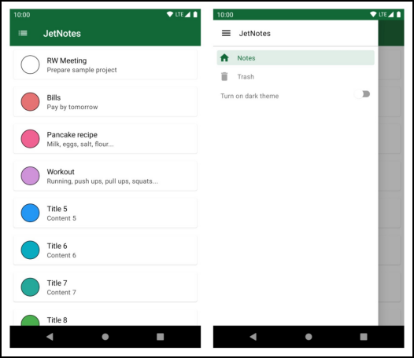
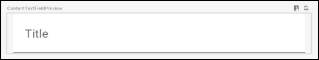
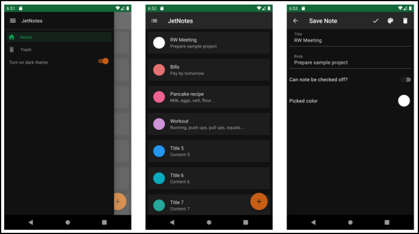

# 第八章：将Material Design应用于Compose

干得好!你已经到了本节的最后一章。在你迄今为止的旅程中，你已经了解了 Compose 中的基本合成物，以及如何在一个真正的应用程序中组合、设计和使用它们，而且你还必须管理状态。

在本章中，你将

• 学习如何使用Material Design的可合成物，这是Jetpack Compose为你提供的。

• 更深入地了解状态管理。

• 完成 "保存笔记 "屏幕。

• 了解Material主题的情况。

• 改变JetNotes以支持黑暗主题。

当你完成这一章时，JetNotes将成为一个功能完备的应用程序!

### 打开笔记屏幕

在你开始在 "保存笔记 "屏幕上工作之前，你需要一种方法来打开它。通过观察设计，你可以看到你已经计划了两种方法来做到这一点。

1. 通过点击一个浮动的行动按钮（FAB），它将在创建模式下打开 "保存笔记 "屏幕，用户在这里创建一个新的笔记。

2. 通过点击笔记屏幕上的任何笔记，在编辑模式下打开它，用户可以编辑该特定的笔记。

你将从第一种情况开始。然而，在向笔记屏幕添加浮动的行动按钮之前，你需要给它添加一些布局结构。


**注释屏幕**

花点时间看一下屏幕的不同部分。你有

• 顶部栏杆

• 身体内容

• 浮动的行动按钮

• 应用程序抽屉

这是Android应用程序的一个常见布局结构。今天的大多数应用程序都遵循类似的设计。为了更容易实现这样的布局结构，Jetpack Compose提供了支架。

在进入任何细节之前，你要在 "注释 "屏幕上添加一个 "支架"。

#### 添加脚手架

要跟上代码实例，请在Android Studio中打开本章的启动项目，并选择打开一个现有项目。

接下来，导航到08-applying-material-design-to-compose/projects，选择starter文件夹作为项目根。一旦项目打开，让它建立和同步，你就可以开始了

注意，你可以通过跳转到最终项目来查看完成的JetNotes应用。

现在，打开NotesScreen.kt，用Scaffold()替换Column()。

```kotlin
@Composable
fun NotesScreen(viewModel: MainViewModel) {
  // Observing notes state from MainViewModel
...
  Scaffold(
    topBar = {
      TopAppBar(
        title = "JetNotes",
        icon = Icons.Filled.List,
        onIconClick = {}
) },
    content = {
      if (notes.isNotEmpty()) {
        NotesList(
          notes = notes,
          onNoteCheckedChange = {
            viewModel.onNoteCheckedChange(it)
          },
          onNoteClick = { viewModel.onNoteClick(it) }
        )
} }
) }
```


以下是你刚才所做的分解，你删除了Column()和它的孩子，你用它把TopAppBar和NotesList堆叠在一起，你用Scaffold()代替它。

现在，你需要为Scaffold添加一个导入。

```kotlin
import androidx.compose.material.Scaffold
```


建立并运行。你会注意到，其行为与以前一样。

 

**注释屏幕**

Scaffold实现了基本的Material Design视觉布局结构。它提供了一个API，通过确保它们有一个合适的布局策略，并通过收集必要的数据，使这些组件能够正确地一起工作，来组合几个Material composables来构建你的屏幕。

这是Jetpack Compose文档中的Scaffold()签名。

```kotlin
@Composable
fun Scaffold(
  modifier: Modifier = Modifier,
  scaffoldState: ScaffoldState = rememberScaffoldState(),
  topBar: @Composable () -> Unit = {},
  bottomBar: @Composable () -> Unit = {},
  snackbarHost: @Composable (SnackbarHostState) -> Unit =
{ SnackbarHost(it) },
  floatingActionButton: @Composable () -> Unit = {},
  floatingActionButtonPosition: FabPosition = FabPosition.End,
  isFloatingActionButtonDocked: Boolean = false,
  drawerContent: @Composable (ColumnScope.() -> Unit)? = null,
  drawerGesturesEnabled: Boolean = true,
  drawerShape: Shape = MaterialTheme.shapes.large,
  drawerElevation: Dp = DrawerDefaults.Elevation,
  drawerBackgroundColor: Color = MaterialTheme.colors.surface,
  drawerContentColor: Color =
contentColorFor(drawerBackgroundColor),
  drawerScrimColor: Color = DrawerDefaults.scrimColor,
  backgroundColor: Color = MaterialTheme.colors.background,
  contentColor: Color = contentColorFor(backgroundColor),
  content: @Composable (PaddingValues) -> Unit
)
```


注意它是如何为顶栏、底栏、浮动行动按钮、抽屉和内容提供API的。你可以从这些选项中挑选，只使用你需要的东西。

在NotesScreen.kt中，你只用了topBar和content。Scaffold()会确保你为topBar提供的内容在屏幕的顶部，而你为content提供的内容在topBar内容的下面。这就是为什么当你用Scaffold()替换Column()时，屏幕看起来是一样的。

### 恢复应用程序抽屉

在上一章中，你暂时从 "备忘录 "屏幕上删除了应用程序抽屉。现在，是时候把它放回去了，并稍作改进。

正如你刚刚学到的，Scaffold()允许你添加应用程序的抽屉内容。它还可以让用户通过从屏幕左侧拖动抽屉来拉出抽屉。

通过更新代码将AppDrawer重新添加到Notes屏幕上。

```kotlin
@Composable
fun NotesScreen(viewModel: MainViewModel) {
  // Observing notes state from MainViewModel
...
  // here - Drawer state
  val scaffoldState: ScaffoldState = rememberScaffoldState()
  // here - Coroutine scope used for opening/closing the drawer
  val coroutineScope = rememberCoroutineScope()
  Scaffold(
    topBar = {
      TopAppBar(
        title = "JetNotes",
        icon = Icons.Filled.List,
        onIconClick = {
          // here - Drawer open
          coroutineScope.launch {
            scaffoldState.drawerState.open()
          }
} )
    },
    scaffoldState = scaffoldState, // here - Scaffold state
    drawerContent = { // here - Drawer UI
      AppDrawer(
        currentScreen = Screen.Notes,
        closeDrawerAction = {
          // here - Drawer close
          coroutineScope.launch {
            scaffoldState.drawerState.close()
          }
} )
},
... )
}
```


首先，你为drawerContent参数传递了一个AppDrawer()。

通过将Screen.Notes传递给currentScreen，你确保了当用户打开应用抽屉时，笔记项目被选中。对于第二个参数，你传递了一个管理scaffoldState的动作。

在上面的Scaffold()调用中，你用rememberCoroutineScope()检索了一个CoroutineScope。这个函数使用getContext()提供的可选CoroutineContext返回一个绑定到组合中这一点的CoroutineScope。当这个调用离开组合时，这个范围将被取消。

你应该使用这个作用域来启动响应回调事件的工作，如点击或其他用户交互，其中对该事件的响应需要随着时间的推移而展开，并在管理该过程的可组合的人离开组合时被取消。

注意到你用一个coroutine来调用scaffoldState.drawerState.open()。如果你查看DrawerState文档，你可以看到open()和close()是可暂停的函数。

它们用动画打开/关闭抽屉，并暂停直到抽屉完全打开/关闭或动画被取消。正因为如此，你必须在一个循环程序中调用这些方法。

请看rememberCoroutineScope()上面的一行。在那里，你添加了val scaffoldState。ScaffoldState = rememberScaffoldState()。这对你来说是一个新概念，接下来你会学到更多的知识。上一章的知识会帮助你更好地理解它。 :]不要忘记添加所有必要的导入。

```kotlin
import androidx.compose.material.ScaffoldState
import androidx.compose.material.rememberScaffoldState
import com.raywenderlich.android.jetnotes.routing.Screen
import
com.raywenderlich.android.jetnotes.ui.components.AppDrawer
import androidx.compose.runtime.rememberCoroutineScope
import kotlinx.coroutines.launch
```


现在你已经添加了抽屉，你终于可以看看它是否像以前那样工作了。构建并运行你的应用程序。



**笔记屏幕和应用程序抽屉**

同样，你可以通过点击顶部栏的图标或从屏幕左侧向右拖动来打开应用抽屉。

尝试拉出应用抽屉，然后改变设备的方向。你会看到，当应用程序重新创建活动时，应用程序的抽屉仍然是打开的，这意味着remember()成功地保留了状态。但是，这到底是如何工作的呢？

#### 可组合函数中的记忆

Scaffold()可以管理两个有状态的组合物：App drawer和Snackbar。它们的状态，DrawerState和SnackbarHostState，被封装在一个叫做ScaffoldState的对象中。

如果你用Scaffold使用这些组合物之一，你需要确保它们的状态会相应地更新，并在重新组合时得到保留。

构成让你在构成树中存储值。另一种说法是，可组合的函数可以访问它们上次被调用时的情况。这就是 remember() 帮助你的地方。

#### 使用remember

下面是remember()在代码中的样子。

```kotlin
@Composable
inline fun <T> remember(calculation: @DisallowComposableCalls ()
-> T): T
```

 

remember()有几个不同的变化。这个将记住计算()产生的值，它在组合过程中被评估。在重组过程中，remember()将返回由其组成()产生的值。

同时注意@DisallowComposableCalls，以避免在记忆调用中记住可组合的函数。

当你把AppDrawer()添加到Scaffold()时，你用rememberScaffoldState()来创建一个ScaffoldState。这是它在Jetpack Compose文档中的签名。

```kotlin
@Composable
fun rememberScaffoldState(
  drawerState: DrawerState = rememberDrawerState(
    DrawerValue.Closed
    ),
  snackbarHostState: SnackbarHostState = remember {
    SnackbarHostState()
  }
): ScaffoldState
```


注意这里，remember()创建并记住了一个SnackbarHostState。对于DrawerState，你使用rememberDrawerState()，它将创建并记住一个DrawerState。

看看那个函数的实现。

```kotlin
@Composable
fun rememberDrawerState(
    initialValue: DrawerValue,
    confirmStateChange: (DrawerValue) -> Boolean = { true }
): DrawerState {
  return rememberSaveable(saver =
DrawerState.Saver(confirmStateChange)) {
      DrawerState(initialValue, confirmStateChange)
  }
}
```


在这里，你可以看到rememberSaveable()正在被使用，它的行为与remember()类似，只是通过使用保存的实例状态机制，存储的值将在活动或流程重新创建后继续存在。

当涉及到DrawerState时，rememberScaffoldState()依靠rememberSaveable()来在重组和Activity重现期间保留状态。在这个例子中，有两次状态会发生变化：当用户打开应用抽屉和关闭抽屉时。

你添加了两个动作，并确保当用户点击图标或AppDrawer()传递关闭抽屉事件时，ScaffoldState会更新。

对于SnackbarState，rememberScaffoldState()依赖于remember()来保存在重组过程中是否有snackbar可见。然而，对于这个应用程序，你不会担心这个问题，因为它没有使用snackbar。

最后，你把scaffoldState传给了Scaffold()。这让 Scaffold() 在变化时显示正确的状态。你读了很多关于状态和Scaffold()的文章，以及它是如何保存其状态的，但仅仅是将Jetpack Compose树中发生的事情可视化会更容易。

#### 记住对构图树的影响

下面是NotesScreen()的组成树的样子。


**注释屏幕 - 组成树**

在第5章 "组合可组合物 "中，你了解到在组合树中除了UI元素外，还可以有其他类型的节点。这就是一个例子。调用remember()将导致树中出现一个额外的节点，该节点存储一个特定的值。

这也意味着在组合中记住的值，一旦其调用的可组合性被从树上移走，就会被遗忘。如果调用的组合式在树上移动，它们将被重新初始化。例如，如果你在LazyColumn或LazyColumnFor中移动项目，这就可能发生。

这是对状态管理的一个很好的离题。但现在是时候回到Material Design的可组合性上来了。]

继续到下一节，你将在注释屏幕上添加一个浮动的行动按钮。

### 添加FAB

一个浮动的行动按钮代表一个屏幕的主要行动。在 "笔记 "屏幕中，主要动作是创建一个新笔记的动作。

在上一节中，你了解到Scaffold()已经提供了一个API来将FAB添加到布局中。要实现它，请更新NotesScreen.kt中的Scaffold()。

```kotlin
@Composable
fun NotesScreen(viewModel: MainViewModel) {
  // Observing notes state from MainViewModel
...
  val scaffoldState: ScaffoldState = rememberScaffoldState()
  Scaffold(
    ...,
    floatingActionButtonPosition = FabPosition.End,
    floatingActionButton = {
      FloatingActionButton(
        onClick = { viewModel.onCreateNewNoteClick() },
        contentColor = MaterialTheme.colors.background,
        content = {
          Icon(
            imageVector = Icons.Filled.Add,
            contentDescription = "Add Note Button"
          )
} )
},
... )
}
```


在这里，你使用了FloatingActionButton()，并把它作为floatingActionButton的参数传递。然后你把FabPosition.End作为floatingActionButtonPosition的参数，它把FAB定位在右下角。

FloatingActionButton()还暴露了一些参数，但你只用了你需要的。点击按钮会执行viewModel.onCreateNewNoteClick()。通过这个，你把一个事件传递给ViewModel，然后它可以决定如何处理。

对于内容，你传递了一个图标，它显示为一个加号。为了使图标的内容与背景的颜色相同，你传递了 

MaterialTheme.colors.background作为contentColor。

如果你不添加这些导入，Android Studio会抱怨。

```kotlin
import androidx.compose.material.*
import androidx.compose.material.icons.filled.Add
```


一些导入可能被浓缩到导入语句androidx.compose.material.*中，所以要确保清理你的导入，删除任何多余的语句。

构建并运行该应用程序，现在你会在注释屏幕中看到FAB。

 

**带有浮动行动按钮的笔记屏幕**

点击它，但什么也不会发生。到目前为止，viewModel.onCreateNewNoteClick()没有任何作用。

一旦你实现了保存笔记屏幕的入口，你就会改变这一点。

### 增加一个入口点

在上一节中，你添加了允许你在创建模式下打开保存笔记界面的FAB。

然而，在你这样做之前，你需要为它添加一个可组合的入口点。你将分三步来做这件事。

1. 你将设置MainActivityScreen()以根据JetNotesRouter的状态显示不同的屏幕。

2. 你将把可组合的连接到MainActivity作为其内容。

3. 你将调用JetNotesRouter来改变状态，当用户点击FloatingActionButton时。

打开SaveNoteScreen.kt，在文件的顶部添加以下可组合的内容。

```kotlin
@Composable
fun SaveNoteScreen(viewModel: MainViewModel) {
}
```


不要忘记为MainViewModel添加一个导入。

```kotlin
import
com.raywenderlich.android.jetnotes.viewmodel.MainViewModel
```


有了这个，你创建了一个可组合的函数，代表了保存笔记屏幕的根。

#### 使用JetNotesRouter来改变屏幕

在上一章中，你添加了在启动MainActivity时打开Notes屏幕的代码。现在是时候添加逻辑，用JetNotesRouter改变屏幕。

打开MainActivity.kt，在文件底部的MainActivity之外添加以下可组合的内容。

```kotlin
@Composable
@ExperimentalMaterialApi
private fun MainActivityScreen(viewModel: MainViewModel) {
  Surface {
    when (JetNotesRouter.currentScreen) {
      is Screen.Notes -> NotesScreen(viewModel)
      is Screen.SaveNote -> SaveNoteScreen(viewModel)
      is Screen.Trash -> TrashScreen(viewModel)
    }
} }
```


当MainActivityScreen被调用时，它订阅了Screen。该状态被保存在JetNotesRouter中。每当状态改变时，MainActivityScreen会重新组合，并为每个屏幕调用正确的根组合。

在这里，你使用了Surface()，它是最基本的可合成物之一。它负责将孩子们剪成特定的形状，为应用程序添加背景并配置文本的颜色。它经常被用作应用程序内容的根组件。

为了使上面的代码发挥作用，你还需要添加以下导入。

```kotlin
import androidx.compose.material.Surface
import androidx.compose.runtime.Composable
import com.raywenderlich.android.jetnotes.routing.JetNotesRouter
import com.raywenderlich.android.jetnotes.routing.Screen
import
com.raywenderlich.android.jetnotes.ui.screens.SaveNoteScreen
import com.raywenderlich.android.jetnotes.ui.screens.TrashScreen
```

你可能会问自己为什么要添加@ExperimentalMaterialApi。一些 

在这一节中，你要构建的可组合物将使用一个实验性的API。为了节省你的时间，使你不必在将来翻阅每个可合成物并添加这个注释，你现在就可以添加它。别担心，当你使用实验性材料API的东西时，你会意识到的。

#### 将你的可组合性连接到MainActivity

接下来，你将把这个可合成的东西连接到MainActivity。在MainActivity中更新setContent()。

```kotlin
class MainActivity : AppCompatActivity() {
  ...
  @ExperimentalMaterialApi
  override fun onCreate(savedInstanceState: Bundle?) {
    super.onCreate(savedInstanceState)
    setContent {
      JetNotesTheme {
        MainActivityScreen(viewModel = viewModel) // here
        } }
} }
```


在这里，你让MainActivityScreen()成为该应用的根部可组合程序。你还用JetNotesTheme()包装了它，以应用你在Theme.kt中定义的主题颜色。

你现在有办法在应用程序中改变屏幕了在你打开保存笔记屏幕之前，最后要做的事情是从MainViewModel中调用JetNotesRouter。

#### 调用JetNotesRouter

打开MainViewModel.kt并更新onCreateNewNoteClick（）。

```kotlin
class MainViewModel(private val repository: Repository) :
ViewModel() {
...
  fun onCreateNewNoteClick() {
    JetNotesRouter.navigateTo(Screen.SaveNote)
  }
... }
```


为了使其发挥作用，你还需要添加JetNotesRouter和屏幕导入。

```kotlin
import com.raywenderlich.android.jetnotes.routing.JetNotesRouter
import com.raywenderlich.android.jetnotes.routing.Screen
```


很好!你现在已经把你的MainViewModel和JetNotesRouter连接起来了。由于你将FAB点击事件从SaveNotesScreen()传递给MainViewModel，你可以通过更新JetNotesRouter中的Screen状态对其做出反应。

通过更新该状态，你触发了MainActivityScreen()的重新组合。这将从组合树中移除NotesScreen，而增加SaveNotesScreen。

优秀!建立并运行你的应用程序。点击注释屏幕中的FAB，看看会发生什么。

你会看到 "保存笔记 "屏幕打开......但它是空的。不要担心，你将在下面的章节中为该屏幕添加内容。


**打开保存笔记屏幕**

另一个问题是，你不能回到笔记屏幕。点击返回按钮只是关闭JetNotes。

要解决这两个问题，你的第一步是添加一个顶栏。

### 添加顶栏

直到现在，你一直专注于添加代码来打开保存笔记屏幕。但现在你可以打开它了，保存笔记屏幕是空的。在这一节中，你将为它添加可合成物。 :]

你将从顶栏开始。在直接进入代码之前，先看一下设计。同样，你会看到这个屏幕有一个熟悉的布局结构。

你可以把保存笔记的屏幕分成两部分：顶栏和正文内容。正因为如此，你可以再次使用Scaffold()作为你的根可组合。

打开SaveNoteScreen.kt，然后更新SaveNoteScreen()。

```kotlin
@Composable
fun SaveNoteScreen(viewModel: MainViewModel) {
  Scaffold(
topBar = {},
content = {} )
}
```

有了这个，你为你的顶栏和正文内容添加了占位符。

不要忘了把Scaffold()的导入也加上。

```kotlin
import androidx.compose.material.Scaffold
```


现在，你可以开始为顶栏的实际合成物工作了。


**保存笔记屏幕。顶栏**

#### 添加SaveNoteTopAppBar

在保存笔记界面，顶栏需要支持两种不同的模式。

1. 创建模式。这让用户可以创建一个新的笔记。在顶栏有两个动作处理这种情况：一个是完成笔记的创建，一个是打开一个颜色选择器。

2. 编辑模式。用户选择它来编辑一个现有的笔记。这个模式有三个动作，一个是保存修改，一个是打开颜色选择器，一个是删除现有的笔记。

现在你已经定义了你所需要的东西，从状态和事件的角度来考虑顶栏的问题。哪些状态应该被传递给顶栏，哪些事件应该被暴露给父类的可组合性？

总的来说，有一个状态是你应该传递给顶栏组合的，有四个事件是顶栏组合应该暴露的。接下来，你将定义SaveNoteTopAppBar()来实现这一点。

在SaveNoteScreen()下面添加以下代码。

```kotlin
@Composable
private fun SaveNoteTopAppBar(
  isEditingMode: Boolean,
  onBackClick: () -> Unit,
  onSaveNoteClick: () -> Unit,
  onOpenColorPickerClick: () -> Unit,
  onDeleteNoteClick: () -> Unit
){ }
```


以下是该代码中需要注意的重要事项。

• isEditingMode。代表顶栏是否处于编辑模式。

• onBackClick。当用户返回到笔记屏幕时，暴露一个事件。

• onSaveNoteClick。当用户保存一个新的或现有的笔记时暴露一个事件。

• onOpenColorPickerClick。当用户打开颜色选择器时暴露一个事件。

• onDeleteNoteClick。当用户删除现有笔记时，暴露一个事件。

#### 显示顶栏

现在你已经为顶栏准备好了可组合的根，你将添加在用户界面中发出顶栏的可组合。

添加以下代码到SaveNoteTopAppBar()。

```kotlin
TopAppBar(
  title = {
    Text(
      text = "Save Note",
      color = MaterialTheme.colors.onPrimary
    )
} )
```


在这里，你使用了一个Material Design的可组合性。TopAppBar。这个特殊的TopAppBar的定义为标题、导航图标和动作提供了插槽--这正是你在保存笔记界面所需要的。你会添加每一个组件，但现在，你添加了标题。

你用一个简单的Text()表示标题，在这里你定义了屏幕标题和文本颜色。接下来，你必须定义代表后退按钮的navigationIcon。通过向TopAppBar()添加navigationIcon参数来实现。

```kotlin
navigationIcon = {
  IconButton(onClick = onBackClick) {
    Icon(
      imageVector = Icons.Default.ArrowBack,
      contentDescription = "Save Note Button",
      tint = MaterialTheme.colors.onPrimary
) }
}
```


对于navigationIcon，你传递了IconButton()并定义了onClick动作 

和正确的资产。这个图标将显示为一个返回箭头。这是很直接的。接下来添加动作。

```kotlin
actions = {
  // Save note action icon
  IconButton(onClick = onSaveNoteClick) {
    Icon(
      imageVector = Icons.Default.Check,
      tint = MaterialTheme.colors.onPrimary,
      contentDescription = "Save Note"
) }
  // Open color picker action icon
  IconButton(onClick = onOpenColorPickerClick) {
    Icon(
      painter = painterResource(
        id = R.drawable.ic_baseline_color_lens_24
      ),
      contentDescription = "Open Color Picker Button",
      tint = MaterialTheme.colors.onPrimary
    )
} }
```


这两个动作由两个IconButtons表示。这些按钮将分别触发onSaveNoteClick和onOpenColorPickerClick动作。你需要添加的最后一个动作是删除动作。通过在动作中添加以下代码来完成。

```kotlin
// 删除动作图标（仅在编辑模式下显示）
if (isEditingMode) {
  IconButton(onClick = onDeleteNoteClick) {
Icon(
  imageVector = Icons.Default.Delete,
      contentDescription = "Delete Note Button",
      tint = MaterialTheme.colors.onPrimary
) }
}
```


对于最后一个动作，你定义了只有当顶部栏处于编辑模式时，应用程序才应该添加IconButton()。

即使你没有指定IconButtons的布局结构，它们仍然被组织在一个行中。这是因为TopAppBar定义了这样的动作：actions:RowScope.() -> Unit = {}.你用RowScope.()定义你传递给动作的内容。

像往常一样，你也需要添加几个导入。

```kotlin
import androidx.compose.material.*
import androidx.compose.material.IconButton
import androidx.compose.material.MaterialTheme
import androidx.compose.material.TopAppBar
import androidx.compose.material.icons.Icons
import androidx.compose.material.icons.filled.ArrowBack
import androidx.compose.material.icons.filled.Check
import androidx.compose.material.icons.filled.Delete
import androidx.compose.ui.res.vectorResource
import com.raywenderlich.android.jetnotes.R
```


现在，添加SaveNoteTopAppBar的预览组合。

```kotlin
@Preview
@Composable
fun SaveNoteTopAppBarPreview() {
  SaveNoteTopAppBar(
    isEditingMode = true,
    onBackClick = {},
    onSaveNoteClick = {},
    onOpenColorPickerClick = {},
    onDeleteNoteClick = {}
) 
```


建立你的项目，在预览面板中，你会看到像这样的东西。


**SaveNoteTopAppBar组合式（编辑模式） - 预览**

你也可以玩一下，为isEditingMode传递false。如果你刷新你的预览，你会看到你的顶栏在不处于编辑模式时的样子。


**SaveNoteTopAppBar的可操作性（新笔记模式） - 预览**

真棒!想看看你的顶栏的运行情况吗？在下一节中，你将把SaveNoteTopAppBar()添加到保存笔记屏幕中。]

#### 显示SaveNoteTopAppBar的composable函数

现在你已经创建了SaveNoteTopAppBar()，你可以在保存笔记屏幕中显示它。但是在这之前，你需要知道用户是为一个新的笔记还是为一个现有的笔记打开保存笔记的屏幕。

打开MainViewModel.kt，在notesNotInTrash下面添加以下代码。

```kotlin
private var _noteEntry = MutableLiveData(NoteModel())
val noteEntry: LiveData<NoteModel> = _noteEntry
```


有了这个，你为用户在保存笔记界面打开编辑的笔记条目添加了一个状态。两种模式都将使用这个状态，你将通过NoteModel的ID来区分这两种模式。

现在，更新SaveNoteScreen()。

```kotlin
@Composable
fun SaveNoteScreen(viewModel: MainViewModel) {
  val noteEntry: NoteModel by viewModel.noteEntry
    .observeAsState(NoteModel())
  Scaffold(
    topBar = {
      val isEditingMode: Boolean = noteEntry.id != NEW_NOTE_ID
      SaveNoteTopAppBar(
        isEditingMode = isEditingMode,
        onBackClick = {
          JetNotesRouter.navigateTo(Screen.Notes)
        },
        onSaveNoteClick = { },
        onOpenColorPickerClick = { },
        onDeleteNoteClick = { }
) },
content = {} )
}
```


这里，你添加了观察viewModel.noteEntry状态的代码。每当这个状态发生变化时，SaveNoteScreen()就会进行一次重新组合。

在Scaffold()中，你为topBar槽传递了SaveNoteTopAppBar()。

通过noteEntry.id，你可以检查该屏幕是否处于编辑模式。如果NoteModel.id等于NEW_NOTE_ID，该屏幕就处于创建模式。否则，它就处于编辑模式。

现在，你只是为其他事件传递了空动作。你将在以后添加它们。

接下来，添加必要的导入。

```kotlin
import androidx.compose.runtime.getValue
import androidx.compose.runtime.livedata.observeAsState
import
com.raywenderlich.android.jetnotes.domain.model.NEW_NOTE_ID
import com.raywenderlich.android.jetnotes.domain.model.NoteModel
import com.raywenderlich.android.jetnotes.routing.JetNotesRouter
import com.raywenderlich.android.jetnotes.routing.Screen
```


最后，构建并运行该应用程序。


**在保存笔记屏幕上添加顶栏**

现在，当你打开 "保存笔记 "屏幕时，你会看到顶栏。你也可以通过点击顶部栏的 "返回 "按钮回到笔记界面。

### 在编辑模式下打开保存笔记屏幕

在上一节中，你实现了一种在创建模式下打开保存笔记屏幕的方法。现在，你将添加允许用户编辑现有笔记的逻辑。

打开MainViewModel.kt，像这样更新onCreateNewNoteClick（）和onNoteClick（）。

```kotlin
fun onCreateNewNoteClick() {
  _noteEntry.value = NoteModel()
  JetNotesRouter.navigateTo(Screen.SaveNote)
}
fun onNoteClick(note: NoteModel) {
  _noteEntry.value = note
     JetNotesRouter.navigateTo(Screen.SaveNote)
}
```


这很简单。在上一节中，你定义了SaveNoteScreen()执行时将订阅viewModel.noteEntry的状态。

在这里，你只需用正确的NoteModel更新该状态，这取决于用户如何打开保存笔记屏幕。如果用户选择了一个笔记，你就在打开 "保存笔记 "屏幕之前用所选的笔记更新状态。如果用户点击了FAB，你就用一个空的NoteModel来更新状态。

通过这样做，当SaveNoteScreen()第一次执行时，viewModel.noteEntry将已经包含NoteModel状态。

构建并运行，然后点击注释屏幕中的任何注释。

 

**编辑模式下的保存笔记屏幕**

请注意，现在顶栏里有三个动作，这意味着它处于编辑模式。这是因为isEditingMode被设置为真，因为NoteModel.id不等于NEW_NOTE_ID。

但仍有内容缺失，所以接下来我们来实现这个目标。

### 创建一个可组合的内容

你需要能够在保存笔记的屏幕上编辑笔记，所以你的下一步是创建一个内容的组合，让你做这个。

参考一下设计，你会发现用户可以使用一个颜色选择器来选择纸条的颜色。然而，现在他们无法看到他们选择的是哪种颜色。所以你的第一个任务是实现显示你从颜色选择器中选择的颜色的组件。

#### 显示选定的颜色

要做到这一点，去SaveNoteScreen.kt并在SaveNoteTopAppBar()下面添加以下可组合的内容。

```kotlin
@Composable
private fun PickedColor(color: ColorModel) {
  Row(
    Modifier
      .padding(8.dp)
.padding(top = 16.dp) ){
    Text(
      text = "Picked color",
      modifier = Modifier
.weight(1f)
        .align(Alignment.CenterVertically)
    )
    NoteColor(
      color = Color.fromHex(color.hex),
      size = 40.dp,
      border = 1.dp,
      modifier = Modifier.padding(4.dp)
) }
}

```

这是一个相当简单的可组合的，你已经熟悉了它的组件。你甚至已经自己构建了一些主题--比如NoteColor()。

你用一个行来组织两个元素，Text()和NoteColor()，彼此相邻。通过修改器，你添加了一些填充物，并指示Text()使用所有的可用宽度。

PickedColor()没有暴露任何事件，因为它唯一的工作是显示用户挑选的颜色，所以它需要一个ColorModel作为状态来渲染。

现在，通过在SaveNoteTopAppBarPreview()下面添加以下代码，也可以添加预览的可组合性。

```kotlin
@Preview
@Composable
fun PickedColorPreview() {
  PickedColor(ColorModel.DEFAULT)
}
```


很好!现在，建立你的项目并检查预览面板。你会看到像这样的东西。


**可选颜色组件 - 预览**

干得好!你已经完成了你三个任务中的一个。现在，是时候研究一个允许你使任何笔记都可以检查的组件了。

#### 让用户勾选一个笔记

在某些情况下，你的用户可能想勾选一个备注--例如，当他们完成了一项任务。在默认情况下，没有任何选项可以表明一个笔记已经完成。如果用户想要这个功能，他们需要将笔记标记为可检查。你的下一步是给他们这种可能性。

在SaveNoteScreen.kt中，在SaveNoteTopAppBar()下面添加以下可组合的内容。

```kotlin
@Composable
private fun NoteCheckOption(
  isChecked: Boolean,
  onCheckedChange: (Boolean) -> Unit
){ Row(
    Modifier
      .padding(8.dp)
.padding(top = 16.dp) ){
    Text(
      text = "Can note be checked off?",
      modifier = Modifier.weight(1f)
    )
    Switch(
      checked = isChecked,
      onCheckedChange = onCheckedChange,
      modifier = Modifier.padding(start = 8.dp)
    )
} }
```


就像PickedColor()一样，这个可组合的布局结构也很简单。你用一个Row()来对齐Text()和Switch()。

Switch()是Jetpack Compose中的Material Design组件之一。它很熟悉，因为它的行为与当前Android UI工具包中的对应物一样。在你实现应用抽屉的时候，你也用过它。

当涉及到状态和事件时，NoteCheckOption()以一个布尔值作为其状态，并暴露了onCheckedChange。(Boolean) -> Unit作为一个事件。

父类传递isChecked的状态，所以Switch()知道如何渲染自己。每当用户与Switch()进行交互时，一个带有新值的事件就会被发送到父级的可组合的事件上。

为了使其发挥作用，你需要添加一个额外的导入。

```kotlin
import androidx.compose.material.Switch
```


别忘了在SaveNoteTopAppBarPreview()下面添加以下代码，给它一个可预览的组合。

```kotlin
@Preview
@Composable
fun NoteCheckOptionPreview() {
  NoteCheckOption(false) {}
}
```


在这里，你为isChecked状态传递false，为onCheckedChange传递一个空动作。

建立你的项目，你会在预览面板中看到你的可组合性。


**CanBeCheckedOffComponent可组合式 - 预览**

干得好!在组装 "保存笔记 "屏幕的内容之前，只需再添加一个可合成的东西。 :]

#### 添加标题和内容

到目前为止，你已经添加了一些可合成的东西来表示笔记的颜色和用户在完成任务时是否可以勾选该笔记。但是，你仍然需要为笔记中最重要的部分添加可合成物：其标题和内容。

在SaveNoteScreen.kt中，在SaveNoteTopAppBar()下面添加以下代码。

```kotlin
@Composable
private fun ContentTextField(
  modifier: Modifier = Modifier,
  label: String,
  text: String,
onTextChange: (String) -> Unit ){
  TextField(
    value = text,
    onValueChange = onTextChange,
    label = { Text(label) },
    modifier = modifier
      .fillMaxWidth()
      .padding(horizontal = 8.dp),
    colors = TextFieldDefaults.textFieldColors(
      backgroundColor = MaterialTheme.colors.surface
    )
) }
```


你将在用户输入笔记的标题和内容的文本字段中使用这种可组合性。在这里，你使用Material Design的可组合性，TextField()。

TextField()可以让你轻松实现接受用户输入的组件。对于状态来说，父类的可组合性将传递文本，ContentTextField()将使用onTextChange将文本的变化作为一个事件传递上去。(String) -> Unit。你还暴露了一个标签，以传达文本字段的用途。你还暴露了一个修改器，作为良好的做法，允许你在调用现场传递自定义修改器。

接下来，在SaveNoteTopAppBarPreview()下面添加一个可合成的预览。

```kotlin
@Preview
@Composable
fun ContentTextFieldPreview() {
  ContentTextField(
    label = "Title",
    text = "",
    onTextChange = {}
) }
```


现在，建立你的项目并检查预览面板。在那里，你会看到ContentTextFieldPreview()。



**可组合的ContentTextField - 预览**

优秀的工作!你现在有了创建 "保存笔记 "屏幕内容的所有部件。

#### 构建保存笔记内容

接下来你要做的是把你创建的所有可合成的东西放在一起，做成保存笔记的屏幕内容。在SaveNoteScreen.kt中，在SaveNoteTopAppBar()下面添加SaveNoteContent()。

```kotlin
@Composable
private fun SaveNoteContent(
  note: NoteModel,
  onNoteChange: (NoteModel) -> Unit
){
Column(modifier = Modifier.fillMaxSize()) {
} }
```


这个可组合的将代表创建和编辑笔记的整个逻辑。你将在输入字段和其他元素中显示笔记中的数据，当你想保存或更新笔记时，你将使用onNoteChange()来通知父代。

现在将输入字段添加到Column()中。

```kotlin
ContentTextField(
  label = "Title",
  text = note.title,
  onTextChange = { newTitle ->
    onNoteChange.invoke(note.copy(title = newTitle))
  }
)
ContentTextField(
  modifier = Modifier
    .heightIn(max = 240.dp)
    .padding(top = 16.dp),
  label = "Body",
  text = note.content,
  onTextChange = { newContent ->
    onNoteChange.invoke(note.copy(content = newContent))
  }
)
```


这两个ContentTextFields将代表笔记的标题和正文。你还为输入添加了一些样式和各自的onTextChange处理程序。通过它们，你更新了笔记的内部状态，并让父级知道了更新。

最后，添加NoteCheckOption()和PickedColor()来表示笔记的更多细节。

```kotlin
val canBeCheckedOff: Boolean = note.isCheckedOff != null
NoteCheckOption(
  isChecked = canBeCheckedOff,
  onCheckedChange = { canBeCheckedOffNewValue ->
    val isCheckedOff: Boolean? = if (canBeCheckedOffNewValue)
false else null
    onNoteChange.invoke(note.copy(isCheckedOff = isCheckedOff))
  }
)
PickedColor(color = note.color)
```

从设计中，你可以看到你想把这些组件组织成一列，前两个组件负责接受用户对笔记的标题和内容的输入。在这两个组件的下面是NoteCheckOption()，这样用户就可以使笔记可检查。最后一个组件是PickedColor()，显示用户为笔记选择的颜色。

接下来，添加以下导入。

```kotlin
import androidx.compose.material.*
```


如果能在SaveNoteContent()中也进行预览，那就太棒了。在SaveNoteTopAppBarPreview()下面添加以下代码。

```kotlin
@Preview
@Composable
fun SaveNoteContentPreview() {
  SaveNoteContent(
    note = NoteModel(title = "Title", content = "content"),
    onNoteChange = {}
  )
}
```


建立该项目，在预览面板中，你会看到SaveNoteContent的样子。


### 保存笔记界面的总结

到目前为止做得很好!在你完成用户界面之前，你只有一个步骤，那就是为 

保存笔记的屏幕。现在你将关注MainViewModel，你需要它来完成保存笔记的屏幕。

#### 增加对ViewModel的支持

在MainViewModel中，你已经添加了暴露noteEntry状态的代码，但你仍然需要再添加一个状态。在保存笔记界面，用户可以为笔记选择一种颜色。为了显示用户可以选择的颜色列表，你需要向SaveNoteScreen()提供它们。

打开MainViewModel.kt，在noteEntry下面添加以下代码。

```kotlin
 val colors: LiveData<List<ColorModel>> by lazy {
  repository.getAllColors()
}
```


数据库已经包含了你需要的颜色。你只需在这里通过添加LiveData暴露它们，你可以在SaveNoteScreen()中观察到。

不要忘记添加以下导入。

```kotlin
 import
com.raywenderlich.android.jetnotes.domain.model.ColorModel
```


#### 改变noteEntry状态

接下来，你需要添加支持，以便在用户与保存笔记屏幕互动时，改变noteEntry状态。

在MainViewModel中添加以下代码。

```kotlin
fun onNoteEntryChange(note: NoteModel) {
  _noteEntry.value = note
}
fun saveNote(note: NoteModel) {
  viewModelScope.launch(Dispatchers.Default) {
    repository.insertNote(note)
    withContext(Dispatchers.Main) {
      JetNotesRouter.navigateTo(Screen.Notes)
      _noteEntry.value = NoteModel()
    }
} }
fun moveNoteToTrash(note: NoteModel) {
  viewModelScope.launch(Dispatchers.Default) {
    repository.moveNoteToTrash(note.id)
    withContext(Dispatchers.Main) {
      JetNotesRouter.navigateTo(Screen.Notes)
    }
} }
```


是时候对每种方法进行分解了。

通过onNoteEntryChange()，你可以更新noteEntry状态。每次用户在保存笔记的屏幕上做出改变时，你都会调用这个方法。

saveNote()负责更新数据库中的笔记。如果用户正在创建一个新的注释，你将在数据库中添加一个新条目。如果用户正在编辑一个现有的笔记，你就会更新它。

你使用一个coroutine来在后台更新数据库。这个方法也关闭了保存笔记屏幕，并将用户返回到笔记屏幕。注意，你必须切换到主线程来更新JetNotesRouter的状态。你只能从主线程中更新状态。

moveNoteToTrash()的行为类似于saveNote()。它把笔记移到垃圾桶里，并让用户返回到笔记界面。

#### 将SaveNoteScreen与MainViewModel连接起来

现在MainViewModel已经准备好了，你可以完成保存笔记屏幕的UI部分。

打开SaveNoteScreen.kt并更新SaveNoteScreen()中的Scaffold()。

```kotlin
Scaffold(
  topBar = {
    val isEditingMode: Boolean = noteEntry.id != NEW_NOTE_ID
    SaveNoteTopAppBar(
      isEditingMode = isEditingMode,
      onBackClick = {
        JetNotesRouter.navigateTo(Screen.Notes)
      },
      onSaveNoteClick = { // here
        viewModel.saveNote(noteEntry)
      },
      onOpenColorPickerClick = { },
      onDeleteNoteClick = { // here
        viewModel.moveNoteToTrash(noteEntry)
      }
) },
  content = { // here
    SaveNoteContent(
      note = noteEntry,
      onNoteChange = { updateNoteEntry ->
        viewModel.onNoteEntryChange(updateNoteEntry)
                      } )
} )
```


你在这里所做的就是用SaveNoteContent()填充内容。这个组合式将显示所有笔记的细节和数据，同时让你改变它来更新一个笔记，或者填入它来创建一个新的笔记。

太棒了!建立并运行你的应用程序。


**保存笔记屏幕**

你可以在创建模式下打开保存笔记屏幕，创建一个新的笔记，或者你可以点击笔记列表中的任何笔记，在编辑模式下打开该屏幕。

对标题或正文进行修改，然后点击顶部栏中的检查图标。你会看到你的改动将被保存。

你也可以通过点击垃圾桶图标将该笔记移至垃圾桶。

#### 改变笔记的颜色

仍然缺少一件事。你仍然不能改变笔记的颜色。要解决这个问题，请像这样更新SaveNoteScreen()。

```kotlin
@Composable
@ExperimentalMaterialApi // here (BottomDrawer)
fun SaveNoteScreen(viewModel: MainViewModel) {
...
// here
  val colors: List<ColorModel> by viewModel.colors
    .observeAsState(listOf())
// here
  val bottomDrawerState: BottomDrawerState =
    rememberBottomDrawerState(BottomDrawerValue.Closed)
  val coroutineScope = rememberCoroutineScope()
  Scaffold(
    topBar = {
      val isEditingMode: Boolean = noteEntry.id != NEW_NOTE_ID
      SaveNoteTopAppBar(
        ...,
        onOpenColorPickerClick = { // here
          coroutineScope.launch { bottomDrawerState.open() }
        },
... )
},
content = {
      BottomDrawer( // here
        drawerState = bottomDrawerState,
        drawerContent = {
          ColorPicker(
            colors = colors,
            onColorSelect = { color ->
              val newNoteEntry = noteEntry.copy(color = color)
              viewModel.onNoteEntryChange(newNoteEntry)
            }
) },
        content = {
          SaveNoteContent(
            note = noteEntry,
            onNoteChange = { updateNoteEntry ->
              viewModel.onNoteEntryChange(updateNoteEntry)
            }
)
          } )
} )
}
```


首先，检查你在Scaffold()上面定义的内容。你将SaveNoteScreen()订阅给viewModel.colors的状态。这让你可以将该状态传递给ColorPicker()。

接下来，你创建了一个类型为BottomDrawerState的底部抽屉状态。你在Scaffold()中使用的新的Material Design组件需要这个。你还用它来在用户点击顶部栏的颜色选择器按钮时打开底部抽屉。

在Scaffold()中，你把SaveNoteContent()包裹在BottomDrawer()中。 

BottomDrawer()是一个Material Design的组合，允许你指定一个固定在屏幕底部的模态抽屉。在写这篇文章的时候，这是一个实验性的材料API的一部分。因此，你必须在SaveNoteScreen()中添加@ExperimentalMaterialApi注释。

注意，你为drawerContent和DrawerContent传递了ColorPicker()。 

SaveNoteContent()的内容。这个抽屉的状态管理原则类似于你在NotesScreen()中对AppDrawer()的实现。

建立并运行该应用程序。打开Save Note，从屏幕底部向上滑动，或点击顶部栏的颜色选择器图标。


**保存笔记屏幕上的颜色选择器**

现在你可以改变任何现有笔记的颜色或为新的笔记设置颜色。接下来，你将添加一个功能来确认用户是否真的想放弃一个笔记。

#### 确认一项删除行动

虽然 "保存笔记 "屏幕现在在功能上已经完成，但关注细节总是好的。

现在，当用户点击顶部栏中的垃圾桶图标时，笔记会立即移到垃圾桶中。然而，要求用户首先确认这样的操作是一个好的做法。

在SaveNoteScreen.kt中，在Scaffold()前添加以下一行。

```kotlin
val moveNoteToTrashDialogShownState: MutableState<Boolean> =
rememberSaveable {
  mutableStateOf(false)
}
```


该状态表示对话框是否可见。

接下来，更新SaveNoteTopAppBar()，将onDeleteNoteClick改为如下。

```kotlin
SaveNoteTopAppBar(
  ...,
  onDeleteNoteClick = {
    moveNoteToTrashDialogShownState.value = true
  }
)
```


现在，当用户点击顶部栏中的垃圾桶图标时，你只需将moveNoteToTrashDialogShownState的值属性更新为 "true "就可以显示该对话框。这块状态将通过配置的改变而持续存在，使用savedInstanceState。

最后，在Scaffolds()的bodyContent内容的底部添加以下代码。

```kotlin
Scaffold(
  topBar = { ... },
  content = {
    BottomDrawer(...)
    if (moveNoteToTrashDialogShownState.value) {
      AlertDialog(
        onDismissRequest = {
          moveNoteToTrashDialogShownState.value = false
        },
title = {
          Text("Move note to the trash?")
        },
text = { Text(
            "Are you sure you want to " +
                "move this note to the trash?"
) },
        confirmButton = {
          TextButton(onClick = {
            viewModel.moveNoteToTrash(noteEntry)
          }) {
            Text("Confirm")
          }
        },
        dismissButton = {
          TextButton(onClick = {
            moveNoteToTrashDialogShownState.value = false
}) {
            Text("Dismiss")
          }
} )
} }
)
```


这里，你使用了Material Design的AlertDialog()。它暴露了像onDismissRequest、confirmButton和dismissButton这样的参数，你可以用它们来定制按钮和动作。它的行为就像标准的AlertDialog，你给用户一个选项，同意你的请求，或者取消或驳回请求 在运行应用程序之前，添加以下导入。

```kotlin
import androidx.compose.runtime.MutableState
import androidx.compose.runtime.mutableStateOf
import androidx.compose.runtime.saveable.rememberSaveable
```


建立并运行该应用程序。打开任何笔记并将其移至垃圾桶，即可看到你的警报对话框。


**保存笔记屏幕中的警报对话框**

你甚至可以改变设备的方向，对话框仍然会显示。这是一个更好的用户体验。

#### 增加对后退按钮的支持

目前，当你打开保存笔记界面并按下返回按钮时，应用程序就会关闭。由于你没有使用在返回栈上操作的活动或片段，也没有在内部处理基本的系统导航，所以你需要处理如果用户按下系统的返回按钮，你的应用程序会有什么表现。

在SaveNoteScreen()中，在Scaffold()上面添加以下代码。

```kotlin
BackHandler(onBack = {
  if (bottomDrawerState.isOpen) {
    coroutineScope.launch { bottomDrawerState.close() }
  } else {
    JetNotesRouter.navigateTo(Screen.Notes)
  }
})
```


BackHandler()是一个用于处理按下系统返回按钮的效果。

具体来说，在这里你定义了当用户在颜色选择器打开时，在保存笔记屏幕上按下返回按钮，它将关闭颜色选择器。如果颜色选择器没有打开，它就会让用户返回到笔记界面。

也添加一个额外的导入。

```kotlin
import androidx.activity.compose.BackHandler
```


现在，构建并运行该应用程序，以验证一切正常。你的应用程序没有视觉上的变化，但如果你现在按下系统的返回按钮，你会关闭保存笔记屏幕上的底部抽屉，或者回到笔记屏幕。]

### 在 "笔记 "屏幕中使用Material Design的可合成物

Jetpack Compose所提供的Material Design组件都是用基本组件构建的。当你构建笔记屏幕时，你以同样的方式实现了顶部应用栏和笔记卡。但是，由于Material Design的合成器为主题设计提供了额外的支持，所以用Material Design的合成器替换你构建的合成器是很有用的。

打开NotesScreen.kt，用Material Design的TopAppBar替换Scaffold()中的TopAppBar()。

```kotlin
Scaffold(
  topBar = {
    TopAppBar(
      title = {
        Text(
          text = "JetNotes",
          color = MaterialTheme.colors.onPrimary
        )
      },
      navigationIcon = {
        IconButton(onClick = {
          coroutineScope.launch
{ scaffoldState.drawerState.open() }
        }) {
          Icon(
            imageVector = Icons.Filled.List,
            contentDescription = "Drawer Button"
          )
} }
) },
... )
```


这与你上面使用的材料TopAppBar相同。

不要忘记把旧的TopAppBar的导入替换成Material的。

```kotlin
import androidx.compose.material.TopAppBar
```


#### 使用可用于注释的材料组成

还有一件事你可以用Material Design的组合物来代替：你的Note()。

打开Note.kt，并将其全部内容替换为："。

```kotlin
val background = if (isSelected)
  Color.LightGray
else
  MaterialTheme.colors.surface
Card(
  shape = RoundedCornerShape(4.dp),
  modifier = modifier
  .padding(8.dp)
    .fillMaxWidth(),
  backgroundColor = background
){ ListItem(
    text = { Text(text = note.title, maxLines = 1) },
    secondaryText = {
      Text(text = note.content, maxLines = 1)
    },
    icon = {
      NoteColor(
        color = Color.fromHex(note.color.hex),
        size = 40.dp,
        border = 1.dp
) },
    trailing = {
      if (note.isCheckedOff != null) {
        Checkbox(
          checked = note.isCheckedOff,
          onCheckedChange = { isChecked ->
            val newNote = note.copy(isCheckedOff = isChecked)
            onNoteCheckedChange.invoke(newNote)
          },
          modifier = Modifier.padding(start = 8.dp)
        )
} },
    modifier = Modifier.clickable {
      onNoteClick.invoke(note)
    }
) }
```


这里，你用一个Card()和一个ListItem()来实现Note()。Card()是一个相对简单的可组合的。卡片是在一个主题上显示内容和动作的表面。你可以自定义它们的形状、背景颜色、内容颜色、边界和高度。

ListItem()是列表项的一个Material Design实现。它们代表列表中的项目，具有明显的Material Design的外观和感觉。你用它的文本做标题，用secondaryText做内容，用图标做NoteColor()，用尾部做Checkbox。

在撰写本文时，ListItem()是实验性材料API的一部分，所以要添加

```kotlin
@Composable
@ExperimentalMaterialApi // here
fun Note(
  modifier: Modifier = Modifier, // here
  note: NoteModel,
  onNoteClick: (NoteModel) -> Unit = {},
  onNoteCheckedChange: (NoteModel) -> Unit = {},
  isSelected: Boolean = false
){ ... }
```

 

你必须对所有明确或隐含地使用了 "A "或 "B "的可合成物进行这样的处理。 

注()。这些是。NotePreview(), NotesList(), NotesScreen和NotesListPreview()。

你还需要为你使用的新合成物添加导入。

```kotlin
import androidx.compose.material.Card
import androidx.compose.material.ListItem
import androidx.compose.material.*
```


构建并运行该应用。你会看到，笔记屏幕看起来和以前一样，但你的大部分组合物现在是Material Design的组合物。做得很好!

在结束本章之前，还有一件事要探讨：添加一个主题。你将简要地了解Material Design主题，以及如何为你的应用程序支持一个黑暗主题。

## Compose的主题设计

每个安卓应用程序都有一个特定的调色板、排版和形状。Jetpack Compose提供了一个Material Design系统的实现，使你可以很容易地指定你的应用程序的主题选择。

在JetNotes中，你不会过多地玩弄排版和形状，但该应用在其所有屏幕上都使用了某种调色板。Theme.kt包含了JetNotes的所有颜色的定义。

```kotlin
private val LightThemeColors = lightColors(
  primary = rwGreen,
  primaryVariant = rwGreenDark,
  secondary = rwRed
)
private val DarkThemeColors = lightColors(
  primary = rwGreen,
  primaryVariant = rwGreenDark,
  secondary = rwRed
)
@Composable
fun JetNotesTheme(content: @Composable () -> Unit) {
  val isDarkThemeEnabled =
    isSystemInDarkTheme() ||
JetNotesThemeSettings.isDarkThemeEnabled
  val colors = if (isDarkThemeEnabled) DarkThemeColors else
LightThemeColors
  MaterialTheme(colors = colors, content = content)
}
```


有两种颜色定义。LightThemeColors和DarkThemeColors。目前，它们共享相同的定义，因为该应用程序不支持黑暗主题--还没有!:]

在Jetpack Compose中实现主题化的核心元素是MaterialTheme()。 

JetNotesTheme()观察应用程序何时应改变为深色主题的状态。当你配置特定的颜色时，你调用MaterialTheme()并将这些颜色传递给它，但你也传递这些颜色适用的内容。排版和形状的工作方式也是如此。

然后，你用以下方法检索传入这个可组合的参数 

MaterialTheme()。你在实现应用程序时已经做过几次了。 

这个对象暴露了颜色、排版和形状的属性。

你在整个应用程序中使用的每个Material组件都定义了默认使用的属性。由于你在构建JetNotes时使用了Material组件和来自MaterialTheme()的颜色，添加对黑暗主题的支持就像定义一个黑暗调色板一样容易。]

打开Theme.kt，用这个替换DarkThemeColors()。

```kotlin
private val DarkThemeColors = darkColors(
  primary = Color(0xFF00A055),
  primaryVariant = Color(0xFF00F884),
  secondary = rwRed,
  onPrimary = Color.White,
)
```


添加以下导入。

```kotlin
import androidx.compose.material.darkColors
import androidx.compose.ui.graphics.Color
```


建立并运行该应用程序。打开导航抽屉，打开黑暗主题。



**黑暗主题**

祝贺你!你已经到了第二节的结尾!JetNotes现在是一个功能齐全的应用程序。]

### 关键点

• Jetpack Compose提供的组合物使其能够轻松地遵循Material Design。

• 通过remember()，Compose可以让你在组合树中存储数值。

• 使用OnBackPressedDispatcherOwner并通过Ambient提供它，你可以获得对系统返回按钮的处理。

• Jetpack Compose提供了一个Material Design的实现，允许你通过指定调色板、排版和形状来为你的应用程序做主题。

• 使用MaterialTheme()，你可以为你的应用程序定义一个主题，可以定制颜色、排版和形状。

• 要为不同的主题定义浅色和深色，你可以分别使用lightColors()和darkColors()。

## 今后该何去何从？

希望这对你来说是一次有趣的旅程。你已经走过了很长一段路，从只使用基本的组合物到用Material Design组合物管理状态。在下一节中，你将在一个更复杂的应用程序上工作，即JetReddit!在那里，你会学到更多关于如何构建复杂的用户界面，动画如何工作等等。

但是别担心，以你目前所获得的知识，你接受这一挑战不会有任何问题。]