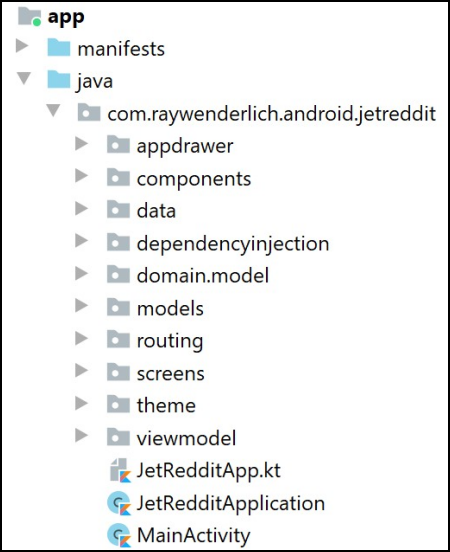
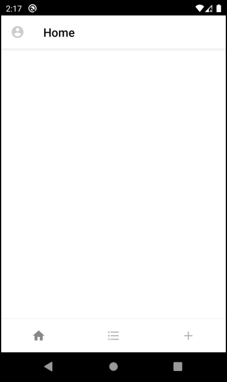
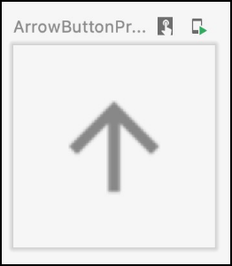
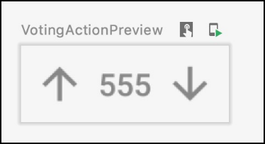
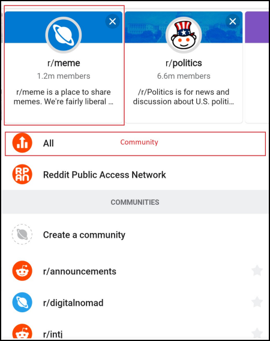
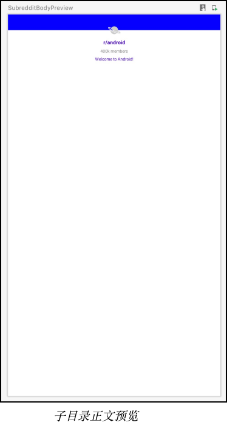
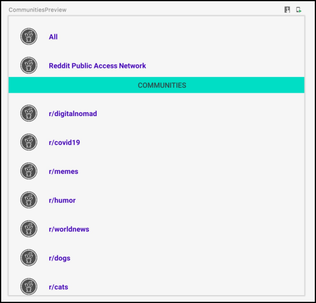
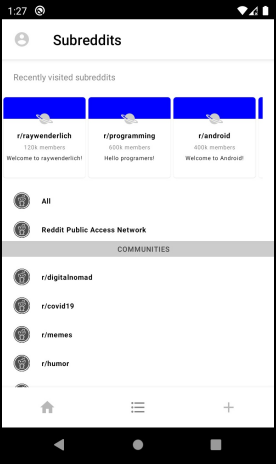

# 第10章：在Jetpack中构建复杂的用户界面 


现在你已经了解了ConstraintLayout()及其高级功能，你已经准备好构建任何复杂的用户界面，无论你的要求是什么。

在本章中，你将专注于为你的JetReddit应用程序建立更多的屏幕和功能。首先，你将制作一个带有当前帖子列表的主屏幕，这是该应用程序的主要功能。然后，你将建立一个屏幕，在那里你可以看到你最喜欢的和最近访问的子红包的列表。

## 构建主屏幕

为了理解你的任务，看看下面这个来自原始Reddit应用程序的例子。


**Reddit主屏幕**

在这里，你看到一个有两个帖子的主屏幕。该屏幕由一个标题、内容和帖子行动组成。有两种类型的内容，一个是文本，一个是图片。请记住，用户可能有两个以上的帖子，所以整个屏幕是可以滚动的。正如你在前几章已经做的那样，你将逐步实现这个屏幕。

由于内容可以是图片或文字，你将实现两种类型的帖子。最好的方法是使所有的组件都是自定义的可组合的，所以你在两种类型之间唯一需要改变的是内容。

要跟上代码实例，请用Android Studio打开本章的启动项目，并选择打开一个现有的项目。

接下来，导航到10-building-complex-ui-in-jetpack-compose/projects，选择starter文件夹作为项目根。

一旦项目打开，让它建立和同步，你就可以开始了!

你可能已经熟悉了前一章的项目层次结构，但如果你不熟悉，可以看看这个图片。



**项目层次结构**

这里有几个包，但你只会改变屏幕内的代码，以实现应用程序的新功能，以及自定义组件的组件--例如Post()，这些屏幕需要。

其余的包已经为你准备好了代码，以处理导航、从数据库获取数据、依赖注入和主题切换。

一旦你熟悉了文件组织，就可以构建(build)并运行(run)该应用程序。你会看到一个像这样的屏幕。



**启动屏幕**

这是个空的主屏幕。它只包含前一章中的应用抽屉。

你现在可以开始了。你将从主屏幕的小型组件开始，然后逐步增加直到完成。你的第一个任务是实现帖子的标题。

#### 添加一个帖子的标题

主屏幕上的每个帖子都有一个标题，包含以下信息：它属于哪个子版块，发布帖子的用户名称，帖子的年龄和标题。

第一步，在组件中打开Post.kt，用以下实现替换Header()。

```kotlin
@Composable
fun Header(post: PostModel) {
   Row(modifier = Modifier.padding(start = 16.dp)) {
     Image(
         ImageBitmap.imageResource(id =
R.drawable.subreddit_placeholder),
         contentDescription = stringResource(id =
R.string.subreddits),
         Modifier
             .size(40.dp)
             .clip(CircleShape)
     )
     Spacer(modifier = Modifier.width(8.dp))
     Column(modifier = Modifier.weight(1f)) {
       Text(
           text = stringResource(R.string.subreddit_header,
post.subreddit),
           fontWeight = FontWeight.Medium,
           color = MaterialTheme.colors.primaryVariant
       )
       Text(
           text = stringResource(R.string.post_header,
post.username, post.postedTime),
           color = Color.Gray
       )
}
     MoreActionsMenu()
   }
   Title(text = post.title)
}
```


下面是你用这段代码做的事情。

• 首先，你在放置图标的地方添加了一个Row()。

• 接下来，你添加了一个Column()来定位这两个文本，一个在另一个下面。

• 在Row()的末尾，你添加了一个MoreActionsMenu按钮，它已经为你准备好了。

• 最后，你把Title()放在Row()之外。Title()是一个Text()，已经为你做了自定义样式设计。

要看你的新页眉，构建项目并打开分割视图来查看预览。一旦构建完成，看一下名为HeaderPreview的预览。


**标题预览**

现在标题已经有了它所需要的所有元素。不要担心颜色与你的设计不一致，当你运行应用程序时，它们会改变以适应主题。

你要写的下一个组件是投票行动按钮。

#### 建立投票行动按钮

投票行动按钮有两个图像和一个文本，这使得它与其他行动按钮略有不同。这两个箭头几乎是一样的，但区别在于图标和onClick()之后的动作。与其复制你的工作，不如提取一个可组合的，并为每个箭头重用它。

用以下代码替换ArrowButton()代码。

```kotlin
@Composable
fun ArrowButton(onClickAction: () -> Unit, arrowResourceId: Int)
{
  IconButton(onClick = onClickAction, modifier =
Modifier.size(30.dp)) {
    Icon(
      imageVector = ImageVector.vectorResource(arrowResourceId),
      contentDescription = stringResource(id = R.string.upvote),
      modifier = Modifier.size(20.dp),
      tint = Color.Gray
) }
}
```


这里，你添加了IconButton()，并修改了颜色和大小。你把onClick()和矢量资源作为参数传递，因为你想在上下箭头中重复使用这个可组合的资源。

要看到你的箭头按钮，请建立项目并查看ArrowButtonPreview()下的预览屏幕。



**箭头按钮预览**

你看到一个简单的向上箭头。现在，你将使用这个可组合的来完成投票动作按钮。

将VotingAction()代码替换为：

```kotlin
@Composable
fun VotingAction(
  text: String,
  onUpVoteAction: () -> Unit,
  onDownVoteAction: () -> Unit
){
Row(verticalAlignment = Alignment.CenterVertically) {
    ArrowButton(onUpVoteAction,
R.drawable.ic_baseline_arrow_upward_24)
    Text(
      text = text,
      color = Color.Gray,
      fontWeight = FontWeight.Medium,
      fontSize = 12.sp
)
    ArrowButton(onDownVoteAction,
R.drawable.ic_baseline_arrow_downward_24)
} }
```


你添加了一个带有两个箭头按钮的Row()，中间还有一个Text()。对于每个ArrowButton()，你传递了一个不同的onClick()和向量drawable。这让你可以设置一个不同的箭头图像，以及定义点击按钮后发生什么的处理程序。

构建项目并查看VotingActionPreview()下的预览部分。



**投票行动按钮预览**

你现在看到两个箭头，一个是向上投票，一个是向下投票。在中间，你看到的是总票数。

评论、分享和奖励的动作非常相似，所以它们是为你预先制作的。如果你对它们的工作方式感兴趣，可以看一下启动项目中的PostAction()。

完成Post()最后缺少的东西是它的两种内容类型。这一次，你将使用一种不同的方法：在完成内容之前建立Post()。

#### 构建post

你可能会想，如果不先实现内容，你将如何构建Post()。 

要知道如何--以及为什么--对Post()做如下修改。

```kotlin
@Composable
fun Post(post: PostModel, content: @Composable () -> Unit = {})
{
  Card(shape = MaterialTheme.shapes.large) {
    Column(modifier = Modifier.padding(
      top = 8.dp,
      bottom = 8.dp)
){
Header(post)
Spacer(modifier = Modifier.height(4.dp)) content.invoke()
Spacer(modifier = Modifier.height(8.dp)) PostActions(post)
} }
}
```


首先，你添加了一个Card()和一个Column()来布置可组合的内容。然后，你添加了Header()、内容和PostActions()。

看起来你在这里调用了内容，尽管你还没有实现它。这是因为，这一次，你使用了一个可组合的作为函数参数，然后在你需要的地方精确地调用了它。

内容是存在的，但它默认是空的，除非你提供它。你通过提供{}来实现这一点，它为可组合函数返回空内容。

构建应用程序并查看预览部分下的PostPreview()。


**帖子预览**

正如你所看到的，这个帖子已经包含了标题和动作。唯一缺少的是内容。你现在要解决这一部分。

#### 添加内容

看看TextPost()和ImagePost()。

```kotlin
@Composable
fun TextPost(post: PostModel) {
  Post(post) {
    TextContent(post.text)
  }
}
@Composable
fun ImagePost(post: PostModel) {
  Post(post) {
    ImageContent(post.image ?: R.drawable.compose_course)
  }
}
```


这些函数已经为你建立了，因为它们只调用Post()并传递一个参数：TextContent()或ImageContent()，取决于你需要显示的内容类型。如果你对它们的实现感到好奇，请随时查看它们。]

接下来，在文件的底部找到以下代码。

```kotlin
@Preview
@Composable
fun ImagePostPreview() {
  Post(DEFAULT_POST) {
    ImageContent(DEFAULT_POST.image ?:
R.drawable.compose_course)
} }
```


构建应用程序，看一下ImagePostPreview()下的预览部分。


**图文并茂的帖子预览**

你的Post()现在已经完成了所有的内容，你可以准备完成主屏幕了。

#### 添加多个帖子

为了完成主屏幕，你需要添加使用Post()显示多个帖子的功能，这是你刚刚做的。这些帖子应该因类型和内容而异。

在这个项目中，数据库、资源库和视图模型层已经为你准备好了，因为你在第七章 "在 Compose 中管理状态 "中已经涉及到了它们。

你的任务是使用准备好的类来获取帖子数据，然后在HomeScreen()中渲染内容。

开始时，打开HomeScreen.kt文件，用以下代码替换HomeScreen()。

```kotlin
@Composable
fun HomeScreen(viewModel: MainViewModel) {
  val posts: List<PostModel> by
viewModel.allPosts.observeAsState(listOf())
  LazyColumn(modifier = Modifier.background(color =
MaterialTheme.colors.secondary)) {
    items(posts) {
      if (it.type == PostType.TEXT) {
        TextPost(it)
      } else {
        ImagePost(it)
      }
      Spacer(modifier = Modifier.height(6.dp))
    }
} }
```


为了完成这个屏幕，你做了以下工作。

• 首先，你从数据库中获取了所有的帖子，这些帖子被观察为一种状态，以处理重组。

• 接下来，你添加了一个LazyColumn()来制作一个可滚动的获取帖子的列表。

• 最后，你根据帖子的类型对其进行渲染，并在底部放一个Spacer()来分隔项目，使用LazyColumn的items()。

构建并运行该应用程序，然后看看应用程序打开后的主屏幕。


**主屏幕**

你现在看到一个具有不同内容的多个帖子的列表，你可以滚动浏览。

现在你已经完成了主屏幕，你的下一个任务是制作Subreddits屏幕。

## 构建子目录屏幕

首先，看一下下面的图片，了解你将建立什么。



**子目录屏幕示例**

该屏幕由两个主要部分组成：一个水平滚动的子红点项目列表和一个垂直滚动的Column()，其中包含子红点列表和社区列表。

你将建立的两个项目用红色标记。在顶部，你看到的是subreddit主体，它持有一个subreddit项目。在它下面，你发现社区项目，它建立了社区的列表。

#### 建立subreddit的主体

再看一下示例图片中的子论坛主体。它由一个背景图片、一个图标和三个文本组成。由于一些元素重叠，你将使用ConstraintLayout()以获得灵活性。

打开screen/SubredditsScreen.kt，将SubredditBody里面的代码替换为以下内容。

```kotlin
@Composable
fun SubredditBody(subredditModel: SubredditModel, modifier:
Modifier = Modifier) {
  ConstraintLayout(
    modifier = modifier
      .fillMaxSize()
.background(color = MaterialTheme.colors.surface) ){
    val (backgroundImage, icon, name, members, description) =
createRefs() // 1
    SubredditImage( // 2
      modifier = modifier.constrainAs(backgroundImage) {
        centerHorizontallyTo(parent)
        top.linkTo(parent.top)
      }
)
    SubredditIcon( // 3
      modifier = modifier.constrainAs(icon) {
        top.linkTo(backgroundImage.bottom)
        bottom.linkTo(backgroundImage.bottom)
        centerHorizontallyTo(parent)
      }.zIndex(1f)
    )
    SubredditName( // 4
      nameStringRes = subredditModel.nameStringRes,
      modifier = modifier.constrainAs(name) {
        top.linkTo(icon.bottom)
        centerHorizontallyTo(parent)
      }
)
    SubredditMembers( // 5
      membersStringRes = subredditModel.membersStringRes,
      modifier = modifier.constrainAs(members) {
        top.linkTo(name.bottom)
        centerHorizontallyTo(parent)
      }
)
```


这里发生了很多事情，所以这里有一个细分，一次一个元素。

1. 你首先使用createRefs()创建必要的约束性引用。它们代表了你将在一个子版块中展示的五个元素。

2. 第一个元素是图片，它水平居中，并与父体的顶部链接。SubredditImage()已经为你建立了。查看它的定义以了解更多。

3. SubredditIcon()在水平方向上位于父图像的中心，垂直方向上位于背景图像的中心。你还使用了zIndex()来提高图标在backgroundImage上面的位置。在Jetpack Compose中，可合成物的顺序并不决定它们在Z轴上的顺序--而是取决于可合成物的渲染速度。这意味着SubredditImage()有时可能会出现在SubredditIcon()之上。

   为了避免这种情况，你使用了zIndex()，它可以让你改变顺序来渲染共享同一父体的可组合物。zIndex()的值越大，应用程序就越晚绘制可合成物。zIndex()的默认值是0。通过将其设置为1，你确保了应用程序将始终绘制SubredditIcon()。

4. 你把SubredditName()放在SubredditIcon()的底部，水平居中地放在父节点上。

5. SubredditMembers()跟随SubredditName()。

6. 最后，SubredditDescription()跟随SubredditMembers()。

要看到这些变化，请构建应用程序并查看SubredditBodyPreview下的预览部分。



##### 调整元素的高度和阴影

元素的位置是正确的，但它们的高度是错误的，而且在边缘没有明显的阴影。

接下来，你要解决高度和阴影的问题。将Subreddit()的代码替换为以下内容。

```kotlin
@Composable
fun Subreddit(subredditModel: SubredditModel, modifier: Modifier
= Modifier) {
Card(backgroundColor = MaterialTheme.colors.surface,
    shape = RoundedCornerShape(4.dp),
    modifier = modifier
      .size(120.dp)
      .padding(
        start = 2.dp,
        end = 2.dp,
        top = 4.dp,
        bottom = 4.dp
) ){
    SubredditBody(subredditModel)
  }
}
```


这段代码将SubredditBody()置于Card()内，并设置该卡的大小、颜色和填充。

构建应用程序并查看SubredditPreview()下的预览部分。


**子目录预览**

现在可合成的大小是正确的，你可以看到边界处的阴影。干得好!你刚刚完成了拼图的另一块。

接下来，你将建立社区项目。

#### 建设社区项目

社区项目是相当简单的；它只有一个图标和一个文本。要建立它，将Community()的代码改为。

```kotlin
@Composable
fun Community(text: String, modifier: Modifier = Modifier,
onCommunityClicked: () -> Unit = {}) {
  Row(modifier = modifier
    .padding(start = 16.dp, top = 16.dp)
    .fillMaxWidth()
    .clickable { onCommunityClicked.invoke() }
){ Image(
        bitmap = ImageBitmap.imageResource(id =
R.drawable.subreddit_placeholder),
        contentDescription = stringResource(id =
R.string.community_icon),
        modifier = modifier
            .size(24.dp)
            .clip(CircleShape)
) Text(
        fontSize = 10.sp,
        color = MaterialTheme.colors.primaryVariant,
        text = text,
        fontWeight = FontWeight.Bold,
        modifier = modifier
    .padding(start = 16.dp)
.align(Alignment.CenterVertically)
) }
}
```


正如你所看到的，这个实现是非常简单的。它由一个可点击的Row()组成，后面有一个Image()和一个Text()。

构建应用程序并查看CommunityPreview()下的预览部分。


**社区预览**

你看到一个图标和一个社区文本，正如你所期望的那样。

##### 增加一个社区名单

接下来，你将建立包含所有主要和新增社区的列表。

在Communities()中加入以下代码。

```kotlin
@Composable
fun Communities(modifier: Modifier = Modifier) {
  mainCommunities.forEach {
    Community(text = stringResource(it))
  }
  Spacer(modifier = modifier.height(4.dp))
  BackgroundText(stringResource(R.string.communities))
  communities.forEach {
    Community(text = stringResource(it))
  }
}
```


有两个为你准备的字符串资源列表：mainComunities和communities。在屏幕的第一部分，你添加了主要的社区，在第二部分，你添加了其他的社区。

两个列表都用一个Spacer()和一个BackgroundText()隔开，这是为你预先构建的。BackgroundText()是一个Text()，它包含一个背景颜色并填满整个屏幕的宽度。

构建应用程序并查看CommunitiesPreview()下的预览部分。



**社区预览**

你可以看到这两个社区的列表被BackgroundText()生成的内容所分隔。当你在设备上运行该应用时，颜色会更新。

现在你有了所有必要的组件，你准备完成SubredditsScreen()。

#### 完成屏幕

构建SubredditsScreen()的最后一部分是将你到目前为止所构建的一切结合到一个列表中，用户可以水平和垂直滚动。

首先，用以下内容替换SubredditsScreen。

```kotlin
@Composable
fun SubredditsScreen(modifier: Modifier = Modifier) {
  Column(modifier =
modifier.verticalScroll(rememberScrollState())) {
    Text(
      modifier = modifier.padding(16.dp),
      text =
      stringResource(R.string.recently_visited_subreddits),
      fontSize = 12.sp,
      style = MaterialTheme.typography.subtitle1
    )
    LazyRow(
      modifier = modifier.padding(end = 16.dp)
){
      items(subreddits) { Subreddit(it) }
    }
    Communities(modifier)
  }
}
```


在前面的代码中，你添加了一个可滚动的Column()作为根，这样用户就可以垂直滚动。

接下来，你在顶部添加了一个带有副标题的Column()。为了创建水平滚动的subreddits列表，你使用了LazyRow()并将一个已经准备好的SubredditModels列表传递给items()。

最后，你添加了Communities()来显示所有社区。

这次建立应用程序并在你的设备上运行它。一旦你安装了该应用程序，点击底栏中的中间图标。



**子红点屏幕**

你可以在顶部看到子版块的列表，用户可以水平滚动该列表。下面是社区的列表。整个屏幕都是垂直滚动的--试试吧

恭喜你！你已经建立了JetReddit应用程序的主要部分，并学会了如何建立复杂的元素。你已经建立了JetReddit应用程序的主要部分，并学会了如何建立复杂的元素。你可以在10building-complex-ui-in-jetpack-compose/projects/final中找到本章的完整代码。

## 关键点

• 通过首先实现最基本的组件来构建你的应用程序。

• 如果你看到有重复的部分，使用基于组件的方法将它们提取为独立的可组合物。

• 对每一个组件使用预览，直到你建立了整个屏幕。

• 如果你的组件有参数，请将预览作为一个单独的可组合的组件，以避免为PreviewParameters制作自定义类。

• 使用emptyContent()来显示可组合的空内容。

• 如果多个合成物重叠在一起，并且你想改变它们在Z方向的显示顺序，请使用zIndex()。

在本章中，你学到了如何制作复杂的UI元素，以及遵循基于组件的方法将复杂的UI分解成更简单的部分的重要性。你现在已经准备好在你自己的应用程序中构建任何复杂的用户界面。

在下一章，你将学习如何对Compose的生命周期做出反应，并继续构建你的JetReddit应用。

在那里见到你!