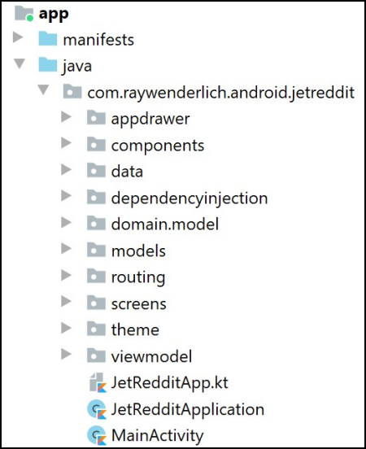

# 第11章：响应Compose生命周期方法


在前几章中，你专注于通过添加高级布局和复杂的用户界面来构建JetReddit应用程序。

在本章中，你将学习如何对可组合函数的生命周期做出反应。这种方法将允许你在你的可组合函数处于活动状态时的特定时刻执行你的代码。

Jetpack Compose提供了一个事件列表，可以在生命周期的特定点上触发，称为效果。在本章中，你将了解到不同种类的效果，以及如何使用它们来实现你的逻辑。

## 在 Compose 中的事件

为了跟随代码示例，使用Android Studio打开本章的启动项目，并选择打开一个现有项目。导航到11-reacting-tocompos-lifecycle/projects，选择启动器文件夹作为项目根。一旦项目打开，让它构建和同步，你就可以开始了

你可能已经熟悉了前一章的项目层次结构，但如果你不熟悉，请看以下图片。



**项目层次结构**

在本章中，你将只使用其中的两个包：实现一个新屏幕的screen，和添加一个新的路由选项的routing。其余的包已经准备好为你处理导航、从数据库获取数据、依赖注入和主题切换。

一旦你熟悉了文件组织，就可以建立并运行该应用程序。你会看到。


**主屏幕**

这是一个完全实现的主屏幕。当你浏览这个应用程序时，你会注意到有两个屏幕是为你预先建立和实现的。我的个人资料，在应用程序的抽屉里，和新的帖子，在底部导航的第三个选项。

在本章中，你将实现在 "新帖 "屏幕内选择一个社区的选项。


## 实施社区选择器

接下来，你将实现一个社区选择器，就像原始Reddit应用程序使用的那样。请看下面的图片作为参考。


**Reddit社区选择器**

社区选择器包含一个工具条，一个搜索输入字段和一个社区列表。为了获取社区列表，你将使用一个包含预制方法的ViewModel。

打开ChooseCommunityScreen.kt文件，看一下代码。有三个可组合的程序。ChooseCommunityScreen()用于整个屏幕。 

SearchedCommunities()用于社区列表，ChooseCommunityTopBar()用于预建的顶部导航栏。

### 创建一个社区列表

正如你在前几章所学到的，你将首先建立较小的组件，从SearchedCommunities()开始。首先将SearchedCommunities()的代码改为如下。

```kotlin
@Composable
fun SearchedCommunities(
  communities: List<String>,
  viewModel: MainViewModel?,
  modifier: Modifier = Modifier
){
communities.forEach {
    Community(
      text = it,
      modifier = modifier,
      onCommunityClicked = {
        viewModel?.selectedCommunity?.postValue(it)
        JetRedditRouter.goBack()
      }
) }
}
```


在可组合的参数中，你可以看到一个代表社区名称的字符串列表，用于更新数据的MainViewModel和一个默认的修改器。

首先，你遍历社区列表，为每个元素创建一个Community()。在上一章中，你已经创建了Community()，所以这是个重复使用它的好机会。

接下来，对于每个社区元素，你传递它的名字和一个修改器，然后设置onCommunityClicked动作。当用户点击任何一个社区时，你用selectedCommunity来通知其他可组合的元素，该元素被保存在viewModel中。

最后，在用户选择社区后，你通过调用JetRedditRouter的goBack()来关闭屏幕。

要看到这些变化，请在ChooseCommunityScreen.kt的底部添加预览代码。

```kotlin
@Preview
@Composable
fun SearchedCommunitiesPreview() {
Column {
    SearchedCommunities(defaultCommunities, null, Modifier)
  }
}
```


建立应用程序并查看预览部分。你看到一个有三个元素的社区列表。


### 使社区名单可以搜索

下一步是添加一个TextField()来根据用户的输入搜索社区。用下面的代码替换ChooseCommunityScreen()。

```kotlin
@Composable
fun ChooseCommunityScreen(viewModel: MainViewModel, modifier:
Modifier = Modifier) {
  val scope = rememberCoroutineScope()
  val communities: List<String> by
viewModel.subreddits.observeAsState(emptyList())
  var searchedText by remember { mutableStateOf("") }
  var currentJob by remember { mutableStateOf<Job?>(null) }
  val activeColor = MaterialTheme.colors.onSurface
  LaunchedEffect(Unit) {
    viewModel.searchCommunities(searchedText)
  }
  Column {
    ChooseCommunityTopBar()
    TextField(
      value = searchedText,
      onValueChange = {
        searchedText = it
        currentJob?.cancel()
        currentJob = scope.async {
          delay(SEARCH_DELAY_MILLIS)
          viewModel.searchCommunities(searchedText)
        }
      },
      leadingIcon = {
        Icon(Icons.Default.Search, contentDescription =
stringResource(id = R.string.search))
      },
      label = { Text(stringResource(R.string.search)) },
      modifier = modifier
        .fillMaxWidth()
        .padding(horizontal = 8.dp),
      colors = TextFieldDefaults.outlinedTextFieldColors(
        focusedBorderColor = activeColor,
        focusedLabelColor = activeColor,
        cursorColor = activeColor,
        backgroundColor = MaterialTheme.colors.surface
) )
    SearchedCommunities(communities, viewModel, modifier)
  }
}
```


在这里，你首先通过调用rememberCoroutineScope()创建了一个coroutineScope。 rememberCoroutineScope()是一个SuspendingEffect，它是Compose中的一个效果类型。它创建了一个CoroutineScope，它被绑定到组合中。CoroutineScope只被创建一次，而且即使在重新组合后也保持不变。任何属于这个作用域的Job将在该作用域离开组合时被取消。

然后，你创建了三个状态：一个是社区列表，这是从数据库中观察到的。第二个是searchedText，它基于用户的输入而更新。第三种是存储你的搜索任务。

接下来，你调用了LaunchedEffect(Unit)，在第一次构图时搜索社区。搜索一个空字符串将返回数据库中的所有社区。

LaunchedEffect(key)在可组合的元素进入重新组合时运行这段代码，只要你传入的键在重新组合之间有变化。因为你传入的是Unit，它是一个常数，所以它只运行一次--在元素第一次被显示时。

最后，你添加了一个Column()，其中有三个组合：预先建立的ChooseCommunityTopBar()，TextField()用于捕获用户输入，SearchedCommunities()用于显示社区列表。

在TextField()中每改变一个值，这段代码就会取消之前的作业，并在你已经创建的范围内开始一个新的作业。

在coroutine的代码块中，你添加了delay()，有300毫秒的延迟。这可以防止用户每次键入一个新的字符时开始新的社区搜索，除非两次键入之间的时间超过300毫秒。 

更新searchedText会取消之前的作业，新的作业会以新的延迟启动。

建立并运行，然后通过选择底部导航中的第三个选项来打开新帖子屏幕。

点击 "选择一个社区 "按钮，打开你刚刚实施的屏幕。


**社区选择者**

你会看到一个社区的列表和一个搜索输入字段，你可以用它来过滤当前的列表。如果你输入的速度很快，在你等待超过300毫秒时，列表才会更新。

目前，你从本地数据库获取数据，但当搜索使用远程API时，这个实现可以节省你的网络数据并减少服务器可能收到的请求数量。

如果你想在不选择社区的情况下返回，你可以点击顶部应用栏的关闭图标。但是，当你点击设备上的内置返回按钮时会发生什么？应用程序会关闭，而不是导航到前一个屏幕。

接下来，你将使用效果来实现背部导航。

## 实现后退按钮处理程序

在前几节中，你使用了内置的返回按钮处理程序。这一次，你将使用效果来建立你自己的。

为了在 Compose 中实现后退按钮的处理，你需要使用调度器，它允许你注册适当的回调。

打开routing里面的BackButtonHandler.kt，用以下内容替换BackButtonHandler()。

```kotlin
@Composable
fun BackButtonHandler(
  enabled: Boolean = true,
  onBackPressed: () -> Unit
){
val dispatcher = localBackPressedDispatcher.current ?: return val backCallback = remember {
    object : OnBackPressedCallback(enabled) {
      override fun handleOnBackPressed() {
        onBackPressed.invoke()
      }
} }
  DisposableEffect(dispatcher) {
    dispatcher.addCallback(backCallback)
    onDispose {
      backCallback.remove()
    }
} }
```


BackButtonHandler()需要两个参数。

• enabled:确定是否启用了背压。

• onBackPressed()。当用户按下一个按钮时调用一个动作。

首先，你用localBackPressedDispatcher创建了一个调度器属性。 localBackPressedDispatcher是一个预先建立的静态CompositionLocal，其类型为OnBackPressedDispatcher，允许你添加和删除对系统返回按钮点击的回调。

接下来，你通过重写OnBackPressedCallback做了一个backCallback。这个回调接收一个参数，指示它是否被启用，然后覆盖handleOnBackPressed()，当用户按下后退按钮时触发。注意，该回调会消耗前面描述的可组合参数，以设置启用状态并调用所需的动作。

最后，你添加了DisposableEffect()，将dispatcher作为一个参数传递。你给dispatcher添加了一个回调，然后调用onDispose()来删除这个回调。

DisposableEffect是一个组合的副作用，它接受一个叫做subject的参数。每当主题改变时，你需要处置该效果并再次调用它。当你离开组合时，该效果也会被处理掉。你通过调用onDispose()来处理这个问题，在这里你删除了dispatcher的回调。这可以防止泄漏。

在你的案例中，每次dispatcher改变时，效果就会被弃置并重新启动，这是有可能的，因为dispatcher取决于应用程序的生命周期。

### 为后退按钮添加一个动作

下一步是建立BackButtonAction()并提供之前的CompositionLocal。用以下内容替换BackButtonAction()。

```kotlin
@Composable
fun BackButtonAction(onBackPressed: () -> Unit) {
  CompositionLocalProvider(
    localBackPressedDispatcher provides (
        LocalLifecycleOwner.current as ComponentActivity
).onBackPressedDispatcher ){
    BackButtonHandler {
      onBackPressed.invoke()
    }
} }
```


BackButtonAction()需要一个参数，即onBackPressed()，这是用户按下返回按钮时需要发生的动作。

你通过传递LocalLifecycleOwner并对其调用current来提供BackPressedDispatcher，它返回生命周期所有者的当前值。你需要把这个值铸成ComponentActivity，通过调用onBackPressedDispatcher来获取当前Activity的Back Press dispatcher。

接下来，你使用了之前的BackButtonHandler()并调用了onBackPressed()作为你的动作。你没有传递启用参数，该参数默认启用回调。

### 调用后退按钮的动作

现在你已经实现了BackButtonAction()，唯一要做的就是在ChooseCommunityScreen()中调用它。

要做到这一点，在ChooseCommunityScreen()的底部添加以下代码。

```kotlin
 BackButtonAction {
  JetRedditRouter.goBack()
}
```


在这里，你只是添加了一个BackButtonAction()，并在路由器上调用了goBack()来回到上一个屏幕。

建立并运行，然后打开选择社区屏幕。应用程序中没有新的UI变化，但你现在可以点击关闭图标或系统返回按钮，以回到前一个屏幕。

在这一阶段，你已经了解了Compose中的两类效果。接下来，你将了解更多的效果。

## 在 Compose 中的效果

为了更清楚地了解效果这一主题，你首先需要了解副作用在 Compose 中是如何工作的。

副作用是指改变函数范围之外的任何东西的值的操作。这方面的一个例子是当一个易变的对象被传递给一个函数并改变了该函数的一些属性。这种改变会影响到使用同一对象的代码的其他部分，所以在应用时需要小心。

副作用的最大问题是你无法控制它们实际发生的时间。这在可合成物中是有问题的，因为它们里面的代码在每次重组时都会执行。效果可以帮助你，让你控制代码的执行时间。下面是关于具体效果的更多细节。

### 副作用

SideEffect()确保你的事件只在组合成功时执行。如果组合失败，事件会被丢弃。此外，只有当你不需要处置事件，但希望它在每次重新组合时都能运行时才使用它。

请看下面的片段。

```kotlin
@Composable
fun MainScreen(router: Router) {
  val drawerState = rememberDrawerState(DrawerValue.Closed)
SideEffect {
    router.isRoutingEnabled = drawerState.Closed
  }
}
```


在这个片段中，SideEffect()改变了路由器的状态。当抽屉关闭时，你将禁用应用程序中的路由：否则，你将启用它。在这种情况下，路由器是一个单子，你不想处置它，因为其他屏幕正在使用它进行导航。

下一个效果，LaunchedEffect()，类似于你之前使用的rememberCoroutineScope()。

### 启用的效果

LaunchedEffect在组合的CoroutineScope中启动了一个coroutine。就像rememberCoroutineScope()一样，当LaunchedEffect离开组合时，它的coroutine会被取消，并在重新组合时重新启动。

请看下面的例子，以获得更深入的了解。

```kotlin
@Composable
fun SpeakerList(searchText: String) {
  var communities by remember
{ mutableStateOf(emptyList<String>()) }
  LaunchedEffect(searchText) {
    communities = viewModel.searchCommunities(searchText)
  }
  Communities(communities)
}
```


这个片段类似于你在ChooseCommunityScreen()中实现搜索功能时的做法。

当你实现ChooseCommunityScreen时，searchText是一个可变的状态，取决于用户的输入。这一次，searchText是一个函数参数，没有被保存为一个可变的状态。根据Google的指南，你应该遵循这种方法来防止性能问题。

LaunchedEffect在它第一次进入组合时启动，并且在每次参数改变时启动。在参数变化期间或离开组合时，它取消所有正在运行的工作。

你现在学会了所有的效果类型，但是有一些函数可能会帮助你在更具体的情况下使用这些效果。这些函数创建了不同种类的状态，应该在效果合成器里面使用。列表中的第一个函数是rememberUpdatedState()。

### 记住更新的状态

当使用LaunchedEffect时，每当传递的参数发生变化时，它就会启动。如果你想使用一个永不改变的恒定参数，你的效果将永远不会重新启动，如果你有需要更新的值，这就是一个问题。

在这种情况下，你可以对你需要更新的值使用rememberUpdatedState。这将创建一个对该值的引用，并允许它在可合成物被重新组合时进行更新。你需要这种方法的例子是一个闪屏。

```kotlin
@Composable
fun LandingScreen(onSplashFinished: () -> NetworkData) {
  val currentOnSplashFinished by
rememberUpdatedState(onSplashFinished)
  LaunchedEffect(Unit) {
    delay(SplashWaitTimeMillis)
    currentOnSplashFinished()
  }
}
```


当闪屏开始时，你想设置一个超时时间，让它持续多久，如果你的应用程序需要的话，就做一些后台工作。当你的一些后台工作完成后，你可能想更新你的可组合的值，从而触发重新组合。

为了更新你的onSplashFinished lambda的值，你用rememberUpdatedState包裹它，然后在LaunchedEffect里面用Unit作为参数来使用。由于Unit是一个常量值，效果将永远不会重启，以确保你的闪屏总是有相同的等待时间，但你的lambda仍然会在超时结束后以最新的值被调用。

在使用效果时，下一个会帮助你的函数是produceState。

### 生产状态

有时你想在后台做一些工作，然后把它传递给表现层。请记住，可组合的函数有状态，任何在可组合中使用的数据都需要转换为组合状态，以便使用并在重新组合中存活。

你可以使用produceState来编写一个函数，获取数据并将其直接转换为compose State。在下面的代码中，你可以看到一个按作者加载书籍的例子。

```kotlin
@Composable
fun loadBooks(author: String, booksRepository: BooksRepository):
State<Result<List<Book>>> {
  return produceState(initialValue = Result.Loading, author,
booksRepository) {
    val books = booksRepository.load(author)
    value = if (books == null) {
      Result.Error
} else {
      Result.Success(books)
    }
} }
```


该函数有两个参数，一个是作者，另一个是booksRepository。调用ProduceState来创建一个coroutine，获取书籍并直接将其转换为一个可组合的State。如果两个传递的参数中的任何一个发生变化，工作将被取消，并以新的值重新启动。

这允许你创建一个带有返回类型的可组合函数，并从其他可组合函数中调用它，就像你通常在你的演示器或视图模型中做的那样。请注意，带有返回类型的可组合函数的名称惯例是以小写字母开头，就像其他非可组合函数一样。

## 迁移效果

如果你使用旧版本的Jetpack Compose，你可能有一些不同的效果，在本章中没有提到。这些效果现在已经被移除，但 

你仍然可以使用LaunchedEffect、DisposableEffect和SideEffect来实现同样的实现。

要迁移到较新的版本，你可以使用这个为你准备的操作指南。

```kotlin
// onActive without subject parameter
onActive {
  someFunction()
}
```

将其替换为。

```kotlin
 LaunchedEffect(Unit) {
  someFunction()
}
```


你可以通过使用LaunchedEffect的常量值（如Unit或true）来代替onActive()，而不使用主题参数。这将确保该效果只使用一次，在第一次构图时使用。接下来，如果你像这样使用它。

```kotlin
// onActive with subject parameter
onActive(parameter) {
  someFunction()
}
```

将其替换为。

```kotlin
 LaunchedEffect(parameter) {
  someFunction()
}
```


如果你在onActive()中使用主题参数，你可以直接用LaunchedEffect代替它。

那么，如果你使用的是类似的东西。

```kotlin
// onActive with onDispose
onActive {
  val disposable = getData()
onDispose {
    disposable.dispose()
  }
}
```


将其替换为。

```kotlin
DisposableEffect(Unit) {
  val disposable = getData()
onDispose {
    disposable.dispose()
  }
}
```


就像在没有主题参数的例子中，你可以通过使用DisposableEffect的常量值（如Unit或true）在内部用onDispose()代替onActive()。

最后，如果你在使用。

```kotlin
// onCommit without subject parameter
onCommit {
  someFunction()
}
```


将其替换为。

```kotlin
 SideEffect {
  someFunction()
}
```


你可以通过使用SideEffect的常量值（如Unit或true）来替代没有主题参数的onCommit()。这将确保该效果在第一次合成时使用，并在每次重新合成时再次使用。要使用带主题参数的onCommit()或内部的onDispose()，请使用与onActive()相同的代码。

## 关键点

• 当你使用协程并需要在一个事件后取消并重新启动协程时，请使用rememberCoroutineScope()。

• 当你使用循环程序，并且每次你的参数发生变化时都需要取消并重新启动循环程序，并且它没有存储在一个可变的状态中时，请使用LaunchedEffect()。

• DisposableEffect()在你不使用循环程序，并且需要在每次参数变化时处置并重新启动事件时非常有用。

• SideEffect()只在构图成功时触发事件，你不需要处置主体。

• 当你想只启动你的效果一次，但仍然能够更新数值时，请使用rememberUpdatedState()。

• 使用produceState()直接将不可组合的状态转换成可组合的状态。

• 具有返回类型的可组合物的名称应该以小写字母开头。

### 今后该何去何从？

祝贺你!现在，你知道如何对 Compose 生命周期做出反应，这是 Jetpack Compose 最复杂的部分之一。在这一点上，你已经看到了如何解决你在使用Compose时遇到的一些最复杂和最重要的问题的概况。

在下一章中，你将学习如何使用动画来使你的用户界面更加漂亮。动画很有趣--而且最终很容易做到--所以请继续阅读并享受吧!