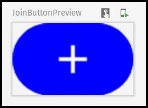
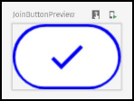
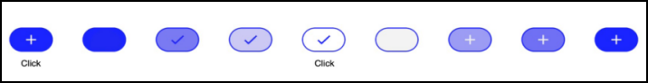
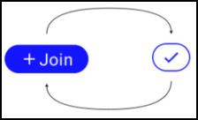
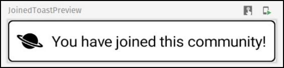

# 第12章：使用Compose的动画属性

很好地完成了上一章的学习。到目前为止，在本书的第三部分，你已经学会了如何使用ConstraintLayout，构建复杂的UI，并对Compose生命周期做出反应。这些东西当然很有趣，但更有趣的是什么？玩动画!而这正是你现在要做的。]在本章中，你将学习如何。

• 使用animate*AsState()对可组合属性进行动画化。

• 使用updateTransition()对你的可组合物的多个属性进行动画化。

• 将可合成的内容制作成动画。

• 实施一个动画按钮来加入一个子红点。

• 实现一个动画祝酒词，当用户加入一个子版块时显示。

在直接进入动画世界之前，你将创建一个代表一个按钮的可组合的，让用户加入一个假想的子reddit。

你将从实现一个简单的按钮开始，就像下面所示的那样。


**简单连接按钮**

如果一个用户还没有加入该分论坛，他们可以通过点击带有加号图标的蓝色按钮来加入。如果用户已经是会员，一个带有蓝色复选的白色按钮代表该状态。再次点击该按钮会恢复到之前的状态。

要跟上代码实例，请在Android Studio中打开本章的启动项目，并选择打开一个现有的项目。

接下来，导航到12-animating-properties-using-compose/projects，选择启动文件夹作为项目根。一旦项目打开，让它构建和同步，你就可以开始了

注意，如果你跳到最后一个项目，你会发现已经完成的按钮，所有的动画逻辑都已经实现。

现在你都准备好了，是时候开始编码了。

## 构建JoinButton

在组件包中，添加一个名为JoinButton.kt的新文件，然后打开它并添加以下代码。

```kotlin
@Composable
fun JoinButton(onClick: (Boolean) -> Unit = {}) {
}

enum class JoinButtonState {
  IDLE,
PRESSED }

@Preview
@Composable
fun JoinButtonPreview() {
  JoinButton(onClick = {})
}
```


这里没有什么可看的。你只是为你的按钮创建了一个可组合的根，并添加了一个预览。现在，没有什么可以预览，因为你还没有添加任何内容。

你还添加了JoinButtonState，它表示按钮的状态，状态的两个选项是IDLE或PRESSED。

接下来，在JoinButton()中添加以下代码。

```kotlin
var buttonState: JoinButtonState
  by remember { mutableStateOf(JoinButtonState.IDLE) }
// Button shape
val shape = RoundedCornerShape(corner = CornerSize(12.dp))
// Button background
val buttonBackgroundColor: Color =
  if (buttonState == JoinButtonState.PRESSED)
Color.White
else
Color.Blue
// Button icon
val iconAsset: ImageVector =
  if (buttonState == JoinButtonState.PRESSED)
    Icons.Default.Check
else
    Icons.Default.Add
val iconTintColor: Color =
  if (buttonState == JoinButtonState.PRESSED)
    Color.Blue
else
Color.White
Box(
  modifier = Modifier
    .clip(shape)
    .border(width = 1.dp, color = Color.Blue, shape = shape)
    .background(color = buttonBackgroundColor)
    .size(width = 40.dp, height = 24.dp)
    .clickable(onClick = {
      buttonState =
        if (buttonState == JoinButtonState.IDLE) {
          onClick.invoke(true)
          JoinButtonState.PRESSED
        } else {
          onClick.invoke(false)
          JoinButtonState.IDLE
        }
    }),
  contentAlignment = Alignment.Center
){ Icon(
    imageVector = iconAsset,
    contentDescription = "Plus Icon",
    tint = iconTintColor,
    modifier = Modifier.size(16.dp)
) }
```


这可能看起来有很多代码，但你会发现它非常简单。下面是一个分解，从顶部开始。

你首先用remember()声明了一个buttonState。理想情况下，你会用PostModel来表示你的状态，但这种简化的方法足以展示动画的工作原理。

接下来，你用RoundedCornerShape()来定义按钮的形状。

你还定义了按钮的背景颜色，它将根据按钮状态的不同而改变。当按钮的JoinButtonState.PRESSED时，它将是白色。当它是JoinButtonState.IDLE时，它将是蓝色。

接下来，你定义了按钮的图标和图标颜色。当按钮的状态是JoinButtonState.PRESSED时，你将用一个白色的加号表示图标。如果是JoinButtonState.IDLE，你将用一个蓝色的复选标记来表示它。

你添加的最后一件事是发出按钮的用户界面的代码。你用Box()来定义按钮的形状和背景，用Icon()来定义按钮的图标。

为了使这段代码发挥作用，你还需要添加一些导入。

```kotlin
import androidx.compose.foundation.shape.CornerSize
import androidx.compose.foundation.shape.RoundedCornerShape
import androidx.compose.foundation.background
import androidx.compose.foundation.border
import androidx.compose.foundation.clickable
import androidx.compose.foundation.layout.Box
import androidx.compose.foundation.layout.size
import androidx.compose.material.Icon
import androidx.compose.material.icons.Icons
import androidx.compose.material.icons.filled.Add
import androidx.compose.material.icons.filled.Check
import androidx.compose.runtime.*
import androidx.compose.ui.Alignment
import androidx.compose.ui.Modifier
import androidx.compose.ui.draw.clip
import androidx.compose.ui.graphics.Color
import androidx.compose.ui.graphics.vector.ImageVector
import androidx.compose.ui.tooling.preview.Preview
import androidx.compose.ui.unit.dp
```


很好!现在，建立该项目并检查预览面板。



**JoinButton - 闲置状态**

注意，你可以把buttonState的初始状态改为PRESSED，以预览你的按钮的不同设置。



**JoinButton - 被按下的状态**真棒!接下来，你要把这个按钮添加到Post()中。

## 在帖子中添加JoinButton

在制作JoinButton()的动画之前，你要把它添加到Post()中，这样你就可以在应用程序中看到它。

打开Post.kt，编辑Header()，看起来像这样。

```kotlin
@Composable
fun Header(
  post: PostModel,
  onJoinButtonClick: (Boolean) -> Unit = {} // here
){ Row(
    modifier = Modifier.padding(start = 16.dp),
  verticalAlignment = Alignment.CenterVertically // here ){
    Image(
      ImageBitmap.imageResource(id =
R.drawable.subreddit_placeholder),
      contentDescription = stringResource(id =
R.string.subreddits),
      Modifier
        .size(40.dp)
        .clip(CircleShape)
    )
    Spacer(modifier = Modifier.width(8.dp))
    Column(modifier = Modifier.weight(1f)) {
      Text(
        text = stringResource(
          R.string.subreddit_header,
          post.subreddit
        ),
        fontWeight = FontWeight.Medium,
        color = MaterialTheme.colors.primaryVariant
      )
      Text(
        text = stringResource(
          R.string.post_header,
          post.username,
          post.postedTime
),
        color = Color.Gray
      )
    }
    Spacer(modifier = Modifier.width(4.dp)) // here
    JoinButton(onJoinButtonClick) // here
    MoreActionsMenu()
}
  Title(text = post.title)
}
```


在上面的代码中，你添加了。

1. verticalAlignment给Row()，使标题内容垂直居中。

2. JoinButton()和Spacer()改为Header()。

3. onJoinButtonClick改为Header()。

非常好!现在，构建(build)并运行(run)该应用程序。检查你的帖子看起来如何。


**有加入按钮的帖子**

点击其中一个JoinButtons，你会看到图标和背景是如何瞬间改变的。

## 给JoinButton的背景制作动画

到目前为止，当状态发生变化时，你已经让按钮的背景从一种颜色变为另一种颜色。在这一节中，你将对这种转变制作动画。

在JoinButton.kt中，用以下代码替换buttonBackgroundColor的当前定义。

```kotlin
// Button background
val buttonBackgroundColor: Color by animateColorAsState(
  if (buttonState == JoinButtonState.PRESSED)
Color.White
else
   Color.Blue )
```


也要增加一个导入。

```kotlin
import androidx.compose.animation.animateColorAsState
```


这里，你用animateColorAsState()包装了定义两种不同背景颜色的if子句。通过这样做，你实现了当状态改变时两种颜色之间的动画。

通过这个简单的改变，你添加了你的第一个动画。你能相信这有多容易吗？]

现在，仔细看看animateColorAsState()。它只是animate*AsState()函数中的一个。在Jetpack Compose文档中，你会发现有十几个不同的animate*AsState()签名，允许你对十几个不同的属性进行开箱动画，包括Float、Color、Dp、Position、Size和其他。你甚至可以定义你自己的属性。

所有这些定义都有一个共同点：你把它们用于 "火烧连营 "动画。一旦你创建了一个可燃可弃的动画，应用程序将记住它的位置，就像其他可组合物一样。要触发动画，或改变动画的进程，你只需向可组合物提供一个不同的目标。

animate*AsState()函数是 Compose 中最简单的动画 API，用于制作单个值的动画。你只需提供结束值（或目标值），API就会从当前值开始动画化到指定值。

现在构建(build)并运行(run)该应用程序。点击应用程序中的任何JoinButton，注意背景颜色的变化。



**加入按钮的背景动画**

该图显示了该按钮在动画的几个帧中的样子。注意到在点击之后，图标是如何立即改变的，而背景是如何从一种颜色慢慢过渡到另一种颜色的。这里真正令人印象深刻的是，实现这个动画是多么容易，这使你的应用程序变得更加漂亮了

## 使用转场对JoinButton进行动画处理

在上一节中，你看到了如何为你的可组合物的一个属性制作动画。 

现在，你要为JoinButton()添加更多的内容。这将使你有机会一次对几个属性进行动画处理。



**用更多的内容加入按钮**

图中显示了在JoinButtonState.IDLE状态下你将如何改变JoinButton的外观。

在添加任何代码之前，分析一下你将如何完成这个动画。你必须对哪些属性进行动画处理？为了使按钮具有新的外观，你需要。

1. 将背景制作成动画，就像你在前一个例子中做的那样。

2. 改变图标。你将以与之前相同的方式改变资产，但你将通过动画化的图标颜色来改进这种变化。

3. 根据状态，隐藏和显示文本。

4. 对按钮的宽度进行动画处理。

所以你需要对四个不同的属性进行动画处理。在添加下面的代码时要记住这一点。

### 界定过渡期

为了给这些属性制作动画，你将使用Transition。Transition管理一个或多个动画作为它的孩子，并在多个状态之间同时运行它们。

在JoinButton.kt中，在JoinButton()中添加以下代码，就在shape下面。

```kotlin
val transition = updateTransition(
  targetState = buttonState,
  label = "JoinButtonTransition"
)
```


也添加这个导入。

```kotlin
import androidx.compose.animation.core.updateTransition
```

updateTransition 创建并记住一个Transition的实例并更新它的状态。当targetState改变时，Transition将运行它所有的子动画，朝向它们为新的targetState指定的目标值。接下来你将添加这些目标值。你还传入了标签属性，这让你在Android Studio中检查和调试这些动画。

接下来，你将定义子动画。用下面的代码替换buttonBackgroundColor定义。

```kotlin
val duration = 600
val buttonBackgroundColor: Color
  by transition.animateColor(
    transitionSpec = { tween(duration) },
    label = "Button Background Color"
  ) { state ->
    when (state) {
      JoinButtonState.IDLE -> Color.Blue
      JoinButtonState.PRESSED -> Color.White
    }
}
```


也添加这些导入。

```kotlin
import androidx.compose.animation.animateColor
import androidx.compose.animation.core.tween
```


在这里，你定义了过渡时间和过渡中的第一个子动画。你使用了 animateColor，这是 animate* 的一个扩展函数，允许你在过渡中定义一个子动画。你为每个状态指定了目标值。这些animate*函数返回一个动画值，在动画过程中，当用updateTransition更新过渡状态时，每一帧都会更新。

你还使用了tween()。通过tween()，你创建了一个配置有给定持续时间、延迟和缓和曲线的TweenSpec。由于你只指定了一个持续时间，代码中使用了0作为delayMillis和FastOutSlowInEasing()作为缓和。

缓和是一种调整动画分数的方法。分数代表你的动画进行到什么程度，其数值在[0, 1]范围内，或者[0, 100]，代表你完成的动画的百分比。

缓和允许过渡元素加速和减速，而不是以一个恒定的、线性的速度移动。

接下来，添加其余的子动画。在buttonBackgroundColor下面，添加以下代码。

```kotlin
val buttonWidth: Dp
  by transition.animateDp(
    transitionSpec = { tween(duration) },
    label = "Button Width"
  ) { state ->
    when (state) {
      JoinButtonState.IDLE -> 70.dp
      JoinButtonState.PRESSED -> 32.dp
    }
  }
val textMaxWidth: Dp
  by transition.animateDp(
    transitionSpec = { tween(duration) },
    label = "Text Max Width"
  ) { state ->
    when (state) {
      JoinButtonState.IDLE -> 40.dp
      JoinButtonState.PRESSED -> 0.dp
    }
}
```


不要忘记添加这些导入。

```kotlin
import androidx.compose.ui.unit.Dp
import androidx.compose.animation.core.animateDp
```


最后，用这个替换当前的iconTintColor定义。

```kotlin
val iconTintColor: Color
  by transition.animateColor(
    transitionSpec = { tween(duration) },
    label = "Icon Tint Color"
  ) { state ->
    when (state) {
      JoinButtonState.IDLE -> Color.White
      JoinButtonState.PRESSED -> Color.Blue
    }
}
```


很好！你现在已经准备好了过渡所需的一切。你现在已经准备好了你的过渡所需的一切，但你仍然要把这段代码与你想做动画的可合成物连接起来。

### 将过渡动画与composables连接起来

属性buttonBackgroundColor和iconTintColor已经到位了，所以你不必改变这些。

接下来，用以下内容替换Box()的定义。

```kotlin
Box(
  modifier = Modifier
    .clip(shape)
    .border(width = 1.dp, color = Color.Blue, shape = shape)
    .background(color = buttonBackgroundColor)
    .size(
      width = buttonWidth, // here
      height = 24.dp
    )
    .clickable(onClick = {
      buttonState =
        if (buttonState == JoinButtonState.IDLE) {
          onClick.invoke(true)
          JoinButtonState.PRESSED
        } else {
          onClick.invoke(false)
          JoinButtonState.IDLE
        }
    }),
  contentAlignment = Alignment.Center
){
Row( // here
verticalAlignment = Alignment.CenterVertically ){
    Icon(
      imageVector = iconAsset,
      contentDescription = "Plus Icon",
      tint = iconTintColor,
      modifier = Modifier.size(16.dp)
    )
    Text(   // here
      text = "Join",
      color = Color.White,
      fontSize = 14.sp,
      maxLines = 1,
      modifier = Modifier.widthIn(
min = 0.dp,
        max = textMaxWidth // here
      )
) }
}
```


首先，注意你是如何改变Box()的内容的。你用Row()将一个Icon()和一个Text()互相对齐。其次，注意到你不必改变Box()的修改器中访问特定过渡属性的方式，以及你如何将其用于Icon()和Text()。就像以前一样，你用buttonBackgroundColor来访问按钮的背景，用iconTintColor来访问图标的色调。

同时添加以下导入。

```kotlin
import androidx.compose.foundation.layout.Row
import androidx.compose.foundation.layout.widthIn
import androidx.compose.material.Text
import androidx.compose.ui.unit.sp
```


这就是它了!现在这就是一个完整的按钮，它将从一个状态动画化到另一个状态。构建并运行该应用程序。现在你会在帖子里看到新的JoinButton。


**带有已完成的加入按钮的帖子**

点击任何一个帖子中的按钮，看看它是如何从一个状态到另一个状态的动画。


**加入按钮动画**

你可以看到按钮的宽度和文字的变化，以及按钮的背景和图标的颜色动画。

## 为可组合的内容制作动画

到目前为止，你已经看到了如何为你的可组合物的属性制作动画。在本节中，你将通过学习如何为可组合的内容制作动画来探索创建动画的不同方法。

注意：在撰写本文时，这个动画API正处于实验阶段，所以当你在代码中看到@ExperimentalAnimationApi注释时，请记住这一点。

在这一节中，你将实现一个祝酒词的组合，当用户加入一个子论坛时出现。它将看起来像这样。


**加入吐司**

当你点击JoinButton加入一个新的subreddit的时候，这个祝酒词就会出现。要实现这样的行为，你需要做几件事，所以让我们从创建初始吐司的组合开始。

### 添加JoinToast

在组件中，创建一个名为JoinToast.kt的新文件。然后，在其中添加以下代码。

```kotlin
@Composable
fun JoinedToast(visible: Boolean) {
  ToastContent()
}
@Composable
private fun ToastContent() {
  val shape = RoundedCornerShape(4.dp)
  Box(
    modifier = Modifier
      .clip(shape)
      .background(Color.White)
      .border(1.dp, Color.Black, shape)
      .height(40.dp)
      .padding(horizontal = 8.dp),
contentAlignment = Alignment.Center ){
    Row(verticalAlignment = Alignment.CenterVertically) {
      Icon(
        painter = painterResource(
          id = R.drawable.ic_planet
        ),
        contentDescription = "Subreddit Icon"
      )
      Spacer(modifier = Modifier.width(8.dp))
      Text(text = "You have joined this community!")
    }
} }
@Preview
@Composable
fun JoinedToastPreview() {
  JoinedToast(visible = true)
}
```


下面是上面的代码的作用。你用一个Box()来给你的吐司一个特定的背景、形状、大小和填充。在Box()中，你添加了一个Row()来对齐一个Icon()、Spacer()和Text()。

为使其发挥作用，还需添加以下导入。

```kotlin
import androidx.compose.foundation.background
import androidx.compose.foundation.border
import androidx.compose.foundation.layout.*
import androidx.compose.foundation.shape.RoundedCornerShape
import androidx.compose.material.Icon
import androidx.compose.material.Text
import androidx.compose.runtime.Composable
import androidx.compose.ui.Alignment
import androidx.compose.ui.Modifier
import androidx.compose.ui.draw.clip
import androidx.compose.ui.graphics.Color
import androidx.compose.ui.res.painterResource
import androidx.compose.ui.tooling.preview.Preview
import androidx.compose.ui.unit.dp
import com.raywenderlich.android.jetreddit.R
```

构建项目并检查预览面板以查看你的可组合性。



**JoinedToast可组合式 - 预览** 真棒!接下来，你将对吐司制作动画。]

### 为JoinToast制作动画

在JoinToast.kt中，将JoinToast()的代码替换为以下内容。

```kotlin
@ExperimentalAnimationApi
@Composable
fun JoinedToast(visible: Boolean) {
  AnimatedVisibility(
      visible = visible,
      enter = slideInVertically(initialOffsetY = { +40 }) +
          fadeIn(),
      exit = slideOutVertically() + fadeOut()
){
    ToastContent()
  }
}
```


如果你不添加这些导入，Android Studio会警告。

```kotlin
import androidx.compose.animation.ExperimentalAnimationApi
import androidx.compose.animation.AnimatedVisibility
import androidx.compose.animation.fadeIn
import androidx.compose.animation.slideInVertically
import androidx.compose.animation.slideOutVertically
import androidx.compose.animation.fadeOut
```


如前所述，@ExperimentalAnimationApi之所以存在，是因为这是一个实验性的API--至少，在写作时是这样。

在这里，你用AnimatedVisibility()包装了ToastContent()，随着可见值的变化，它的内容的出现和消失也会有动画效果。

这是AnimatedVisibility()的签名，取自Jetpack Compose文档。

```kotlin
@Composable
fun AnimatedVisibility(
    visible: Boolean,
    modifier: Modifier = Modifier,
    enter: EnterTransition = fadeIn() + expandIn(),
    exit: ExitTransition = shrinkOut() + fadeOut(),
    initiallyVisible: Boolean = visible,
    content: @Composable () -> Unit
): Unit
```


你可以在进入和退出中定义不同的EnterTransition和ExitTransition，用于外观和消失的动画。有三种类型的EnterTransition和ExitTransition：淡出、展开/收缩和滑动。通过使用+号，你可以将Enter和ExitTransition组合起来。组合的顺序并不重要，因为过渡动画是同时开始的。

现在，回到你的代码。你把可见性从JoinToast()传给了 

AnimatedVisibility()。有了这个，你就可以控制动画的触发时间。当visible变为true时，会触发进入动画。否则，它将触发退出动画。

对于进入过渡，你结合了两个过渡：slideInVertically()和fadeIn()。 slideInVertically()将内容从initialOffsetY定义的起始偏移量垂直滑动到0。你通过配置initialOffsetY控制滑动的方向。一个正的初始偏移量意味着动画将向上滑动，而一个负值将使内容向下滑动。

对于退出过渡，你使用了 slideOutVertically() 和 fadeOut()。

#### 将JoinToast带回家

在你能看到这个动画的运行之前，你需要在HomeScreen()中添加JoinToast()。你还需要将@ExperimentalAnimationApi添加到任何可由JoinToast()组成的父节点。

首先，将@ExperimentalAnimationApi添加到JoinToastPreview()中。

```kotlin
@ExperimentalAnimationApi
@Preview
@Composable
fun JoinedToastPreview() {
  JoinedToast(visible = true)
}
```


接下来，打开HomeScreen.kt，像这样更新HomeScreen()。

```kotlin
@ExperimentalAnimationApi
@Composable
fun HomeScreen(viewModel: MainViewModel) {
  val posts: List<PostModel>
      by viewModel.allPosts.observeAsState(listOf())
  var isToastVisible by remember { mutableStateOf(false) }
  val onJoinClickAction: (Boolean) -> Unit = { joined ->
    isToastVisible = joined
    if (isToastVisible) {
      Timer().schedule(3000) {
        isToastVisible = false
      }
} }
  Box(modifier = Modifier.fillMaxSize()) {
    LazyColumn(modifier = Modifier.background(color =
MaterialTheme.colors.secondary)) {
      items(posts) {
        if (it.type == PostType.TEXT) {
          TextPost(it, onJoinButtonClick = onJoinClickAction)
} else {
          ImagePost(it, onJoinButtonClick = onJoinClickAction)
        }
        Spacer(modifier = Modifier.height(6.dp))
      }
}
    Box(
      modifier = Modifier
        .align(Alignment.BottomCenter)
.padding(bottom = 16.dp) ){
      JoinedToast(visible = isToastVisible)
    }
} }
```


同时添加以下导入。

```kotlin
import androidx.compose.animation.ExperimentalAnimationApi
import androidx.compose.foundation.layout.Box
import androidx.compose.foundation.layout.fillMaxSize
import androidx.compose.foundation.layout.padding
import androidx.compose.ui.Alignment
import
com.raywenderlich.android.jetreddit.components.JoinedToast
import java.util.Timer
import kotlin.concurrent.schedule
```


你在上面的代码中做了几件事。你把一个LazyColumn()用一个 

Box()，它允许你填充屏幕的最大尺寸。你还添加了第二个 

Box()，并在其内容中加入了JoinToast()。这第二个Box()让你把JoinToast()放在底部。然后，你用remember()来定义吐司的可见状态。

接下来，你定义了onJoinClickAction。点击任何 JoinButton 都会触发 onJoinClickAction() 并显示一个敬酒。三秒后，你通过将 isToastVisible 改为 false 来隐藏吐司。

最后，你用onJoinClickAction作为不同帖子的参数。然而，现在，TextPost()和ImagePost()没有onJoinButtonClick参数，所以你会看到一个错误。你接下来要解决这个问题。

#### 将onJoinButtonClick添加到帖子中

打开Post.kt，用以下代码替换TextPost()、ImagePost()和Post()。

```kotlin
@Composable
fun TextPost(
  post: PostModel,
  onJoinButtonClick: (Boolean) -> Unit = {}
){
Post(post, onJoinButtonClick) {
    TextContent(post.text)
  }
}
@Composable
fun ImagePost(
  post: PostModel,
  onJoinButtonClick: (Boolean) -> Unit = {}
){
Post(post, onJoinButtonClick) {
    ImageContent(post.image!!)
  } }
@Composable
fun Post(
  post: PostModel,
  onJoinButtonClick: (Boolean) -> Unit = {},
  content: @Composable () -> Unit = {}
){
Card(shape = MaterialTheme.shapes.large) {
    Column(
      modifier = Modifier.padding(
top = 8.dp,
        bottom = 8.dp
      )
){
Header(post, onJoinButtonClick) Spacer(modifier = Modifier.height(4.dp)) content.invoke()
Spacer(modifier = Modifier.height(8.dp)) PostActions(post)
} }
}
```


这里最重要的是，你在TextPost、ImagePost和Post的签名中加入了onJoinButtonClick，并把它传递给Header()。  做得很好!头部已经将onJoinButtonClick传递给JoinButton()并处理了一切，所以你不需要更新这些组合。然而，由于你使用的是一个实验性的动画API，你需要给你的可组合物添加适当的注释。

## 添加实验性注释

你要添加的注释是@ExperimentalAnimationApi。

打开JetRedditApp.kt，将@ExperimentalAnimationApi添加到以下组合物中。

1. MainScreenContainer()

2. AppContent()

3. JetRedditApp()

你可以按照Android Studio的错误，使用快速行动来轻松添加这些导入。否则，找到这三个函数，在这些函数的顶部粘贴以下语句。

```kotlin
@ExperimentalAnimationApi
override fun onCreate(savedInstanceState: Bundle?) {
  super.onCreate(savedInstanceState)
  setContent {
    JetRedditApp(viewModel)
  }}
```


不要忘记为@ExperimentalAnimationApi也添加一个导入。

```kotlin
import androidx.compose.animation.ExperimentalAnimationApi

```

芜湖                !现在，构建(build)并运行(run)该应用程序。点击任何JoinButton，观察吐司的进入和退出动画。


**加入吐司**

就这样，你使用了三个不同的API来为你的可合成物制作动画。干得好!

## 关键点

• 你可以使用animate*AsState()来实现针对你的可组合物的单个属性的即发即忘的动画。这对制作大小、颜色、alpha和类似的简单属性的动画非常有用。

• 你使用Transition和updateTransition()进行基于状态的转换。

• 当你必须为你的可组合物的多个属性制作动画时，或者当你有多个可以制作动画的状态时，可以使用过渡。

• 在第一次显示内容或离开屏幕、菜单、选项选择器和类似的情况下，转场是非常好的。在填写表格、选择选项和按下按钮时，它们在多个状态之间的动画效果也很好。

• 当你想对可组合内容的出现和消失进行动画处理时，你可以使用AnimatedVisibility()。

• AnimatedVisibility()让你结合不同类型的可见性动画，如果你使用预定义的过渡动画，你可以定义方向。

希望这对你来说是一次有趣的旅程。你有机会玩了三个不同的API，创造了一些简单而又漂亮的动画。下面是本书的最后一章。你确实走了很长的路!

在下一章，你将看到如何将旧的View框架与Jetpack Compose结合起来，以及两者如何在同一个代码库中共存。

到时见!:]