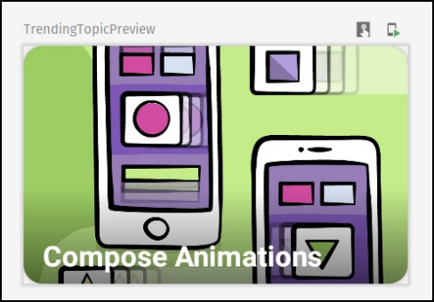

# 第13章：添加视图 

祝贺你达到这本书的最后一章。

到目前为止，你已经学到了很多关于Jetpack Compose的知识。在本书的第一节中，你了解了基本的可合成物。在第二节中，你看到了在构建一个真正的应用程序时如何使用Compose。在第三部分，你学到了如何建立一个更复杂的用户界面，以及如何制作简单但漂亮的动画。

在本章中，你将通过学习结合Jetpack Compose和旧的View框架的基本原则来完成你的旅程，它们可以在同一个代码库中共存。这些知识将使你更容易将你的应用程序逐步迁移到Jetpack Compose。

## 介绍聊天屏幕和趋势视图

要跟上代码实例，请在Android Studio中打开本章的启动项目，并选择打开一个现有的项目。

然后，导航到13-adding-view-compatibility/projects，选择starter文件夹作为项目根。一旦项目打开，让它构建和同步，你就可以开始了你可以通过跳转到最终项目来查看完成的项目。

另外，在运行项目之前，请确保清理应用程序的存储空间。

在本章中，我们在启动项目中添加了一些东西。


**主屏幕上的聊天按钮**

这些新增功能包括一个新的聊天界面，它使用旧的视图框架。如上图所示，通过点击主屏幕顶部栏中新的聊天图标来访问它。

如果你点击该按钮，你将打开以下屏幕。


**聊天屏幕**

在本章中，你将用一个由可组合函数组成的按钮来取代 "开始聊天 "按钮。要看到最终的实现，请查看 screens/ChatActivity.kt 和 res/layout/activity_chat.xml。你还将建立一个 "今日趋势 "组件，它将成为主屏幕列表中的第一个项目。


**趋势查看**

除了一个功能外，你要用可组合物构建整个组件。趋势主题。这将使用view/TrendingTopicView.kt和res/layout/view_trending_topic.xml中的View框架。

接下来，你会看到Jetpack Compose和View框架是如何一起工作的。

## 在视图框架中使用可合成物

学习如何在旧的视图框架下使用可合成物，会让你更容易将现有的屏幕迁移到Jetpack Compose。你将从小的组件开始，逐渐迁移整个屏幕。

此外，有些组件使用Jetpack Compose更容易制作。在框架允许的情况下，没有理由**不**使用这些组件。]

在本节中，你将首先使用Jetpack Compose实现开始聊天按钮。

### 实施 "开始聊天 "按钮

打开ChatActivity.kt，在ChatActivity下面添加以下代码。

```kotlin
@ExperimentalMaterialApi
@Composable
private fun ComposeButton(onButtonClick: () -> Unit) {
  val buttonColors = buttonColors(
    backgroundColor = Color(0xFF006837),
    contentColor = Color.White
  )
  Button(
    onClick = onButtonClick,
    elevation = null,
    shape = RoundedCornerShape(corner = CornerSize(24.dp)),
    contentPadding = PaddingValues(
      start = 32.dp,
end = 32.dp ),
    colors = buttonColors,
modifier = Modifier.height(48.dp) ){
    Text(
      text = "Start chatting".toUpperCase(Locale.US),
      fontSize = 16.sp,
      fontWeight = FontWeight.Medium
) }
}
@ExperimentalMaterialApi
@Preview
@Composable
 private fun ComposeButtonPreview() {
  ComposeButton { }
}
```


为了分解代码，你为按钮添加了一个可组合的根，ComposeButton()。然后你暴露了onButtonClick，这样它就可以对点击做出反应。

为了发出按钮的用户界面，你使用了材质组合中的Button()。你用buttonColors()指定了背景和内容的颜色，并传入了背景颜色和内容颜色。你还设置了形状，并将文本样式化，以符合当前的实现。在写作的时候，Button()是一个实验性的API，所以你添加了ExperimentalMaterialApi。

你还添加了@Preview，以可视化你的按钮在Android Studio中的样子。

为了使其发挥作用，你还必须添加以下导入。

```kotlin
import androidx.compose.foundation.layout.PaddingValues
import androidx.compose.foundation.layout.height
import androidx.compose.foundation.shape.CornerSize
import androidx.compose.foundation.shape.RoundedCornerShape
import androidx.compose.material.Button
import androidx.compose.material.ButtonDefaults.buttonColors
import androidx.compose.material.ExperimentalMaterialApi
import androidx.compose.material.Text
import androidx.compose.runtime.Composable
import androidx.compose.ui.Modifier
import androidx.compose.ui.graphics.Color
import androidx.compose.ui.text.font.FontWeight
import androidx.compose.ui.tooling.preview.Preview
import androidx.compose.ui.unit.dp
import androidx.compose.ui.unit.sp
import java.util.*
```


建立项目并检查预览面板。你会看到类似这样的东西。


**撰写按钮预览**

### 在ChatActivity中添加ComposeButton

接下来，你必须用可组合的按钮替换旧的实现。打开布局资源文件夹中的 activity_chat.xml，用以下内容替换旧的 AppCompatButton。

```kotlin
<androidx.compose.ui.platform.ComposeView
    android:id="@+id/composeButton"
    android:layout_width="wrap_content"
    android:layout_height="48dp"
    android:layout_marginTop="16dp"
    app:layout_constraintEnd_toEndOf="parent"
    app:layout_constraintStart_toStartOf="parent"
    app:layout_constraintTop_toBottomOf="@+id/subtitle" />
```


你还必须更新ChatActivity。在ChatActivity.kt中，用以下代码替换onCreate()。

```kotlin
@ExperimentalMaterialApi
override fun onCreate(savedInstanceState: Bundle?) {
  super.onCreate(savedInstanceState)
  binding = ActivityChatBinding.inflate(layoutInflater)
  val view = binding.root
  setContentView(view)
  binding.backButton.setOnClickListener {
finish() }
  binding.composeButton.setContent {
    MaterialTheme {
      ComposeButton { showToast() }
    }
} }
```


不要忘记为MaterialTheme添加以下导入。

```kotlin
import androidx.compose.material.MaterialTheme
```

旧的按钮的实现在activity_chat.xml中使用AppCompatButton。在这里，你用ComposeView代替它，它是一个可以承载Jetpack Compose UI内容的视图。Compose需要一个主机活动或片段来渲染用户界面。

setContent()为ChatActivity的onCreate()中的视图提供了内容可组合的函数。

ComposeView要求它所连接的窗口包含一个 

ViewTreeLifecycleOwner。这个LifecycleOwner会在主机生命周期被销毁时处置底层的组合。这允许你反复附加和分离视图，同时保留组合。

建立并运行该应用程序。打开聊天界面，看看你的新按钮。该按钮的外观和行为与旧的一样。


**聊天界面中的 "合成按钮"（ComposeButton）。**

伟大的工作!这很容易，不是吗？通过ComposeView，你可以逐步迁移任何使用旧的View框架的屏幕。一旦你迁移了布局，你甚至可以删除托管的Activity或Fragment，只用Jetpack Compose来实现整个屏幕。

但最棒的是，你可以随心所欲地混合和匹配这两个框架。

## 使用视图与Jetpack Compose

现在，把情况倒过来。想象一下，你决定用Jetpack Compose实现一个屏幕或一个组件，但由于某些原因--时间限制、框架支持等--在新的屏幕中重新使用你已经实现的自定义视图会更容易。好吧，Jetpack Compose允许你这样做!:]在这一节中，你将实现 "热门话题 "的组件。


**趋势性话题**

对于这个组件，TrendingTopicView已经为你准备好了。它代表了可滚动的主题列表中的一个项目。要看实现，请查看TrendingTopicView.kt和view_trending_topic.xml。

在你实现该组件之前，你需要对HomeScreen.kt做一些修改。

### 准备主屏幕

在将 "趋势主题 "作为主屏幕中可滚动列表的一部分加入之前，你需要准备代码以支持列表中不同类型的项目。

打开HomeScreen.kt，在底部添加以下代码。

```kotlin
private data class HomeScreenItem(
  val type: HomeScreenItemType,
  val post: PostModel? = null
)
private enum class HomeScreenItemType {
  TRENDING,
POST }
private data class TrendingTopicModel(
     val text: String,
  @DrawableRes val imageRes: Int = 0
)
```


你添加了HomeScreenItem，它代表列表中的一个项目，然后用HomeScreenItemType定义它的类型。如果这个项目的类型是POST，post参数将包含post的数据。否则，它将是空的。

你还添加了TrendingTopicModel，它包含了将在Trending Topics组件中可见的一个话题项的数据。

最后，再增加一个导入。

```kotlin
import androidx.annotation.DrawableRes
```


### 添加热门话题（TrendingTopic)

接下来，你将创建一个可组合的来代表一个主题项。在HomeScreen()下面添加以下代码。

```kotlin
@Composable
private fun TrendingTopic(trendingTopic: TrendingTopicModel) {
  AndroidView({ context ->
    TrendingTopicView(context).apply {
      text = trendingTopic.text
      image = trendingTopic.imageRes
    }
}) }
@Preview
@Composable
private fun TrendingTopicPreview() {
  TrendingTopic(trendingTopic = TrendingTopicModel(
    "Compose Animations",
    R.drawable.jetpack_compose_animations)
  )
}
```


为了消除Android Studio提示，也添加以下导入。

```kotlin
import androidx.compose.ui.tooling.preview.Preview
import androidx.compose.ui.viewinterop.AndroidView
import com.raywenderlich.android.jetreddit.R
import
com.raywenderlich.android.jetreddit.views.TrendingTopicView
```


在这里，你为一个主题项目添加了一个名为TrendingTopic的可组合根。它接受TrendingTopicModel作为参数。

节目的主角是AndroidView()。

```kotlin
@Composable fun <T : View> AndroidView(
    factory: (Context) -> T,
    modifier: Modifier = Modifier,
    update: (T) -> Unit = NoOpUpdate
): Unit
```


AndroidView()组合了一个从factory()获得的Android视图。工厂块将被精确地调用一次，以获得你需要组合的视图。它也保证在UI线程上被调用。因此，除了创建工厂外，该块还可以执行一次性的初始化和设置视图的属性。

由于重新组合，应用程序可能会在UI线程上多次运行update()，也是如此。这是设置依赖于状态的视图属性的正确位置。当状态改变时，该块将重新执行以设置新的属性。该块也将运行一次，就在viewBlock()完成之后。

在你的代码中，你把trendingView作为viewBlock()传递。在update()中，你把它作为NoOpUpdate，这是一个空的lambda函数，它不更新IO。

你还添加了预览功能，所以你可以在预览面板中预览TrendingTopic()。

建立项目并检查预览面板，你会看到。



**趋势主题预览**

### 建立一个趋势性话题的清单

现在你已经有了一个代表一个趋势性话题的可组合物，你将在一个可组合物上工作，用多个趋势性话题代表整个组件。

在HomeScreen()下面添加以下代码。

```kotlin
@Composable
private fun TrendingTopics(
  trendingTopics: List<TrendingTopicModel>,
  modifier: Modifier = Modifier
){ Card(
    shape = MaterialTheme.shapes.large,
modifier = modifier ){
    Column(modifier = Modifier.padding(vertical = 8.dp)) {
      // "Trending Today" heading
      Row(
        modifier = Modifier.padding(horizontal = 16.dp),
verticalAlignment = Alignment.CenterVertically ){
        Icon(
          modifier = Modifier.size(18.dp),
          imageVector = Icons.Filled.Star,
          tint = Color.Blue,
          contentDescription = "Star Icon"
        )
        Spacer(modifier = Modifier.width(4.dp))
        Text(
          text = "Trending Today",
          fontWeight = FontWeight.Bold,
          color = Color.Black
) }
      Spacer(modifier = Modifier.height(8.dp))
    }
} }
```


这是一段较大的代码，但组件的结构非常简单。你添加一个卡片，它将容纳整个趋势主题部分。你添加Column()作为Card()的根，因为你将有两个元素垂直排序。第一个是Row()，容纳标题和星星图标。然后第二个将是所有的趋势主题项目。

现在在最后一个Spacer()之后添加最后一段代码，它代表了趋势性的主题项目。

```kotlin
LazyRow(
  contentPadding = PaddingValues(
    start = 16.dp,
    top = 8.dp,
    end = 16.dp
),
content = {
    itemsIndexed(
      items = trendingTopics,
      itemContent = { index, trendingModel ->
        TrendingTopic(trendingModel)
        if (index != trendingTopics.lastIndex) {
          Spacer(modifier = Modifier.width(8.dp))
        }
} )
} )
```


这段代码非常简单明了。对于趋势主题的内容，你添加了LazyRow()。在其中，你为列表中的每个项目建立了TrendingTopic()。你还使用contentPadding给每个项目添加了一些填充。

为了使其发挥作用，你还必须添加以下导入。

```kotlin
import androidx.compose.material.Card
import androidx.compose.material.Icon
import androidx.compose.material.Text
import androidx.compose.material.icons.Icons
import androidx.compose.foundation.layout.Column
import androidx.compose.foundation.layout.Row
import androidx.compose.foundation.layout.size
import androidx.compose.foundation.layout.width
import androidx.compose.foundation.layout.PaddingValues
import androidx.compose.foundation.lazy.LazyRow
import androidx.compose.foundation.lazy.itemsIndexed
import androidx.compose.material.icons.filled.Star
import androidx.compose.ui.graphics.Color
import androidx.compose.ui.text.font.FontWeight
```


在添加预览的可组合性之前，首先添加你将作为参数使用的假数据。在HomeScreen()上面添加以下内容。

```kotlin
private val trendingItems = listOf(
  TrendingTopicModel(
    "Compose Tutorial",
    R.drawable.jetpack_composer
  ),
  TrendingTopicModel(
    "Compose Animations",
    R.drawable.jetpack_compose_animations
  ),
  TrendingTopicModel(
    "Compose Migration",
    R.drawable.compose_migration_crop
  ),
  TrendingTopicModel(
    "DataStore Tutorial",
    R.drawable.data_storage
  ),
  TrendingTopicModel(
    "Android Animations",
    R.drawable.android_animations
  ),
  TrendingTopicModel(
    "Deep Links in Android",
    R.drawable.deeplinking
  )
)
```


这只是代表虚假趋势话题的假数据。你在这里使用的图片已经为你准备好了。

现在你有了假数据，在TrendingTopicPreview()上面添加可合成的预览。

```kotlin
@Preview
@Composable
private fun TrendingTopicsPreview() {
  TrendingTopics(trendingTopics = trendingItems)
}
```


构建项目并检查预览面板。你会看到这个。


### 在主屏幕上添加 "趋势 "主题

TrendingTopics()现在已经可以在主屏幕中使用了。不过，在将其集成到HomeScreen()中之前，你必须添加逻辑，将趋势项目映射到HomeScreenItems。

在HomeScreen.kt中，在HomeScreen()下面添加以下代码。

```kotlin
private fun mapHomeScreenItems(
    posts: List<PostModel>
): List<HomeScreenItem> {
  val homeScreenItems = mutableListOf<HomeScreenItem>()
  // Add Trending item
  homeScreenItems.add(
      HomeScreenItem(HomeScreenItemType.TRENDING)
  )
  // Add Post items
  posts.forEach { post ->
    homeScreenItems.add(
        HomeScreenItem(HomeScreenItemType.POST, post)
    )
}
  return homeScreenItems
}
```

这个函数接收一个PostModels的列表并返回一个HomeScreenItems的列表，其中第一个项目是HomeScreenItemType.TRENDING类型。

现在，在定义HomeScreen()内容的Box()上面添加调用这个方法的代码。

```kotlin
fun HomeScreen(viewModel: MainViewModel) {
    ...
    // Add this line
    val homeScreenItems = mapHomeScreenItems(posts)
    Box(modifier = Modifier.fillMaxSize()) {
        LazyColumn(...)
... }
}
```


有了这个，你就把PostModels的列表映射到了HomeScreenItems的列表。

最后，更新HomeScreen()中的LazyColumn()，像这样。

```kotlin
LazyColumn(
  modifier = Modifier
    .background(color = MaterialTheme.colors.secondary),
  content = {
    items(
      items = homeScreenItems,
      itemContent = { item ->
        if (item.type == HomeScreenItemType.TRENDING) {
          TrendingTopics(
            trendingTopics = trendingItems,
            modifier = Modifier.padding(
top = 16.dp,
              bottom = 6.dp
            )
          )
        } else if (item.post != null) {
          val post = item.post
          if (post.type == PostType.TEXT) {
            TextPost(
              post = post,
              onJoinButtonClick = onJoinClickAction
            )
          } else {
            ImagePost(
post = post,
              onJoinButtonClick = onJoinClickAction
            )
}
          Spacer(modifier = Modifier.height(6.dp))
        }
}) }
)
```


在这里，你添加了一个逻辑，根据item.type和item.post的内容，发出TrendingTopics()、TextPost()或ImagePost()。

好样的!:]

建立并运行该应用程序，并在主屏幕的顶部查看你看中的趋势主题组件。


**主屏幕上的热门话题**

优秀的工作!你刚刚学会了将Jetpack Compose和旧的View框架相结合的基本原则。这将使你能够毫不费力地将任何应用程序迁移到Jetpack Compose上!:]

## 关键点

• 当你想在视图框架内使用一个可组合的时候，请使用ComposeView。ComposeView是一个可以承载Jetpack Compose UI内容的视图。

• 使用setContent()来为视图提供内容的可组合函数。

• AndroidView()让你从Android View创建一个可组合的。

• AndroidView()组合了一个从factory()获得的Android视图。factory()将被精确调用一次，以获得要组合的视图。它也保证在UI线程上被调用。

• 由于重组，AndroidView的update()块可以被多次运行（在UI线程上）。它是设置依赖于状态的视图属性的正确位置。

## 今后该何去何从？

恭喜你，你刚刚完成了这本书的最后一章。

在这个旅程中，你已经学到了许多关于Jetpack Compose的新概念。你现在可以使用Compose从头开始实现一个新的应用，也可以将现有的应用迁移到这个很棒的框架。

不要害怕对这个问题进行更深入的挖掘。关于Jetpack Compose，有很多东西可以发现。请查看Jetpack Compose课程。(https://www.raywenderlich.com/17332237-jetpack-compose)，如果你想获得第二个使用Compose从头开始构建复杂应用程序的例子。

此外，请查看Jetpack Compose Animations Tutorial:入门文章。(https://www.raywenderlich.com/13282144-jetpack-compose-animationstutorial-getting-started)，它更深入地研究了动画，并向你展示了如何建立很酷的自定义组件

祝愿你在持续的Jetpack Compose冒险中一切顺利!