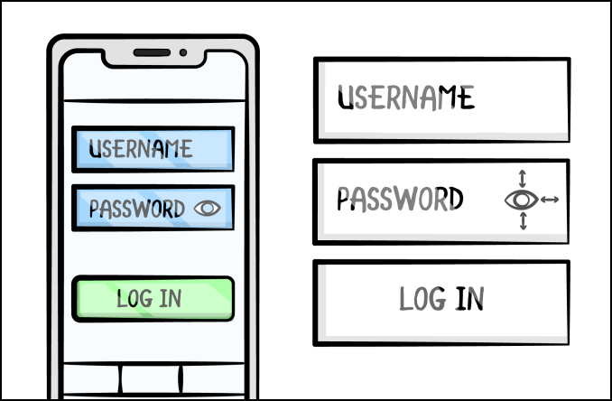
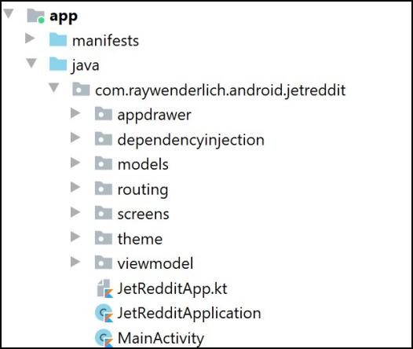
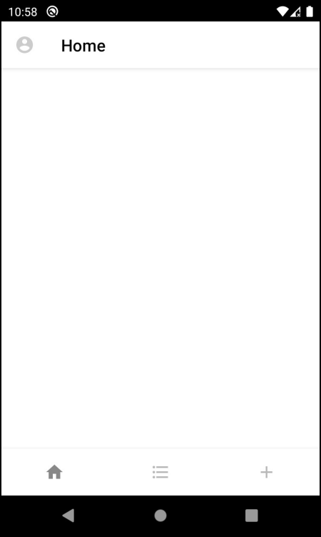
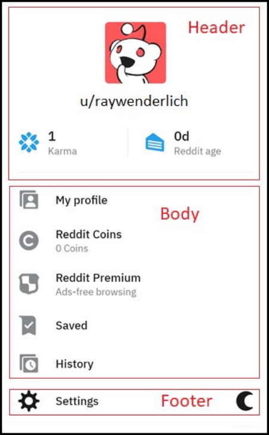
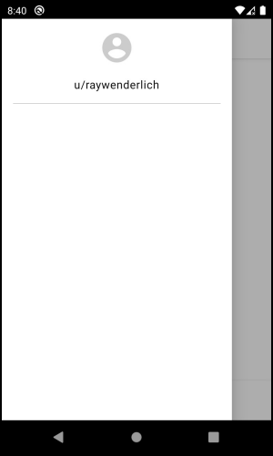
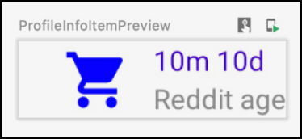
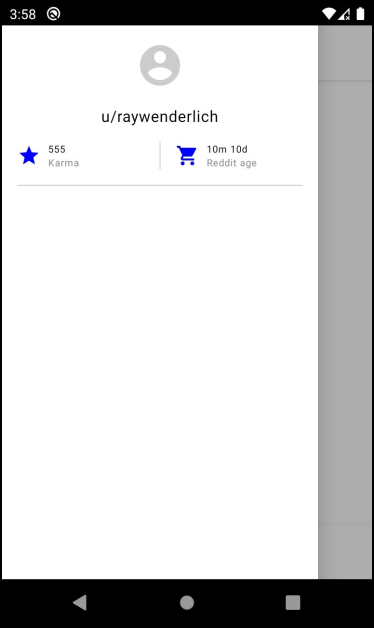
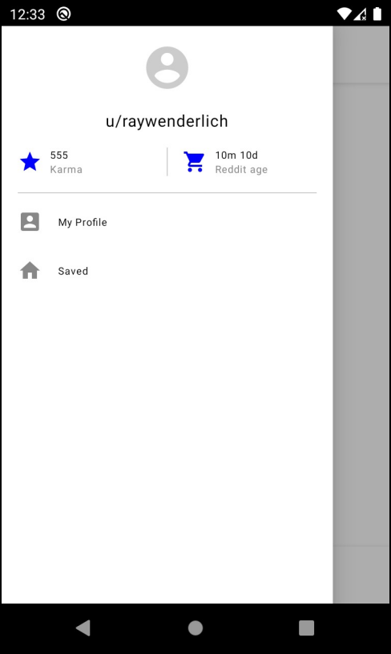
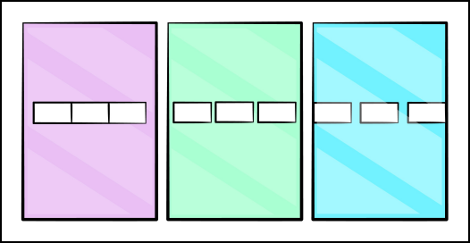

# 第9章:  在Compose中使用约束集(ConstraintSets)

在本节中，你将开始使用Jetpack Compose的高级功能制作一个名为JetReddit的新应用。JetReddit是Raywenderlich.com风格的Reddit应用的一个可组合版本。]

首先，你将学习ConstraintLayout在Jetpack Compose中如何工作，以及你能用它做什么。然后你将使用约束集实现应用程序中的一些核心布局。让我们开始吧!

要学习本章，你需要知道ConstraintLayout是如何工作的。

ConstraintLayout正如它的名字所说，是一个布局。这意味着你用它来包含称为子元素的元素，并对它们进行适当的定位。与之相对的是 

ConstraintLayout与其他布局（如Boxes）一样，将元素放置在特定的位置上，而ConstraintLayout则是将元素彼此相对排列。

如果你仔细想想，Column和Row都是做同样的事情，将每个元素相对于前一个元素定位。另一方面，它们都有同样的问题，那就是它们只能在一个方向上定位元素：要么在垂直方向上，一个在另一个下面，要么在水平方向上，彼此相邻。

### 了解限制性布局

这种定位方式在大多数情况下效果很好，但如果你想建立一个复杂的用户界面，你可以把一个元素放在屏幕的任何地方，那么ConstraintLayout才是最合适的方式。

ConstraintLayout允许你从你选择的任何一面将一个元素相对于另一个元素定位。更具体地说，你可以使用两个元素之间的约束来决定最终的位置。可以从四个不同的侧面进行约束：顶部、底部、左侧和右侧。

注意：最好使用开始和结束，而不是左和右。这可以让你的元素在你的用户使用从右向左阅读的语言时进行切换，也称为RTL（从右向左）支持。

#### ConstraintLayout示例

为了使制约因素更容易理解，请看下面的图片。



**约束布局实例**


在图片的左边，你看到一个基本的登录表格，有两个输入和一个按钮。在密码输入中，你可以看到一个小眼睛图标，它可以切换密码是否以纯文本显示，或者是否隐藏。

在图片的右侧，你可以看到与登录表格相对应的放大的按钮。在眼睛图标周围，箭头显示了约束方向。当你在屏幕上定位你的元素时，你必须从该元素相对于其他元素的角度考虑。

简单地说，你可以说眼睛图标是在密码元素的垂直中心。它也被约束在密码元素的末端，在图标和盒子的末端之间有一个小空间。当你设置约束时，你遵循这种方法来模拟不同元素的位置信息。

现在，要实现这个定位。首先，你在图标的顶部和密码元素的顶部之间建立约束。接下来，你在图标的底部和密码元素的底部之间做一个约束。由于一个约束将图标拉到顶部，另一个约束将图标拉到底部，所以图标最终会在垂直中心。

最后，你在眼睛图标的末端和密码元素的末端之间添加一个约束条件。这将眼睛图标定位在密码元素的最右边。为了得到理想的结果，你所需要做的就是在右边添加一个边距。

现在你已经了解了使用ConstraintLayout的要点，你已经准备好学习它的可组合版本。

### Jetpack Compose中的ConstraintLayout

在Jetpack Compose中，有一个同名的可组合物，叫做 

ConstraintLayout。它提供的功能与你迄今为止使用的ConstraintLayout几乎相同。

```kotlin
@Composable
fun ConstraintLayout(
   modifier: Modifier = Modifier,
   optimizationLevel: Int = Optimizer.OPTIMIZATION_STANDARD,
   crossinline content: @Composable ConstraintLayoutScope.() ->
Unit )
```


这种可组合的方式只需要三个参数。

• modifier用来暴露造型选项，这是很标准的。

• optimizationLevel，设置管理约束条件时的优化级别。默认选项是OPTIMIZATION_STANDARD，它对直接约束和障碍进行优化。

• content，它代表任何数量的可合成物，这些可合成物将成为它的孩子。

现在，想象一下，你有一个像上图那样的场景，你想把眼睛图标放在密码输入元素里面。下面是你在 Compose 中的操作方法。

```kotlin
val (passwordInput, eyeIcon) = createRefs()
Icon(
   imageVector = ImageVector.vectorResource(id =
R.drawable.ic_eye),
   contentDescription = stringResource(id = R.string.eye),
   modifier = Modifier.constrainAs(eyeIcon) {
     top.linkTo(passwordInput.top)
     bottom.linkTo(passwordInput.bottom)
     end.linkTo(passwordInput.end)
   }.padding(end = 16.dp)
)
```


首先，你为ConstraintLayout里面的元素创建引用，作为每个元素的ID。调用createRefs()可以为你创建这些引用。接下来，你设置矢量资源并调用constrainAs()。 

constrainAs()设置当前元素的引用，然后在一个lambda函数中设置它和其他元素之间的约束。

在这种情况下，你设置了eyeIcon的引用，并做了三个约束，如图所示。你通过调用linkTo()来制作每个约束。你把眼睛图标的顶部链接到密码输入的顶部，把眼睛图标的底部链接到密码输入的底部，把眼睛图标的末端链接到密码输入的末端。

最后，你在眼睛图标的末端设置padding，以获得图片中显示的那个小空间。

请记住，这个例子是在假设你已经约束了其他元素的情况下进行的，比如密码输入。

现在你已经掌握了一些关于使用ConstraintLayout()的基本知识，你已经准备好开始构建你的新应用了。

### 实现应用程序的抽屉布局

要跟上代码实例，请用Android Studio打开本章的启动项目，并选择打开一个现有的项目。

接下来，导航到09-using-constraint-layout-in-composables/projects，选择starter文件夹作为项目根。一旦项目打开，让它构建和同步，你就可以开始工作了!



**项目层次结构**

有几个包和类已经为你准备好了，所以你不必担心处理导航、依赖注入和主题切换的问题。如果这看起来有点让人不知所措，不要担心，你只需要对appdrawer和screen包进行修改。

为了使用ConstraintLayout，你需要在你的模块级build.gradle文件中添加以下依赖关系。

```groovy
 implementation "androidx.constraintlayout:constraintlayout-
compose:$current-version"
```


这个依赖已经被添加到你的启动项目中，但当你做新项目时，请记住它，因为它与其他Jetpack Compose依赖有不同的版本。

一旦你熟悉了文件组织，就可以构建(build)并运行(run)该应用程序。你会看到这个屏幕。



**启动屏幕**

在这里，你看到一个顶栏和一个有三个不同图标的底栏。点击其中任何一个都会显示一个空的屏幕，顶栏中的标题会改变。点击顶栏中的账户图标会显示一个空的应用程序抽屉。

创建JetReddit的第一步是建立应用程序的抽屉。你的目标是制作一个类似于官方Reddit应用中的屏幕，看起来像这样。



**Reddit App Drawer**

屏幕被分成三个不同的部分：标题、正文和页脚。在接下来的章节中，你将单独实现它们中的每一个。

在开始之前，通过打开appdrawer/AppDrawer.kt并看一下AppDrawer()，检查应用程序抽屉的根布局实现。

```kotlin
@Composable
fun AppDrawer(
  modifier: Modifier = Modifier,
  closeDrawerAction: () -> Unit
){ Column(
    modifier = modifier
      .fillMaxSize()
.background(color = MaterialTheme.colors.surface) ){
    AppDrawerHeader()
    AppDrawerBody(closeDrawerAction)
    AppDrawerFooter(modifier)
  }
}
```


这个可组合的元素有一个Column作为根元素，有三个自定义的可组合元素作为子元素，对应于前面截图中的页眉、正文和页脚。你的第一步是实现页眉。

### 创建应用抽屉的标题

检查Reddit截图的标题部分可以看出，你可以把它分解成小部分。首先，你需要添加一个个人资料图标，下面是用户的名字。然后你需要添加一些额外的用户资料信息，如用户的业力和Reddit年龄。最后，还有一个分隔符，将标题和正文分开。

#### 实现用户图标和名称

你将首先实现用户图标和用户名。你将把它们添加到一个Column中，因为它们需要垂直排列。先添加列和图像。

```kotlin
@Composable
private fun AppDrawerHeader() {
  Column(
     modifier = Modifier.fillMaxWidth(),
horizontalAlignment = Alignment.CenterHorizontally ){
Image(imageVector = Icons.Filled.AccountCircle,
       colorFilter = ColorFilter.tint(Color.LightGray),
       modifier = Modifier
           .padding(16.dp)
           .size(50.dp),
       contentScale = ContentScale.Fit,
       alignment = Alignment.Center,
       contentDescription = stringResource(id =
R.string.account)
) }
}
```


在这段代码中，你添加了一个柱子，将所有内容水平居中。你把所提供的账户图片放在顶部，下面你将添加一个带有默认用户名的文本，以及一个分隔符，将标题和正文分开。接下来做这个。

```kotlin
@Composable
private fun AppDrawerHeader() {
  Column(
     modifier = Modifier.fillMaxWidth(),
horizontalAlignment = Alignment.CenterHorizontally ){
... Text(
      text = stringResource(R.string.default_username),
      color = MaterialTheme.colors.primaryVariant
    )
  } // end of Column
  Divider(
    color = MaterialTheme.colors.onSurface.copy(alpha = .2f),
    modifier = Modifier.padding(
      start = 16.dp,
      end = 16.dp,
      top = 16.dp
) )
}
```


文本使用的是 default_username 资源，你给分隔线添加了一个 onSurface 颜色，并自定义了 alpha 值。分隔符也有一些额外的填充，使它看起来更漂亮，同时它把标题和抽屉的主体分开。

建立和运行，然后打开抽屉。



**没有个人资料信息的应用程序抽屉头**

在这一点上，你可以看到整个标题部分，除了个人资料信息，你将在接下来实现。

#### 添加个人资料信息

为了更好地了解你需要实施的内容，请看以下图片。


**简介信息**

正如你所看到的，这张图片包括很多重复的元素。这很好，因为它意味着你可以提取组件并多次重复使用它们。

这正是你要对Icon和两个Text元素所做的。你将把这些组件提取到一个叫做ProfileInfoItem的可组合的元素中。

##### 提取可重用的组件

因为这些组件需要相对的约束，你将使用一个ConstraintLayout。在ProfileInfoItem()中添加以下代码。

```kotlin
@Composable
private fun ProfileInfoItem( ...
){
  val colors = MaterialTheme.colors
  ConstraintLayout(modifier = modifier) {
    val (iconRef, amountRef, titleRef) = createRefs() //
references
    val itemModifier = Modifier
    Icon(
      contentDescription = stringResource(id = textResourceId),
      imageVector = iconAsset,
      tint = Color.Blue,
      modifier = itemModifier
        .constrainAs(iconRef) {
          centerVerticallyTo(parent)
          start.linkTo(parent.start)
        }.padding(start = 16.dp)
    )
} }
```


为了开始构建可重复使用的项目，你需要创建一个ConstraintLayout、子视图引用并添加一个Icon作为其子项。同样，使用createRefs()你可以创建多达16个组件的引用，并对它们进行相应的结构调整。

然后你准备好itemModifier，因为区分父级和项目的修改器是一个好的做法。

最后，使用constrainAs(iconRef), centerVertically(parent)和linkTo(parent.start)，你告诉Icon你想把它放在哪里。具体来说，你希望它在父体中垂直居中，并在父体的最开始，有少量的填充。

现在，在图标的下面，添加文本，代表业力点数或Reddit年龄的数量。

```kotlin
@Composable
private fun ProfileInfoItem( ...
){
  val colors = MaterialTheme.colors
  ConstraintLayout(modifier = modifier) {
    ...
    Text(
      text = stringResource(amountResourceId),
      color = colors.primaryVariant,
      fontSize = 10.sp,
      modifier = itemModifier
        .padding(start = 8.dp)
        .constrainAs(amountRef) {
          top.linkTo(iconRef.top)
          start.linkTo(iconRef.end)
          bottom.linkTo(titleRef.top)
        }
) }
}
```


这一点现在应该很熟悉了，因为你希望这个元素是相对于iconRef和titleRef的。你将其限制为 amountRef，将其与 iconRef 的顶部和末端相连接。你还将金额文本的底部链接到标题文本的顶部，接下来你将添加标题文本。

```kotlin
@Composable
private fun ProfileInfoItem( ...
){
  val colors = MaterialTheme.colors
  ConstraintLayout(modifier = modifier) {
    ...
    Text(
      text = stringResource(textResourceId),
      color = Color.Gray,
      fontSize = 10.sp,
      modifier = itemModifier
        .padding(start = 8.dp)
        .constrainAs(titleRef) {
          top.linkTo(amountRef.bottom)
          start.linkTo(iconRef.end)
          bottom.linkTo(iconRef.bottom)
} )
} }
```


很简单。你添加了另一个元素，同样被限制在iconRef上，但这次是在底部而不是顶部。你还将titleRef的顶部与 amountRef的底部连接起来。

重要的是要知道，你将在ProfileInfo()里面使用ProfileInfoItem()，它有自己的ConstraintLayout作为根。为了避免父代和子代可组合物之间的约束冲突，你必须将父代的修改器作为参数传递给子代的ConstraintLayout。

另外，在这个ConstraintLayout中创建新的引用，可以让你在使用多个ConstraintLayout实例时避免前面提到的冲突。

构建应用程序，并看一下预览部分，看看结果。



**简介信息 项目预览**

如果颜色有点不对也不用担心，一旦你运行该应用程序，它们会改变以符合主题。

##### 完成ProfileInfo

现在，你将使用你新做的可组合性来完成ProfileInfo()。用下面的实现替换ProfileInfo()的代码。

```kotlin
@Composable
fun ProfileInfo(modifier: Modifier = Modifier) {
  ConstraintLayout(
      modifier = modifier
          .fillMaxWidth()
          .padding(top = 16.dp)
    val (karmaItem, divider, ageItem) = createRefs()
    val colors = MaterialTheme.colors
    ProfileInfoItem(
        Icons.Filled.Star,
        R.string.default_karma_amount,
        R.string.karma,
        modifier = modifier.constrainAs(karmaItem) {
          centerVerticallyTo(parent)
          start.linkTo(parent.start)
        }
)
    Divider(
        modifier = modifier
      .width(1.dp)
            .constrainAs(divider) {
              centerVerticallyTo(karmaItem)
              centerHorizontallyTo(parent)
              height = Dimension.fillToConstraints
            },
        color = colors.onSurface.copy(alpha = .2f)
)
    ProfileInfoItem(
        Icons.Filled.ShoppingCart,
        R.string.default_reddit_age_amount,
        R.string.reddit_age,
        modifier = modifier.constrainAs(ageItem) {
          start.linkTo(divider.end)
          centerVerticallyTo(parent)
        }
) }
}
```


在这里，你添加了一个ConstraintLayout作为根，并为它所包含的三个元素创建了引用：karma、divider和age。你将karma项约束在父类的开始位置，垂直居中。

接下来，你在父类的垂直中心和第一个ProfileInfoItem的水平中心添加了一个分隔符。

最后，你在分隔线的右边添加了另一个包含年龄信息的ProfileInfoItem，并将其垂直居中。这对你来说应该是越来越熟悉了，因为约束的工作方式就像它们在XML版本的ConstraintLayout中一样。主要的区别是你必须用代码来写它们，但有了神奇的Compose语法，这就小菜一碟了:]现在，将ProfileInfo()添加到AppDrawerHeader()中。

```kotlin
@Composable
private fun AppDrawerHeader() {
  Column(
     modifier = Modifier.fillMaxWidth(),
horizontalAlignment = Alignment.CenterHorizontally ){
Image(
... )
Text(
... )
    ProfileInfo() // Add this
  }
Divider(
... )
}
```


这显示了标题中缺少的资料信息。

构建并运行该应用程序以查看结果。



**带有档案信息的应用程序抽屉标题**

现在你可以看到个人资料信息部分，被一个分隔线分成两部分。

至此，你已经完成了标题部分，并有机会熟悉使用ConstraintLayout的工作。

好了，是时候转到身体上了!

### 实现应用程序抽屉的主体

应用程序抽屉的主体可能是最容易实现的部分，因为你不需要使用ConstraintLayout。

Reddit截图中的主体部分是你的参考，但你将实现一个非常简化的版本。你只需要在这里添加两个按钮，一个用于打开个人资料，另一个用于查看保存的屏幕。

在启动代码中已经为你准备好了可组合的按钮，ScreenNavigationButton。这个可组合的按钮有一个图标、一个标签和一个onClickAction。

接下来，在AppDrawerBody()中添加以下代码。

```kotlin
@Composable
private fun AppDrawerBody(closeDrawerAction: () -> Unit) {
  Column {
    ScreenNavigationButton(
        icon = Icons.Filled.AccountBox,
        label = stringResource(R.string.my_profile),
        onClickAction = {
          closeDrawerAction()
        }
)
    ScreenNavigationButton(
        icon = Icons.Filled.Home,
        label = stringResource(R.string.saved),
        onClickAction = {
          closeDrawerAction()
        }
) }
}
```


这里，你为抽屉的主体添加了两个ScreenNavigationButtons。目前，你传递给按钮的动作只是关闭了抽屉，因为你还没有实现这些屏幕。你将在接下来的章节中处理这个问题。

注意，两个按钮都被设置在Column里面。你这样做是为了让你能预览这个可组合的，但这不是必须的，因为根可组合的AppDrawer已经使用了一个Column。

请记住，你在AppDrawer()中把closeDrawerAction作为一个参数传给了他。

```kotlin
 fun AppDrawer(closeDrawerAction: () -> Unit, modifier: Modifier
= Modifier) {
   ...
   AppDrawerBody(closeDrawerAction)
   ...
}
```


构建(build)并运行(run)该应用程序，然后再次打开应用程序抽屉。



**应用抽屉主体**

现在你可以看到标题部分下面的两个按钮。当你点击它们中的任何一个，抽屉就会关闭。

#### 实现应用程序抽屉的页脚

再次查看Reddit的截图，但这次要仔细注意屏幕的底部。对于这一部分，你需要添加两个新按钮，一个是设置，另一个是改变主题。

首先，将初始的ConstraingLayout设置添加到AppDrawerFooter()中。

```kotlin
@Composable
private fun AppDrawerFooter(modifier: Modifier = Modifier) {
  ConstraintLayout(
    modifier = modifier
      .fillMaxSize()
      .padding(
        start = 16.dp,
        bottom = 16.dp,
        end = 16.dp
) ){
    val colors = MaterialTheme.colors
    val (settingsImage, settingsText, darkModeButton) =
createRefs()
} }
```


在这里，你添加了ConstraintLayout，用修改器对其进行了风格化处理，并准备了定位其子代所需的所有引用。现在添加设置图标和它的标签。

```kotlin
@Composable
private fun AppDrawerFooter(modifier: Modifier = Modifier) {
  ConstraintLayout(
... ){
... Icon(
      modifier = modifier.constrainAs(settingsImage) {
        start.linkTo(parent.start)
        bottom.linkTo(parent.bottom)
      },
      imageVector = Icons.Default.Settings,
      contentDescription = stringResource(id =
R.string.settings),
      tint = colors.primaryVariant
    )
    Text(
      fontSize = 10.sp,
      text = stringResource(R.string.settings),
      style = MaterialTheme.typography.body2,
      color = colors.primaryVariant,
      modifier = modifier
        .padding(start = 16.dp)
        .constrainAs(settingsText) {
          start.linkTo(settingsImage.end)
          centerVerticallyTo(settingsImage)
        }
) }
}
```


这两个元素被放置在父体的底部。图标位于父节点的开始，而标签则链接到settingsImage的结尾。其余的代码应该是不言自明的，因为它主要是对文本和图标进行造型。

现在添加最后一个元素到页脚--主题图标。

```kotlin
@Composable
private fun AppDrawerFooter(modifier: Modifier = Modifier) {
  ConstraintLayout(
... ){
... Icon(
      imageVector = ImageVector.vectorResource(id =
R.drawable.ic_moon),
      contentDescription = stringResource(id =
R.string.change_theme),
      modifier = modifier
        .clickable(onClick = { changeTheme() })
        .constrainAs(darkModeButton) {
          end.linkTo(parent.end)
          bottom.linkTo(settingsImage.bottom)
        },
      tint = colors.primaryVariant
    )
} }
```


主题图标也遵循同样的原则，只是它被限制在父节点的底部和末端。另外，对于主题图标，你添加了一个onClick动作，通过调用changeTheme()来改变主题。这个函数是在启动项目中为你预先建立的。

构建(build)并运行(run)该应用程序，然后打开抽屉。


**应用抽屉的页脚**

现在在抽屉里有一个页脚，上面有设置和主题图标。如果你点击主题图标，应用程序将改变为黑暗主题，其中所有的颜色都已定义。

### ConstraintLayout的高级功能

ConstraintLayout使得构建用户界面比以前容易得多。然而，仍有一些情况在不引入不必要的复杂性的情况下几乎无法解决。

例如，考虑一下本章前面的案例，当你在抽屉里做资料信息的时候，是可以合成的。那个设置有一些元素在屏幕的左边，其他的则靠近中间的垂直线。

现在，想象一下，没有垂直线。你将如何定位你的元素以从屏幕中心开始？一个想法是在中心放置一个不可见的元素，并将你的其他元素相对于该对象定位。这个解决方案与此很相似，只是更加优化。

#### 准则

导线是一个不可见的对象，当你使用ConstraintLayout工作时，你将其作为一个辅助工具。你可以从屏幕的任何一边创建一个指引线，并使用两种不同的方式之一给它一个偏移。

• 你可以指定你想要的偏移量的固定量。

• 如果你想让准则显示在同一个地方，无论屏幕大小如何，你可以给出屏幕百分比。

你使用不同的功能来创建准则，这取决于你想把它们放在哪里。在你前面的例子中，你需要在垂直中心有一条准则，你可以使用以下任一选项。

```kotlin
createGuidelineFromStart(0.5f)
createGuidelineFromEnd(0.5f)
```


这将创建一个垂直的锚点，它离起点有半个屏幕的距离，或离终点有半个屏幕的距离。锚点是一个虚拟的辅助工具，不显示在屏幕上，但允许你对它进行约束。下面是一个如何使用的例子。

```kotlin
val verticalGuideline = createGuidelineFromStart(0.5f)
Icon(
  imageVector = iconAsset,
  contentDescription = stringResource(id =
R.string.some_string),
  modifier = Modifier
    .constrainAs(iconReference) {
       start.linkTo(verticalGuideline)
       top.linkTo(parent.top)
       bottom.linkTo(parent.bottom)
} )
```


在这里，你在屏幕的中心创建一个垂直的指导线。接下来，你添加一个垂直居中的图标，并从你的指导线的位置，即垂直中心开始。

你也可以根据你的需要，使用以下任何一种功能来创建一个锚。对于垂直锚，你可以选择。

- createGuidelineFromStart()

- createGuidelineFromAbsoluteLeft()
- createGuidelineFromEnd()
- createGuidelineFromAbsoluteRight()

对于水平锚，你有以下功能。

- createGuidelineFromTop()
- createGuidelineFromBottom()

然后你用垂直锚来做垂直约束，用水平锚来做水平约束。

纵向约束是：

- Start
- AbsoluteLeft
- End
- AbsoluteRight

横向约束是：

- Top
- Bottom

注意，所有带有绝对前缀的约束和锚都代表屏幕的绝对左边或右边，而不考虑不同的布局方向，比如从右到左。

如果你想了解更多关于准则的信息，请查看官方文档：https://developer.android.com/reference/kotlin/androidx/compose/foundation/layout/ConstraintLayoutBaseScope

#### Barriers

现在你知道了如何将物体定位在屏幕上的特定位置，是时候想想你能解决的一些其他问题了。

看一下下面的图片，以更好地理解下一个问题。


**障碍物**

在图片的左边，你看到一个按钮和两个文本字段：名字和姓氏。在这种情况下，你想把按钮放在这两个文本字段的左边。在第一个例子中，这些文本的宽度几乎相同，所以无论你把哪个文本约束到它，按钮都会在左边。

在第二个例子中，你有一个长名字和一个短姓氏。为了让按钮位于两个文本的左侧，你需要把它限制在第一个名字的开头，因为那是一个较长的名字。

在最后一个例子中，你有一个相反的情况。为了让按钮位于两个文本的左侧，你需要把它限制在最后一个名字的开头。

从这些例子中，你可以看到，为了使其发挥作用，该按钮有时应限制在名字上，有时限制在姓氏上，这取决于哪个名字更大。

为了解决这个问题，你可以在ConstraintLayout中添加一个屏障。屏障是一个可以包含多个约束引用的元素。

下面是你如何使用障碍物来解决前面例子中的问题。

```kotlin
ConstraintLayout(modifier = Modifier.fillMaxSize()) {
  val (button, firstName, lastName) = createRefs()
  val startBarrier = createStartBarrier(firstName, lastName)
  Text(
    text = "long first name",
    modifier = Modifier.constrainAs(firstName) {
      end.linkTo(parent.end)
      top.linkTo(parent.top)
    }
)
  Text(
    text = "last name",
    modifier = Modifier.constrainAs(lastName) {
      end.linkTo(parent.end)
      top.linkTo(firstName.bottom)
    }
)
  Button(
    content = {},
    onClick = {},
    modifier = Modifier.constrainAs(button) {
      end.linkTo(startBarrier)
    }
) }
```


首先，你为所有三个元素创建约束引用。接下来，你通过传递名字和姓氏的引用来创建一个起始屏障。当你想从多个元素的左边设置一个约束时，你就会使用起始屏障。

最后，你做一个从按钮的末端到起始障碍的约束。这将确保按钮总是被约束在具有较大宽度的元素上，从而解决了问题。

与准则一样，你可以通过调用以下函数之一从任何一方创建一个障碍。

- createStartBarrier()
- createAbsoluteLeftBarrier() 
- createEndBarrier()
- createAbsoluteRightBarrier() 
- createTopBarrier()
- createBottomBarrier()

#### Chains

在使用ConstraintLayout时，你可能面临的最后一个问题是当你有多个元素相互制约时。以下是可能出现的情况。



**链条**

你可以看到三个不同的屏幕，每个都包含三个元素。在第一种情况下，这些元素被放在中间，一个挨着一个。在第二种情况下，它们彼此之间和屏幕边缘的间隔是均匀的。在最后一种情况下，这些元素仍然是均匀间隔的，但它们从屏幕边缘开始。

以你目前对约束的了解，如果你有这三个元素，你可以从两边把这些元素相互约束起来，并在边缘把它们约束到父元素。通过这样做，你可以实现第一个结果，但不能实现另外两个结果。

像这样的情况可以用链来解决。链允许你引用多个相互制约的元素，形成一个如上图的链。一旦你有了一个链，你就可以指定你想要的ChainStyle。有三种类型的ChainStyles，它们与前面描述的情况相对应。

• **Packed**。所有的元素都被打包在一个组中，如第一个例子。

• **Spread**。所有的元素都均匀地分布在彼此之间和边缘，如第二个例子。

• **SpreadInside**。所有的元素都均匀地分布在一起，但从边缘开始，如第三个例子。

下面是一个使用ChainStyle.SpreadInside的例子。

```kotlin
val (firstElement, secondElement, thirdElement) = createRefs()
Button(
  modifier = Modifier
  .constrainAs(firstElement) {
    start.linkTo(parent.start)
    end.linkTo(secondElement.start)
    top.linkTo(parent.top)
    bottom.linkTo(parent.bottom)
} )
Button(
  modifier = Modifier
  .constrainAs(secondElement) {
    start.linkTo(firstElement.end)
    end.linkTo(thirdElement.start)
    top.linkTo(parent.top)
    bottom.linkTo(parent.bottom)
} )
Button(
  modifier = Modifier
  .constrainAs(thirdElement) {
    start.linkTo(secondElement.end)
    end.linkTo(parent.end)
    top.linkTo(parent.top)
    bottom.linkTo(parent.bottom)
} )
createHorizontalChain(
    firstElement,
    secondElement,
    thirdElement,
    chainStyle = ChainStyle.SpreadInside
)
```


请注意，只有当你在元素之间创建一个链时，应用一个特定的ChainStyle才会起作用。在前面的代码中，你通过设置三个按钮之间的约束引用来做到这一点。另外，请记住，你可以创建垂直和水平链。

请查看官方ChainStyle文档以了解更多信息：https:// developer.android.com/reference/kotlin/androidx/compose/foundation/layout/ChainStyle。

这是对你目前可以在Android中使用的最复杂布局的概述。到现在，你应该能够用你所学到的知识制作一个任何复杂的屏幕。

请记住这一点，因为在下一章中，这正是你要做的事情：制作一个复杂的用户界面来进一步实现你的JetReddit应用中的功能。

你将结合你到目前为止所学的一切，你将使用基于组件的方法尽可能多地重用代码。下一章见!

### 关键点

• ConstraintLayout将它的子节点相对于对方定位。

• 在你的模块级build.gradle文件中添加实现androidx.constraintlayout:constraintlayoutcompose:$current-version，以使用ConstraintLayout。

• 要在你引用的组合物中使用ConstraintLayout修改器，请将ConstraintLayoutScope作为一个参数传递。

• 最好是使用start和end约束，而不是left和right。

• 使用createRefs()为你的可组合物创建约束性引用。

• 如果你需要将你的可合成物相对于屏幕上的特定位置，请使用**guideline**。

• 通过传递一个特定的dp量或屏幕尺寸的一小部分来设定**guideline**。

• 当你需要从同一侧约束多个可合成物时，使用**barrier**。

• 当你需要多个元素相互制约时，使用**chain**。

• 使用ChainStyle来指定要使用的链的种类。